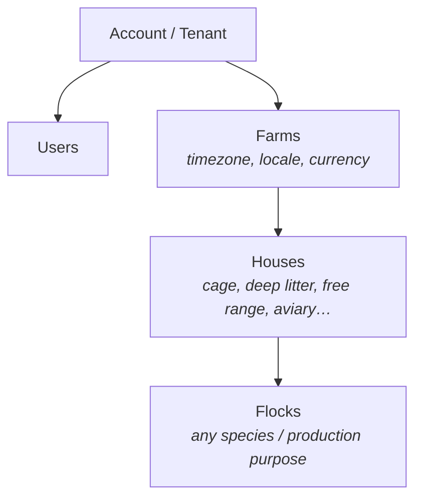

# Cluckwork

Poultry farm management — starting with egg-producing layer operations, with
architectural headroom for broilers, pullets, breeders, live bird sales, meat
products, and hatchery modules.

Cluckwork helps a farm run its daily operation from one system: record
production, track egg lots from the hen through to the sale with full
traceability, block medication-restricted lots, manage sales and customers, and
see the numbers that matter (hen-day rate, saleable %, stock on hand).

The Dashboard brings the morning brief, collection status, stock by grade,
recent orders, and the Lay rate trend onto one screen.


Daily entry separates collection and grading counts for one flock and day. It
shows the sellable target and whether the graded count balances.


- **Backend:** C# / .NET 10 (ASP.NET Core minimal APIs) · **Database:** PostgreSQL (EF Core)
- **Frontend:** React 19 + Vite (TypeScript), served by the API in production

The API and the built SPA ship as a **single container**: one origin serves both
the SPA and the JSON API — no CORS, no version skew between a bundle and its API.

## Run it

### Local development with Aspire

Aspire is the preferred full-stack development path. Prerequisites: the
**.NET 10 SDK**, **Node 26+**, **Docker**, and **Aspire CLI 13.5**. From the
repository root:

```bash
aspire run
```

Aspire starts PostgreSQL, Redis, the API, and Vite; waits on their existing
health checks; and prints the dynamically assigned web and secured dashboard
URLs. The complete setup, observation, persistence, and safe-reset procedure is
in [Aspire local development](docs/runbooks/aspire-local-development.md).

### Production-like Docker stack

Prerequisite: **Docker**. This builds the single-container production shape
instead of the split development processes:

```bash
cp deploy/.env.example deploy/.env
# edit deploy/.env: set POSTGRES_PASSWORD and a JWT RSA keypair (Jwt__*KeyPem)

docker compose -f deploy/docker-compose.yml up --build
```

The app comes up on **http://localhost:8080**. Base data — the default account,
roles, default egg grades — ships inside the EF migrations, so it is already
there. **No credential is ever baked into the repo**, so there is no admin user
yet:

```bash
docker compose -f deploy/docker-compose.yml run --rm app \
  bootstrap-admin --email admin@example.com
```

That prints a one-time password to stdout and nowhere else; first sign-in forces
you to replace it. Production hosts, the IDE workflow, and what to do when it
fails: [first admin provisioning](docs/runbooks/first-admin-provisioning.md).

## Where things are

| Path | What |
|---|---|
| [`src/`](src/) | .NET solution — `Domain` (no deps) → `Application` → `Infrastructure` / `Api` |
| [`web/`](web/) | React + Vite SPA ([`web/README.md`](web/README.md)) |
| [`tests/`](tests/) | Domain, application, and API integration tests (Testcontainers) |
| [`deploy/`](deploy/) | Compose stacks, Traefik, `.env.example` ([`deploy/README.md`](deploy/README.md)) |
| [`specs/`](specs/) | Product & technical spec, wireframes, phase plan |
| [`tools/`](tools/) | Simulation, k6 load, Playwright E2E, schema-doc generation |
| [`docs/`](docs/) | Runbooks, decision records, generated schema docs — [map](docs/README.md) |

| Document | For |
|---|---|
| [`CONTRIBUTING.md`](CONTRIBUTING.md) | Local development, tests, branches, commit messages |
| [`AGENTS.md`](AGENTS.md) | The canonical rule set — every invariant, for humans and coding agents |
| [`SECURITY.md`](SECURITY.md) | Reporting a vulnerability; what CI enforces |
| [`docs/releasing.md`](docs/releasing.md) | Cutting a release; deploying by digest |
| [`docs/architecture.md`](docs/architecture.md) | The request pipeline and the egg-loop state machine, drawn |
| [`docs/runbooks/`](docs/runbooks/) | Operating it: provisioning, break-glass recovery, backup & restore |
| [`specs/product/GLOSSARY.md`](specs/product/GLOSSARY.md) | The domain: flocks, daily entries, egg lots, culls, FIFO allocation |

## More of it

Sales orders move from draft to confirmed. Filter by status, customer, or
unpaid balance; each row shows the order total, outstanding amount, and a link
to its audit history.


Reports show daily production for a selected date range, grade totals, and a
Money summary of revenue, expenses, and basic profit.


The Dashboard and Sales images use the demo-seeded `readme-farm`; Daily entry
and Reports use the simulation fixture. All four come from the built SPA via
[`tools/simulation/ui/specs-screenshots/`](tools/simulation/ui/specs-screenshots/)
and are refreshed with `npm run screenshots`.

## Architecture

Multi-tenant from the root, so the system scales past a single farm:



Flock classification is extensible: `species` (chicken, duck, quail…),
`production_purpose` (layer, broiler, pullet, breeder…), and `production_model`
(egg, meat, raising, breeding, mixed).

Dependencies point inward — `Api` → `Application`/`Infrastructure` → `Domain`,
and `Domain` depends on nothing. Tenant isolation is enforced in the data layer
(EF global query filters plus an insert-time tenant stamp), never by remembering
to add a `WHERE` clause.

The database as actually built — every column, constraint and index — is
generated into [`docs/schema/`](docs/schema/) on every migration.

## Specs & roadmap

The canonical product and technical specification — data model, business rules,
transaction boundaries, KPI formulas, and the **phase plan (Phase 1.0 MVP through
Phase 5)** — is [`specs/product/specs.md`](specs/product/specs.md). New to the
domain? Start with the [glossary](specs/product/GLOSSARY.md).

Phase 1.0 (MVP) and Phase 1.1 (operational fill) are shipped; **Phase 1.5** is
current. Work is tracked as GitHub issues (epics + slices).

## Contributing

[`CONTRIBUTING.md`](CONTRIBUTING.md) for humans, [`AGENTS.md`](AGENTS.md) for
coding agents and for the full rule set behind both.
