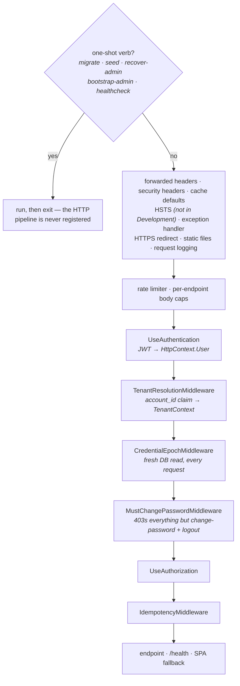
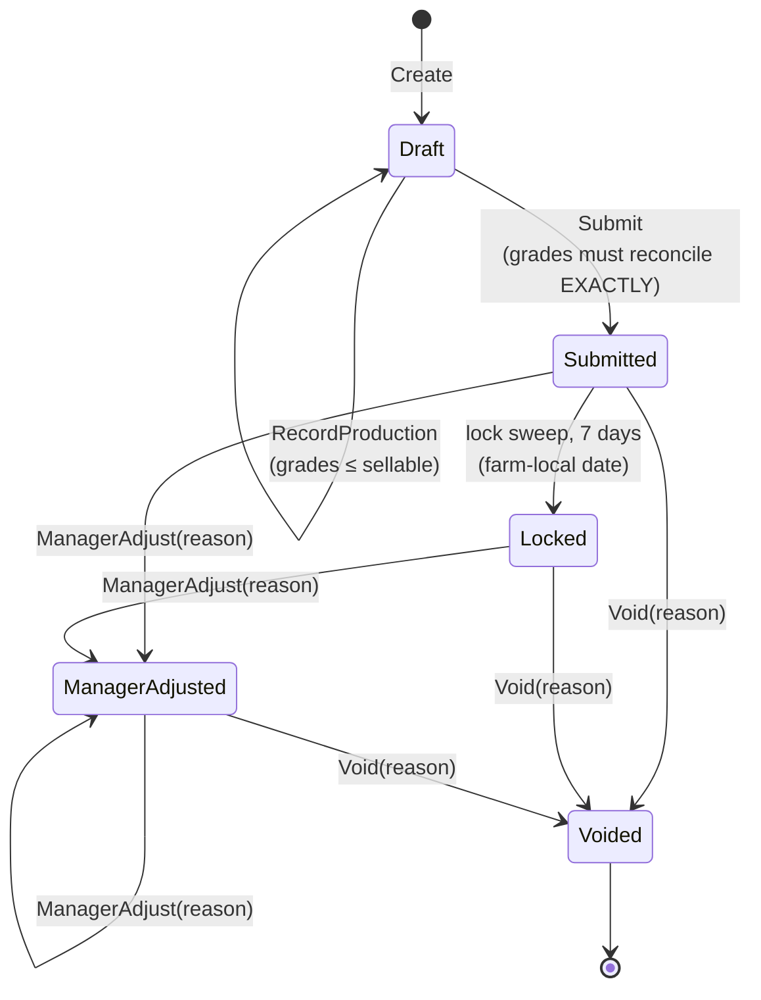
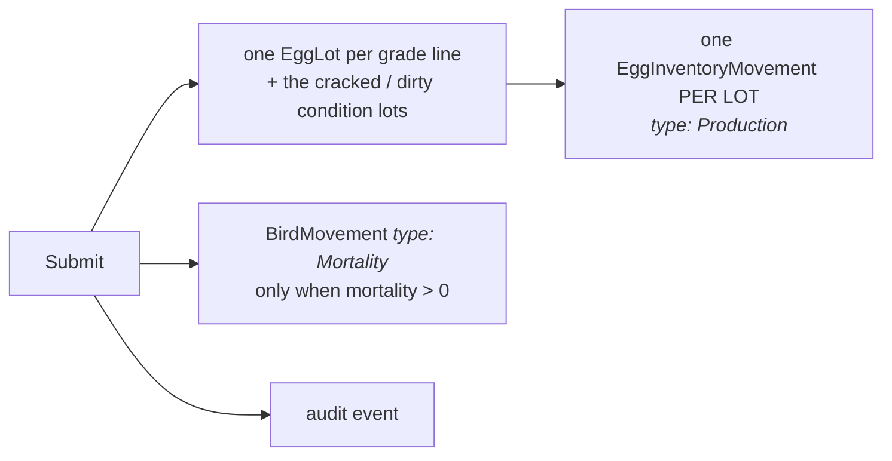
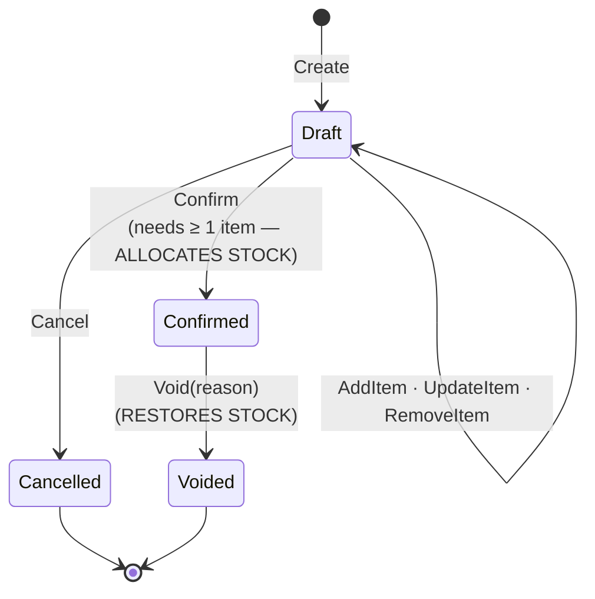

# Architecture — the two orders that matter

Two things in this system are **ordered**, easy to get wrong, and described in
prose that nobody can hold in their head: the request pipeline, and the egg
loop's state machine. Both are drawn here, from the code rather than from the
prose — every claim below was read out of the files named beside it.

Layering (`Api` → `Application`/`Infrastructure` → `Domain`, and `Domain`
depends on nothing) is in [the README](../README.md#architecture). The rules
these diagrams illustrate live in [`AGENTS.md`](../AGENTS.md); the reasoning
behind each lives in [`docs/decisions/`](decisions/).

## The request pipeline

Registration order in `src/Cluckwork.Api/Program.cs`. Only the load-bearing
steps are drawn — the full list runs to 28 entries, most of which are edge
concerns whose relative order does not carry a guarantee.

Three positions in that chain are decisions, not accidents:

| Placement | Why | Break it and |
|---|---|---|
| `CredentialEpochMiddleware` **after** tenant resolution | It reads the user's current epoch from the tenant's database | A revoked credential keeps working (#364) |
| `MustChangePasswordMiddleware` **before** `UseAuthorization` | The gate then applies uniformly, whatever policy tier an endpoint carries | An endpoint's own policy decides whether a forced reset is enforced (#283) |
| `IdempotencyMiddleware` **after** `UseAuthorization` | A replay returns a cached response *without invoking the endpoint* | A role-denied caller replaying someone else's key gets the cached response instead of a 403 |

The epoch check is a database round trip on **every authenticated request**, on
purpose — the round trip *is* the fail-closed guarantee. Do not cache it.

## The egg loop

Three aggregates and one background job. `DailyEntry` produces stock,
`SalesOrder` consumes it, and **`EggLot` is an aggregate root in its own right
that is written directly** — do not read the two state machines below as the
complete set of inventory writers:

| Writer | Path | Effect on a lot |
|---|---|---|
| `DailyEntry.Submit` | `SubmitDailyEntryHandler` | creates lots |
| `DailyEntry` adjust / void | `AdjustDailyEntryHandler`, `VoidDailyEntryHandler` | `EggLot.AdjustProduction` reconciles the lot down to what the corrected day says, with the already-sold amount as the floor |
| `SalesOrder.Confirm` / `Void` | `ConfirmSaleHandler`, `VoidSaleHandler` | `Allocate` / `Restore` |
| **Manual stock movement** | `RecordEggLotMovementHandler` (`/stock`) | `EggLot.AdjustAvailable` for a `Discard`, `InternalUse` or `Reconciliation` movement — no daily entry and no sale involved |

Anything touching lot concurrency or the movement ledger has to account for all
four, not just the two drawn below.

### Daily entry

Worth reading off the diagram, because a linear "Draft → Submitted → Locked →
Voided" sketch gets all three wrong: **`ManagerAdjusted` is re-enterable**,
**`Void` is reachable from three states**, and **a Draft cannot be voided at
all** — it never generated anything to reverse. States and guards live in
`src/Cluckwork.Domain/Eggs/DailyEntry.cs`; the sweep is
`Infrastructure/Jobs/DailyEntryLockSweep.cs` (`Submitted` entries strictly older
than 7 farm-local days).

`Submit` is the transition that creates stock — in one transaction with the
state change (`Application/Features/DailyEntries/SubmitDailyEntry/`):

### Sale

`Confirm` is the only transition that decrements stock, and it does the whole
allocation before the state changes — insufficient stock on any line aborts the
transaction, so a half-allocated confirmed order cannot exist. Lots are drawn
**FIFO by `ProductionDate`, then `Id`** as tiebreaker
(`Infrastructure/Repositories/EggLotRepository.cs`), locked `FOR UPDATE`, and
each draw writes a `SalesOrderAllocation` row. `Void` re-locks those same lots
**in the same order** — that shared ordering is what stops confirm and void
deadlocking against each other — restores each quantity, and marks the
allocation rows released rather than deleting them.

Two things the enums imply but the code does not do:

- **`Shipped` and `Invoiced` are declared and never set.** They exist for later
  phases. The simulation seeder asserts both counts stay zero.
- **`EggLot.RestrictedUntil` is enforced but never written.** `Allocate` refuses
  a restricted lot and the FIFO query filters them out, so the guarantee is
  real — but no production path sets the field yet, because medication tracking
  is a later phase. The mechanism is ready; the writer is not.
