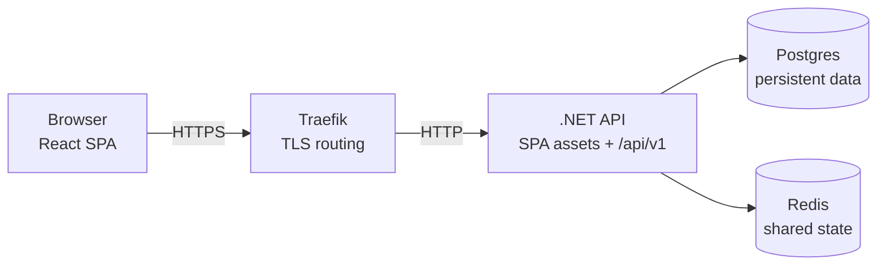
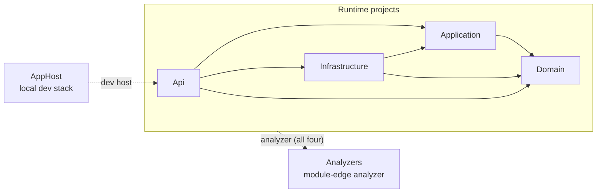
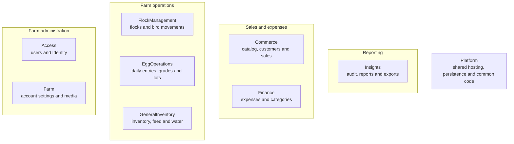
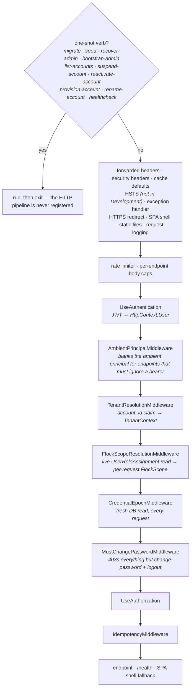
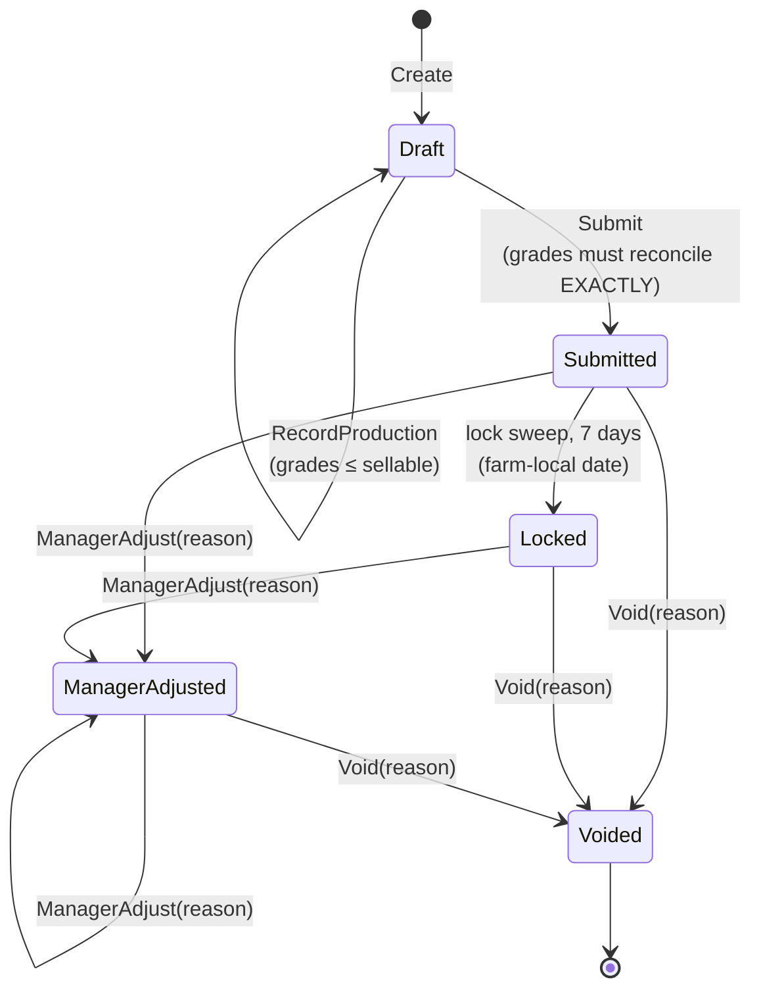
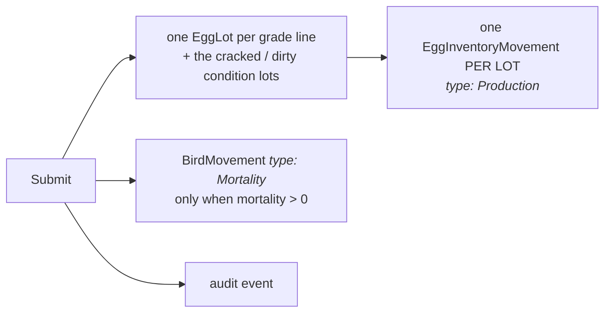
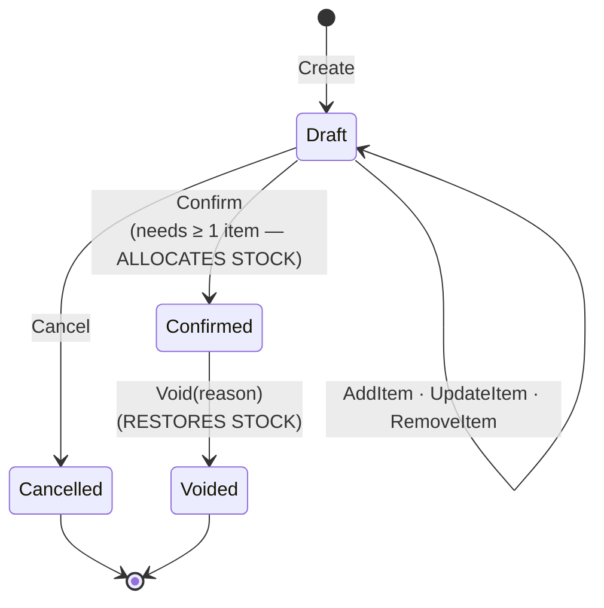

# App architecture and components

Start with the deployment, then the code layers, then the feature modules.
For implementation detail, jump to the [request pipeline](#the-request-pipeline),
[egg loop](#the-egg-loop), or [module coupling matrix](../tests/Cluckwork.Application.Tests/Architecture/Data/coupling-matrix.md).
Rules live in [`src/AGENTS.md`](../src/AGENTS.md); their reasoning lives in [`decisions/`](decisions/).

## Deployment

The reference production stack has one serving API container. It serves both
SPA assets and API requests. The React SPA runs in the browser.

```mermaid
flowchart LR
    browser["Browser<br/>React SPA"] -->|HTTPS| proxy["Traefik<br/>TLS routing"]
    proxy -->|HTTP| api[".NET API<br/>SPA assets + /api/v1"]
    api --> db[("Postgres<br/>persistent data")]
    api --> redis[("Redis<br/>shared state")]
```

| Component | Responsibility |
|---|---|
| Browser | Runs the React UI and sends API requests |
| Traefik | Routes HTTPS traffic in Compose's `prod` profile |
| .NET API | Serves the SPA and endpoints; runs background jobs and sweeps |
| Postgres | Stores farm data, Identity, audit records and jobs; coordinates the job leader lease |
| Redis | Shares claims, rate-limit counters and report leases |

Before the API starts, a separate `migrate` container applies the schema and
exits. Local Compose access bypasses Traefik at `http://localhost:8080`.
For Vite and Aspire, see the [development runbook](runbooks/aspire-local-development.md).
The [single-instance rule](../src/AGENTS.md#deploy-invariant-exactly-one-serving-api-instance-271) covers Redis fallback behavior.

Sources: [`Compose`](../deploy/docker-compose.yml),
[`Dockerfile`](../src/Cluckwork.Api/Dockerfile),
[`Program.cs`](../src/Cluckwork.Api/Program.cs),
[`DurableJobWorker`](../src/Cluckwork.Infrastructure/Jobs/DurableJobWorker.cs).

## Code layers

Solid arrows are runtime project references; Domain has none. Each project
keeps one folder per module, `Modules/<Module>/`, beside the shared Platform
code. The dashed links are build and development references only.

```mermaid
flowchart LR
    subgraph runtime["Runtime projects"]
        api["Api"] --> application["Application"]
        api --> infrastructure["Infrastructure"]
        api --> domain["Domain"]
        infrastructure --> application
        infrastructure --> domain
        application --> domain
    end
    apphost["AppHost<br/>local dev stack"] -. dev host .-> api
    runtime -. "analyzer (all four)" .-> analyzers["Analyzers<br/>module-edge analyzer"]
```

| Project | Responsibility |
|---|---|
| Api | `Modules/<Module>/` endpoints, Platform-owned adapters that use only the module's contract; middleware, CLI and registration |
| Application | `Modules/<Module>/` handlers, validators and repository interfaces; each module's public types in `Contracts/` |
| Infrastructure | `Modules/<Module>/` repositories, EF configurations and Identity; persistence core, jobs and seeding |
| Domain | `Modules/<Module>/` aggregates and value objects; each module's public enums, value types and shared rules (such as `Roles`, `FarmCode` and `DiscountCeiling`) in `Contracts/`; results and auditing |
| Analyzers | Fails the build on an undeclared module edge (CW1001) or on code that names another module's type outside its contract (CW1004); ships no runtime assembly |
| AppHost | Starts the local Aspire stack; never a deploy path |

Sources: [`Api`](../src/Cluckwork.Api/Cluckwork.Api.csproj),
[`Application`](../src/Cluckwork.Application/Cluckwork.Application.csproj),
[`Infrastructure`](../src/Cluckwork.Infrastructure/Cluckwork.Infrastructure.csproj),
[`Domain`](../src/Cluckwork.Domain/Cluckwork.Domain.csproj),
[`AppHost`](../src/Cluckwork.AppHost/Cluckwork.AppHost.csproj).

## Feature modules

This is a grouped inventory of responsibilities, not a dependency graph. Each
module owns a `Modules/<Module>/` folder in every project it spans. Endpoints
and other modules reach it through its `Contracts/`. Other modules may also use
Farm's seam, a short list of extra Farm types. Platform is the shared hub any
module may use.

```mermaid
flowchart LR
    subgraph administration["Farm administration"]
        direction TB
        Access["Access<br/>users and Identity"]
        Farm["Farm<br/>account settings and media"]
        Access ~~~ Farm
    end
    subgraph operations["Farm operations"]
        direction TB
        FlockManagement["FlockManagement<br/>flocks and bird movements"]
        EggOperations["EggOperations<br/>daily entries, grades and lots"]
        GeneralInventory["GeneralInventory<br/>inventory, feed and water"]
        FlockManagement ~~~ EggOperations ~~~ GeneralInventory
    end
    subgraph business["Sales and expenses"]
        direction TB
        Commerce["Commerce<br/>catalog, customers and sales"]
        Finance["Finance<br/>expenses and categories"]
        Commerce ~~~ Finance
    end
    subgraph reporting["Reporting"]
        direction TB
        Insights["Insights<br/>audit, reports and exports"]
    end
    Platform["Platform<br/>shared hosting, persistence and common code"]
    administration ~~~ operations ~~~ business ~~~ reporting
    reporting ~~~ Platform
```

The group headings organize the diagram; the module names come from the
[module rules](../src/Cluckwork.Domain/Common/Architecture/Modules/), and
`CouplingMatrixRealTreeTests` fails when this diagram names a different set of
owners. For read/write dependencies, foreign keys and adapter reach, use the
generated [coupling matrix](../tests/Cluckwork.Application.Tests/Architecture/Data/coupling-matrix.md).

## The request pipeline

The diagram follows the registration order in `src/Cluckwork.Api/Program.cs`
and shows only the steps whose order matters. See `Program.cs` for the full list.

```mermaid
flowchart TD
    CLI{"one-shot verb?<br/><i>migrate · seed · recover-admin · bootstrap-admin<br/>list-accounts · suspend-account · reactivate-account<br/>provision-account · rename-account · healthcheck</i>"}
    CLI -->|yes| EXIT["run, then exit — the HTTP<br/>pipeline is never registered"]
    CLI -->|no| EDGE

    EDGE["forwarded headers · security headers · cache defaults<br/>HSTS <i>(not in Development)</i> · exception handler<br/>HTTPS redirect · SPA shell · static files · request logging"]
    EDGE --> LIMITS["rate limiter · per-endpoint body caps"]
    LIMITS --> AUTHN["UseAuthentication<br/><i>JWT → HttpContext.User</i>"]
    AUTHN --> AMBIENT["AmbientPrincipalMiddleware<br/><i>blanks the ambient principal for endpoints that must ignore a bearer</i>"]
    AMBIENT --> TENANT["TenantResolutionMiddleware<br/><i>account_id claim → TenantContext</i>"]
    TENANT --> FLOCKSCOPE["FlockScopeResolutionMiddleware<br/><i>live UserRoleAssignment read → per-request FlockScope</i>"]
    FLOCKSCOPE --> EPOCH["CredentialEpochMiddleware<br/><i>fresh DB read, every request</i>"]
    EPOCH --> MCP["MustChangePasswordMiddleware<br/><i>403s everything but change-password + logout</i>"]
    MCP --> AUTHZ["UseAuthorization"]
    AUTHZ --> IDEM["IdempotencyMiddleware"]
    IDEM --> ENDPOINT["endpoint · /health · SPA shell fallback"]
```

The table explains five of those positions:

| Placement | Why | Break it and |
|---|---|---|
| `FlockScopeResolutionMiddleware` **after** tenant/user resolution, **before** endpoint queries | It resolves the caller's live `UserRoleAssignment` flock scope for the whole request. It skips resolution when `IExceptionHandlerFeature` is present, which marks a `/error` re-execution, so a database fault can render `/error` without another assignment query | Moving or removing it lets a restricted Worker read unassigned flock rows (#388); removing the re-execution skip makes error rendering itself fail whenever the original failure was the database, so the client gets no mapped `ProblemDetails` response |
| `CredentialEpochMiddleware` **after** tenant resolution | It reads the user's current epoch from the tenant's database | A revoked credential keeps working (#364) |
| `MustChangePasswordMiddleware` **before** `UseAuthorization` | The gate then applies uniformly, whatever policy tier an endpoint carries | An endpoint's own policy decides whether a forced reset is enforced (#283) |
| `IdempotencyMiddleware` **after** `UseAuthorization` | A replay returns a cached response *without invoking the endpoint* | A role-denied caller replaying someone else's key gets the cached response instead of a 403 |
| `SpaShell` **before** the static-file middleware | It templates `/` and `/index.html` with this response's CSP nonce (#873), and the static middleware would otherwise serve the untemplated file from `wwwroot` first | The browser refuses MUI's Emotion styles and nothing reports it. Clients that installed the service worker are hit hardest, because it precaches `/index.html` and answers every navigation from it |

The epoch check reads the database on **every authenticated request**. That
read is what makes a revoked credential fail closed, so do not cache it.

## The egg loop

The egg loop has three aggregates and one background job. `DailyEntry` produces
stock and `SalesOrder` consumes it. **`EggLot` is an aggregate root of its own,
and handlers write it directly**, so the two state machines below are not the
complete set of inventory writers:

| Writer | Path | Effect on a lot |
|---|---|---|
| `DailyEntry.Submit` | `SubmitDailyEntryHandler` | creates lots |
| `DailyEntry` adjust / void | `AdjustDailyEntryHandler`, `VoidDailyEntryHandler` | `EggLot.AdjustProduction` reconciles the lot down to what the corrected day says, with the already-sold amount as the floor |
| `SalesOrder.Confirm` / `Void` | `ConfirmSaleHandler`, `VoidSaleHandler`, through Egg Operations' `IEggStock` | `Allocate` / `Restore` |
| **Manual stock movement** | `RecordEggLotMovementHandler` (`/stock`) | `EggLot.AdjustAvailable` for a `Discard`, `InternalUse` or `Reconciliation` movement, with no daily entry or sale |

Anything touching lot concurrency or the movement ledger has to account for all
four, not just the two drawn below.

### Daily entry

```mermaid
stateDiagram-v2
    [*] --> Draft: Create
    Draft --> Draft: RecordProduction<br/>(grades ≤ sellable)
    Draft --> Submitted: Submit<br/>(grades must reconcile EXACTLY)
    Submitted --> Locked: lock sweep, 7 days<br/>(farm-local date)
    Submitted --> ManagerAdjusted: ManagerAdjust(reason)
    Locked --> ManagerAdjusted: ManagerAdjust(reason)
    ManagerAdjusted --> ManagerAdjusted: ManagerAdjust(reason)
    Submitted --> Voided: Void(reason)
    Locked --> Voided: Void(reason)
    ManagerAdjusted --> Voided: Void(reason)
    Voided --> [*]
```

A linear "Draft → Submitted → Locked → Voided" sketch gets three things wrong
that the diagram shows: **`ManagerAdjusted` is re-enterable**, **`Void` is
reachable from three states**, and **a Draft cannot be voided at all**, because
it never generated anything to reverse. States and guards live in
`src/Cluckwork.Domain/Modules/EggOperations/Eggs/DailyEntry.cs`. The sweep,
`Infrastructure/Jobs/DailyEntryLockSweep.cs`, picks each farm's cutoff
(`Submitted` entries strictly older than `LockAfterDays` farm-local days) and locks them
through `IEggOperationsModule`; the lock loop itself is
`Application/Modules/EggOperations/DailyEntries/LockDueDailyEntries/LockDueDailyEntriesHandler.cs`.

`Submit` creates stock in the same transaction as the state change
(`Application/Modules/EggOperations/DailyEntries/SubmitDailyEntry/`):

```mermaid
flowchart LR
    SUBMIT["Submit"] --> LOTS["one EggLot per grade line<br/>+ the cracked / dirty condition lots"]
    LOTS --> MOVES["one EggInventoryMovement PER LOT<br/><i>type: Production</i>"]
    SUBMIT --> BIRDS["BirdMovement <i>type: Mortality</i><br/>only when mortality > 0"]
    SUBMIT --> AUDIT["audit event"]
```

### Sale

```mermaid
stateDiagram-v2
    [*] --> Draft: Create
    Draft --> Draft: AddItem · UpdateItem · RemoveItem
    Draft --> Cancelled: Cancel
    Draft --> Confirmed: Confirm<br/>(needs ≥ 1 item — ALLOCATES STOCK)
    Confirmed --> Voided: Void(reason)<br/>(RESTORES STOCK)
    Cancelled --> [*]
    Voided --> [*]
```

`Confirm` is the only transition that decrements stock, and it does the whole
allocation before the state changes. Insufficient stock on any line aborts the
transaction, so a half-allocated confirmed order cannot exist. The confirm locks
lots `FOR UPDATE` and draws them **FIFO by `ProductionDate`, then `Id`** as
tiebreaker (`Infrastructure/Modules/EggOperations/Repositories/EggLotRepository.cs`),
and each draw writes a `SalesOrderAllocation` row. Commerce reaches the lots only
through Egg Operations' `IEggStock` port, which locks, plans and draws inside
the confirm's transaction and never saves (#854). `Void` re-locks those same lots
**in the same order**, so confirm and void cannot deadlock each other. It then
restores each quantity and marks the allocation rows released rather than
deleting them.

Two things the enums imply but the code does not do:

- **`Shipped` and `Invoiced` are declared and never set.** They exist for later
  phases. The simulation seeder asserts both counts stay zero.
- **`EggLot.RestrictedUntil` is enforced but never written.** `Allocate` refuses
  a restricted lot and the FIFO query filters them out, so the guarantee
  holds. No production path sets the field yet, because medication tracking is
  a later phase.
