# cluckwork

## Description

PostgreSQL schema created by the repository's EF Core migrations (the frozen  
`InitialCreate` squash plus one migration per change — see  
[docs/decisions/407-migration-freeze.md](../decisions/407-migration-freeze.md)).  
Generated with tbls from an ephemeral migrated database, so raw-SQL artifacts —  
expression indexes, partial index predicates, check constraints — are shown as  
PostgreSQL actually enforces them, not as the EF model approximates them.  
  
A freshly migrated database is not empty: the migrations also seed 21 base  
reference rows — the default account, the four assignable roles, ten default  
egg grades, and six packed-unit conversions — as guarded raw SQL  
(never `HasData`). See  
[docs/decisions/283-migrations-base-provisioning.md](../decisions/283-migrations-base-provisioning.md).  

## Viewpoints

| Name | Description |
| ---- | ----------- |
| [Flocks & egg production](viewpoint-0.md) | The daily egg loop — flocks, daily entries, grading, lots, movements. |
| [Feed & supply inventory](viewpoint-1.md) | Purchasable supplies, FIFO lots, and the movement ledger. |
| [Sales & finance](viewpoint-2.md) | Customers, orders, FIFO allocations, payments, expenses, products. |
| [Identity & access](viewpoint-3.md) | ASP.NET Identity, refresh tokens, per-flock role assignments. |
| [Platform & operations](viewpoint-4.md) | Tenancy root, audit, jobs, idempotency, seeding bookkeeping. |

## Tables

| Name | Columns | Comment | Type |
| ---- | ------- | ------- | ---- |
| [public.__EFMigrationsHistory](public.__EFMigrationsHistory.md) | 2 |  | BASE TABLE |
| [public.Accounts](public.Accounts.md) | 17 |  | BASE TABLE |
| [public.AspNetRoles](public.AspNetRoles.md) | 4 |  | BASE TABLE |
| [public.AspNetUsers](public.AspNetUsers.md) | 24 |  | BASE TABLE |
| [public.AuditEvents](public.AuditEvents.md) | 10 |  | BASE TABLE |
| [public.Customers](public.Customers.md) | 7 |  | BASE TABLE |
| [public.DailyEntries](public.DailyEntries.md) | 19 |  | BASE TABLE |
| [public.durable_jobs](public.durable_jobs.md) | 9 |  | BASE TABLE |
| [public.EggGrades](public.EggGrades.md) | 10 |  | BASE TABLE |
| [public.EggUnitConversions](public.EggUnitConversions.md) | 6 |  | BASE TABLE |
| [public.ExpenseCategories](public.ExpenseCategories.md) | 6 |  | BASE TABLE |
| [public.FarmLogos](public.FarmLogos.md) | 18 |  | BASE TABLE |
| [public.Flocks](public.Flocks.md) | 12 |  | BASE TABLE |
| [public.idempotency_records](public.idempotency_records.md) | 13 |  | BASE TABLE |
| [public.InventoryItems](public.InventoryItems.md) | 11 |  | BASE TABLE |
| [public.Products](public.Products.md) | 12 |  | BASE TABLE |
| [public.refresh_tokens](public.refresh_tokens.md) | 11 |  | BASE TABLE |
| [public.simulation_seed_state](public.simulation_seed_state.md) | 3 |  | BASE TABLE |
| [public.UserRoleAssignments](public.UserRoleAssignments.md) | 6 |  | BASE TABLE |
| [public.AspNetRoleClaims](public.AspNetRoleClaims.md) | 4 |  | BASE TABLE |
| [public.AspNetUserClaims](public.AspNetUserClaims.md) | 4 |  | BASE TABLE |
| [public.AspNetUserLogins](public.AspNetUserLogins.md) | 4 |  | BASE TABLE |
| [public.AspNetUserRoles](public.AspNetUserRoles.md) | 2 |  | BASE TABLE |
| [public.AspNetUserTokens](public.AspNetUserTokens.md) | 4 |  | BASE TABLE |
| [public.SalesOrders](public.SalesOrders.md) | 11 |  | BASE TABLE |
| [public.DailyEntryGrades](public.DailyEntryGrades.md) | 5 |  | BASE TABLE |
| [public.EggLots](public.EggLots.md) | 10 |  | BASE TABLE |
| [public.BirdMovements](public.BirdMovements.md) | 8 |  | BASE TABLE |
| [public.Expenses](public.Expenses.md) | 12 |  | BASE TABLE |
| [public.WaterUsages](public.WaterUsages.md) | 13 |  | BASE TABLE |
| [public.FeedUsages](public.FeedUsages.md) | 14 |  | BASE TABLE |
| [public.InventoryLots](public.InventoryLots.md) | 12 |  | BASE TABLE |
| [public.ProductEggGradeMappings](public.ProductEggGradeMappings.md) | 4 |  | BASE TABLE |
| [public.Payments](public.Payments.md) | 14 |  | BASE TABLE |
| [public.SalesOrderItems](public.SalesOrderItems.md) | 13 |  | BASE TABLE |
| [public.EggInventoryMovements](public.EggInventoryMovements.md) | 9 |  | BASE TABLE |
| [public.InventoryMovements](public.InventoryMovements.md) | 13 |  | BASE TABLE |
| [public.SalesOrderAllocations](public.SalesOrderAllocations.md) | 7 |  | BASE TABLE |

## Relations

```mermaid
erDiagram

"public.AspNetUsers" }o--|| "public.Accounts" : "FOREIGN KEY (#quot;AccountId#quot;) REFERENCES #quot;Accounts#quot;(#quot;Id#quot;) ON DELETE RESTRICT"
"public.AspNetRoleClaims" }o--|| "public.AspNetRoles" : "FOREIGN KEY (#quot;RoleId#quot;) REFERENCES #quot;AspNetRoles#quot;(#quot;Id#quot;) ON DELETE CASCADE"
"public.AspNetUserClaims" }o--|| "public.AspNetUsers" : "FOREIGN KEY (#quot;UserId#quot;) REFERENCES #quot;AspNetUsers#quot;(#quot;Id#quot;) ON DELETE CASCADE"
"public.AspNetUserLogins" }o--|| "public.AspNetUsers" : "FOREIGN KEY (#quot;UserId#quot;) REFERENCES #quot;AspNetUsers#quot;(#quot;Id#quot;) ON DELETE CASCADE"
"public.AspNetUserRoles" }o--|| "public.AspNetRoles" : "FOREIGN KEY (#quot;RoleId#quot;) REFERENCES #quot;AspNetRoles#quot;(#quot;Id#quot;) ON DELETE CASCADE"
"public.AspNetUserRoles" }o--|| "public.AspNetUsers" : "FOREIGN KEY (#quot;UserId#quot;) REFERENCES #quot;AspNetUsers#quot;(#quot;Id#quot;) ON DELETE CASCADE"
"public.AspNetUserTokens" }o--|| "public.AspNetUsers" : "FOREIGN KEY (#quot;UserId#quot;) REFERENCES #quot;AspNetUsers#quot;(#quot;Id#quot;) ON DELETE CASCADE"
"public.SalesOrders" }o--|| "public.Customers" : "FOREIGN KEY (#quot;CustomerId#quot;) REFERENCES #quot;Customers#quot;(#quot;Id#quot;) ON DELETE RESTRICT"
"public.DailyEntryGrades" }o--|| "public.DailyEntries" : "FOREIGN KEY (#quot;DailyEntryId#quot;) REFERENCES #quot;DailyEntries#quot;(#quot;Id#quot;) ON DELETE CASCADE"
"public.DailyEntryGrades" }o--|| "public.EggGrades" : "FOREIGN KEY (#quot;EggGradeId#quot;) REFERENCES #quot;EggGrades#quot;(#quot;Id#quot;) ON DELETE RESTRICT"
"public.EggLots" }o--|| "public.EggGrades" : "FOREIGN KEY (#quot;EggGradeId#quot;) REFERENCES #quot;EggGrades#quot;(#quot;Id#quot;) ON DELETE RESTRICT"
"public.BirdMovements" }o--o| "public.DailyEntries" : "FOREIGN KEY (#quot;DailyEntryId#quot;) REFERENCES #quot;DailyEntries#quot;(#quot;Id#quot;) ON DELETE RESTRICT"
"public.BirdMovements" }o--|| "public.Flocks" : "FOREIGN KEY (#quot;FlockId#quot;) REFERENCES #quot;Flocks#quot;(#quot;Id#quot;) ON DELETE RESTRICT"
"public.Expenses" }o--|| "public.ExpenseCategories" : "FOREIGN KEY (#quot;ExpenseCategoryId#quot;) REFERENCES #quot;ExpenseCategories#quot;(#quot;Id#quot;) ON DELETE RESTRICT"
"public.Expenses" }o--o| "public.Flocks" : "FOREIGN KEY (#quot;FlockId#quot;) REFERENCES #quot;Flocks#quot;(#quot;Id#quot;) ON DELETE RESTRICT"
"public.WaterUsages" }o--o| "public.DailyEntries" : "FOREIGN KEY (#quot;DailyEntryId#quot;) REFERENCES #quot;DailyEntries#quot;(#quot;Id#quot;) ON DELETE RESTRICT"
"public.WaterUsages" }o--|| "public.Flocks" : "FOREIGN KEY (#quot;FlockId#quot;) REFERENCES #quot;Flocks#quot;(#quot;Id#quot;) ON DELETE RESTRICT"
"public.FeedUsages" }o--o| "public.DailyEntries" : "FOREIGN KEY (#quot;DailyEntryId#quot;) REFERENCES #quot;DailyEntries#quot;(#quot;Id#quot;) ON DELETE RESTRICT"
"public.FeedUsages" }o--|| "public.Flocks" : "FOREIGN KEY (#quot;FlockId#quot;) REFERENCES #quot;Flocks#quot;(#quot;Id#quot;) ON DELETE RESTRICT"
"public.FeedUsages" }o--|| "public.InventoryItems" : "FOREIGN KEY (#quot;InventoryItemId#quot;) REFERENCES #quot;InventoryItems#quot;(#quot;Id#quot;) ON DELETE RESTRICT"
"public.InventoryLots" }o--|| "public.InventoryItems" : "FOREIGN KEY (#quot;InventoryItemId#quot;) REFERENCES #quot;InventoryItems#quot;(#quot;Id#quot;) ON DELETE RESTRICT"
"public.ProductEggGradeMappings" }o--|| "public.EggGrades" : "FOREIGN KEY (#quot;EggGradeId#quot;) REFERENCES #quot;EggGrades#quot;(#quot;Id#quot;) ON DELETE RESTRICT"
"public.ProductEggGradeMappings" }o--|| "public.Products" : "FOREIGN KEY (#quot;ProductId#quot;) REFERENCES #quot;Products#quot;(#quot;Id#quot;) ON DELETE CASCADE"
"public.Payments" }o--|| "public.Customers" : "FOREIGN KEY (#quot;CustomerId#quot;) REFERENCES #quot;Customers#quot;(#quot;Id#quot;) ON DELETE RESTRICT"
"public.Payments" }o--|| "public.SalesOrders" : "FOREIGN KEY (#quot;SalesOrderId#quot;) REFERENCES #quot;SalesOrders#quot;(#quot;Id#quot;) ON DELETE RESTRICT"
"public.SalesOrderItems" }o--|| "public.EggGrades" : "FOREIGN KEY (#quot;EggGradeId#quot;) REFERENCES #quot;EggGrades#quot;(#quot;Id#quot;) ON DELETE RESTRICT"
"public.SalesOrderItems" }o--|| "public.Products" : "FOREIGN KEY (#quot;ProductId#quot;) REFERENCES #quot;Products#quot;(#quot;Id#quot;) ON DELETE RESTRICT"
"public.SalesOrderItems" }o--|| "public.SalesOrders" : "FOREIGN KEY (#quot;SalesOrderId#quot;) REFERENCES #quot;SalesOrders#quot;(#quot;Id#quot;) ON DELETE CASCADE"
"public.EggInventoryMovements" }o--|| "public.EggLots" : "FOREIGN KEY (#quot;EggLotId#quot;) REFERENCES #quot;EggLots#quot;(#quot;Id#quot;) ON DELETE RESTRICT"
"public.InventoryMovements" }o--o| "public.Flocks" : "FOREIGN KEY (#quot;FlockId#quot;) REFERENCES #quot;Flocks#quot;(#quot;Id#quot;) ON DELETE RESTRICT"
"public.InventoryMovements" }o--|| "public.InventoryItems" : "FOREIGN KEY (#quot;InventoryItemId#quot;) REFERENCES #quot;InventoryItems#quot;(#quot;Id#quot;) ON DELETE RESTRICT"
"public.InventoryMovements" }o--o| "public.InventoryLots" : "FOREIGN KEY (#quot;InventoryLotId#quot;) REFERENCES #quot;InventoryLots#quot;(#quot;Id#quot;) ON DELETE RESTRICT"
"public.SalesOrderAllocations" }o--|| "public.SalesOrders" : "FOREIGN KEY (#quot;SalesOrderId#quot;) REFERENCES #quot;SalesOrders#quot;(#quot;Id#quot;) ON DELETE CASCADE"
"public.SalesOrderAllocations" }o--|| "public.EggLots" : "FOREIGN KEY (#quot;EggLotId#quot;) REFERENCES #quot;EggLots#quot;(#quot;Id#quot;) ON DELETE RESTRICT"
"public.SalesOrderAllocations" }o--|| "public.SalesOrderItems" : "FOREIGN KEY (#quot;SalesOrderItemId#quot;) REFERENCES #quot;SalesOrderItems#quot;(#quot;Id#quot;) ON DELETE CASCADE"

"public.__EFMigrationsHistory" {
  varchar_150_ MigrationId
  varchar_32_ ProductVersion
}
"public.Accounts" {
  uuid Id
  varchar_120_ Name
  varchar_64_ TimeZoneId
  varchar_32_ Locale
  varchar_3_ DefaultCurrencyCode
  varchar_8_ DefaultCurrencySymbol
  integer DefaultCurrencyMinorUnit
  varchar_16_ UnitSystem
  varchar_16_ FirstDayOfWeek
  varchar_32_ DateFormatOverride
  varchar_32_ TimeFormatOverride
  varchar_32_ Brand
  boolean IsActive
  integer Version
  uuid AccountId
  varchar_16_ DefaultStepperUnit
  varchar_32_ Slug
}
"public.AspNetRoles" {
  uuid Id
  varchar_256_ Name
  varchar_256_ NormalizedName
  text ConcurrencyStamp
}
"public.AspNetUsers" {
  uuid Id
  uuid AccountId FK
  text DisplayName
  varchar_16_ Language
  boolean MustChangePassword
  varchar_256_ UserName
  varchar_256_ NormalizedUserName
  varchar_256_ Email
  varchar_256_ NormalizedEmail
  boolean EmailConfirmed
  text PasswordHash
  text SecurityStamp
  text ConcurrencyStamp
  text PhoneNumber
  boolean PhoneNumberConfirmed
  boolean TwoFactorEnabled
  timestamp_with_time_zone LockoutEnd
  boolean LockoutEnabled
  integer AccessFailedCount
  integer CredentialEpoch
  timestamp_with_time_zone DisabledAt
  uuid DisabledBy
  varchar_16_ PreferredStepperUnit
  integer StepUpLogoutEpoch
}
"public.AuditEvents" {
  uuid Id
  timestamp_with_time_zone OccurredAtUtc
  uuid ActorUserId
  varchar_256_ ActorEmail
  varchar_100_ Action
  varchar_100_ EntityType
  uuid EntityId
  varchar_500_ Reason
  text DetailsJson
  uuid AccountId
}
"public.Customers" {
  uuid Id
  varchar_200_ Name
  varchar_50_ Phone
  varchar_254_ Email
  varchar_500_ Address
  varchar_1000_ Note
  uuid AccountId
}
"public.DailyEntries" {
  uuid Id
  uuid FarmId
  uuid HouseId
  uuid FlockId
  date Date
  varchar_32_ Status
  integer TotalEggs
  integer CrackedEggs
  integer DirtyEggs
  integer DiscardedEggs
  integer MortalityCount
  uuid CrackedGradeId
  uuid DirtyGradeId
  varchar_500_ AdjustReason
  text AdjustedFromJson
  varchar_500_ VoidReason
  timestamp_with_time_zone LockedAtUtc
  integer Version
  uuid AccountId
}
"public.durable_jobs" {
  uuid Id
  varchar_200_ JobType
  text PayloadJson
  varchar_32_ Status
  timestamp_with_time_zone RunAfter
  timestamp_with_time_zone StartedAt
  timestamp_with_time_zone CompletedAt
  text LastError
  integer Attempts
}
"public.EggGrades" {
  uuid Id
  uuid FarmId
  varchar_50_ Name
  varchar_16_ GradeType
  integer SortOrder
  boolean IsSaleable
  boolean Active
  varchar_16_ DailyEntryKind
  integer Version
  uuid AccountId
}
"public.EggUnitConversions" {
  uuid Id
  varchar_16_ UnitCode
  integer EggsPerUnit
  boolean Active
  integer Version
  uuid AccountId
}
"public.ExpenseCategories" {
  uuid Id
  uuid FarmId
  varchar_100_ Name
  boolean Active
  integer Version
  uuid AccountId
}
"public.FarmLogos" {
  uuid Id
  uuid FarmId
  bytea Content
  varchar_32_ ContentType
  integer Width
  integer Height
  integer ByteLength
  varchar_64_ ContentHash
  timestamp_with_time_zone UpdatedAt
  integer Version
  uuid AccountId
  integer BannerByteLength
  bytea BannerContent
  varchar_64_ BannerContentHash
  varchar_32_ BannerContentType
  integer BannerHeight
  timestamp_with_time_zone BannerUpdatedAt
  integer BannerWidth
}
"public.Flocks" {
  uuid Id
  uuid FarmId
  uuid HouseId
  varchar_200_ Name
  varchar_100_ Breed
  date PlacementDate
  integer InitialCount
  varchar_32_ Status
  date DepletedOn
  date ArchivedOn
  integer Version
  uuid AccountId
}
"public.idempotency_records" {
  uuid Id
  uuid AccountId
  varchar_64_ EndpointHash
  varchar_64_ IdempotencyKeyHash
  varchar_64_ RequestHash
  integer Status
  uuid LeaseOwner
  timestamp_with_time_zone LeaseExpiresAt
  integer StatusCode
  text ContentType
  text ResponseBody
  timestamp_with_time_zone CompletedAt
  timestamp_with_time_zone CreatedAt
}
"public.InventoryItems" {
  uuid Id
  uuid FarmId
  varchar_200_ Name
  varchar_32_ Category
  varchar_20_ Unit
  bigint DefaultCostMinorUnits
  varchar_3_ DefaultCostCurrencyCode
  integer DefaultCostCurrencyMinorUnit
  boolean Active
  integer Version
  uuid AccountId
}
"public.Products" {
  uuid Id
  uuid FarmId
  varchar_100_ Name
  varchar_16_ ProductType
  varchar_16_ DefaultUnit
  bigint DefaultPriceMinorUnits
  varchar_3_ CurrencyCode
  integer CurrencyMinorUnit
  varchar_500_ Notes
  boolean Active
  integer Version
  uuid AccountId
}
"public.refresh_tokens" {
  uuid Id
  uuid UserId
  uuid AccountId
  varchar_64_ TokenHash
  timestamp_with_time_zone ExpiresAt
  timestamp_with_time_zone CreatedAt
  timestamp_with_time_zone RevokedAt
  varchar_64_ ReplacedByTokenHash
  boolean RevokedByGrace
  varchar_36_ ConcurrencyStamp
  integer IssuedEpoch
}
"public.simulation_seed_state" {
  uuid AccountId
  date Anchor
  timestamp_with_time_zone CompletedAtUtc
}
"public.UserRoleAssignments" {
  uuid Id
  uuid UserId
  uuid FarmId
  uuid HouseId
  uuid FlockId
  uuid AccountId
}
"public.AspNetRoleClaims" {
  integer Id
  uuid RoleId FK
  text ClaimType
  text ClaimValue
}
"public.AspNetUserClaims" {
  integer Id
  uuid UserId FK
  text ClaimType
  text ClaimValue
}
"public.AspNetUserLogins" {
  text LoginProvider
  text ProviderKey
  text ProviderDisplayName
  uuid UserId FK
}
"public.AspNetUserRoles" {
  uuid UserId FK
  uuid RoleId FK
}
"public.AspNetUserTokens" {
  uuid UserId FK
  text LoginProvider
  text Name
  text Value
}
"public.SalesOrders" {
  uuid Id
  varchar_100_ ReferenceNumber
  uuid CustomerId FK
  varchar_32_ Status
  date OrderDate
  bigint TotalMinorUnits
  varchar_3_ TotalCurrencyCode
  integer TotalCurrencyMinorUnit
  varchar_500_ VoidReason
  integer Version
  uuid AccountId
}
"public.DailyEntryGrades" {
  uuid Id
  uuid DailyEntryId FK
  uuid EggGradeId FK
  integer Quantity
  uuid AccountId
}
"public.EggLots" {
  uuid Id
  uuid FlockId
  date ProductionDate
  uuid EggGradeId FK
  integer QuantityProduced
  integer QuantityAvailable
  uuid DailyEntryId
  date RestrictedUntil
  integer Version
  uuid AccountId
}
"public.BirdMovements" {
  uuid Id
  uuid FlockId FK
  date Date
  varchar_16_ Type
  integer Quantity
  varchar_500_ Note
  uuid DailyEntryId FK
  uuid AccountId
}
"public.Expenses" {
  uuid Id
  uuid FarmId
  uuid ExpenseCategoryId FK
  date Date
  varchar_200_ Description
  bigint AmountMinorUnits
  varchar_3_ CurrencyCode
  integer CurrencyMinorUnit
  uuid FlockId FK
  varchar_500_ Note
  integer Version
  uuid AccountId
}
"public.WaterUsages" {
  uuid Id
  uuid FlockId FK
  date Date
  numeric_18_3_ Quantity
  varchar_8_ Unit
  varchar_32_ Source
  numeric_18_3_ MeterStart
  numeric_18_3_ MeterEnd
  varchar_500_ Note
  uuid DailyEntryId FK
  timestamp_with_time_zone CreatedAtUtc
  integer Version
  uuid AccountId
}
"public.FeedUsages" {
  uuid Id
  uuid FlockId FK
  uuid InventoryItemId FK
  date Date
  numeric_18_3_ Quantity
  varchar_20_ Unit
  bigint EstimatedCostMinorUnits
  varchar_3_ EstimatedCostCurrencyCode
  integer EstimatedCostCurrencyMinorUnit
  uuid DailyEntryId FK
  varchar_500_ Note
  timestamp_with_time_zone CreatedAtUtc
  integer Version
  uuid AccountId
}
"public.InventoryLots" {
  uuid Id
  uuid InventoryItemId FK
  date ReceivedDate
  varchar_100_ LotNumber
  date ExpiryDate
  numeric_18_3_ QuantityReceived
  numeric_18_3_ QuantityAvailable
  bigint UnitCostMinorUnits
  varchar_3_ UnitCostCurrencyCode
  integer UnitCostCurrencyMinorUnit
  integer Version
  uuid AccountId
}
"public.ProductEggGradeMappings" {
  uuid Id
  uuid ProductId FK
  uuid EggGradeId FK
  uuid AccountId
}
"public.Payments" {
  uuid Id
  uuid SalesOrderId FK
  uuid CustomerId FK
  date PaymentDate
  bigint AmountMinorUnits
  varchar_3_ CurrencyCode
  integer CurrencyMinorUnit
  varchar_20_ Method
  varchar_50_ ReferenceNumber
  varchar_500_ Note
  boolean Voided
  varchar_500_ VoidReason
  integer Version
  uuid AccountId
}
"public.SalesOrderItems" {
  uuid Id
  uuid SalesOrderId FK
  uuid ProductId FK
  varchar_16_ ProductTypeSnapshot
  uuid EggGradeId FK
  varchar_16_ Unit
  integer BaseUnitFactor
  integer Quantity
  integer QuantityBase
  bigint UnitPriceMinorUnits
  varchar_3_ UnitPriceCurrencyCode
  integer UnitPriceCurrencyMinorUnit
  uuid AccountId
}
"public.EggInventoryMovements" {
  uuid Id
  uuid EggLotId FK
  varchar_16_ MovementType
  integer QuantityDelta
  varchar_50_ ReferenceType
  uuid ReferenceId
  varchar_500_ Reason
  timestamp_with_time_zone CreatedAtUtc
  uuid AccountId
}
"public.InventoryMovements" {
  uuid Id
  uuid InventoryItemId FK
  uuid InventoryLotId FK
  date Date
  varchar_32_ Type
  numeric_18_3_ QuantityDelta
  varchar_20_ Unit
  uuid FlockId FK
  varchar_500_ Note
  timestamp_with_time_zone CreatedAtUtc
  varchar_50_ ReferenceType
  uuid ReferenceId
  uuid AccountId
}
"public.SalesOrderAllocations" {
  uuid Id
  uuid SalesOrderId FK
  uuid SalesOrderItemId FK
  uuid EggLotId FK
  integer Quantity
  timestamp_with_time_zone ReleasedOnUtc
  uuid AccountId
}
```

---

> Generated by [tbls](https://github.com/k1LoW/tbls)
