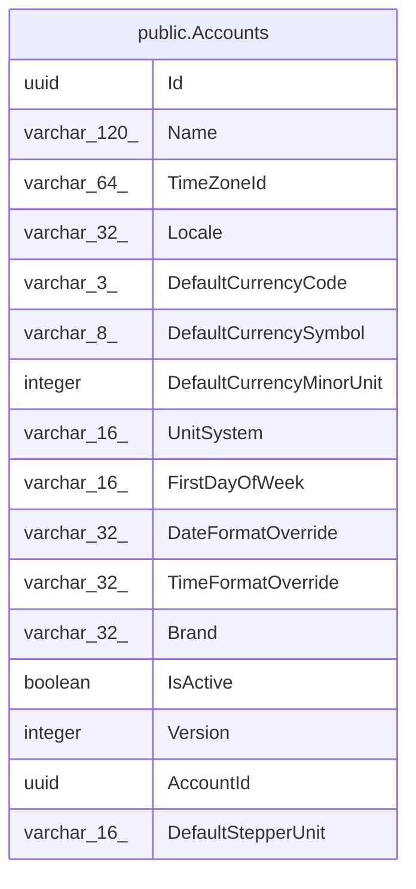

# public.Accounts

## Columns

| Name | Type | Default | Nullable | Children | Parents | Comment |
| ---- | ---- | ------- | -------- | -------- | ------- | ------- |
| Id | uuid |  | false |  |  |  |
| Name | varchar(120) |  | false |  |  |  |
| TimeZoneId | varchar(64) |  | false |  |  |  |
| Locale | varchar(32) |  | false |  |  |  |
| DefaultCurrencyCode | varchar(3) |  | false |  |  |  |
| DefaultCurrencySymbol | varchar(8) |  | true |  |  |  |
| DefaultCurrencyMinorUnit | integer |  | false |  |  |  |
| UnitSystem | varchar(16) |  | false |  |  |  |
| FirstDayOfWeek | varchar(16) |  | true |  |  |  |
| DateFormatOverride | varchar(32) |  | true |  |  |  |
| TimeFormatOverride | varchar(32) |  | true |  |  |  |
| Brand | varchar(32) |  | false |  |  |  |
| IsActive | boolean |  | false |  |  |  |
| Version | integer |  | false |  |  |  |
| AccountId | uuid |  | false |  |  |  |
| DefaultStepperUnit | varchar(16) | 'Individual'::character varying | false |  |  |  |

## Viewpoints

| Name | Definition |
| ---- | ---------- |
| [Platform & operations](viewpoint-4.md) | Tenancy root, audit, jobs, idempotency, seeding bookkeeping. |

## Constraints

| Name | Type | Definition |
| ---- | ---- | ---------- |
| Accounts_AccountId_not_null | n | NOT NULL "AccountId" |
| Accounts_Brand_not_null | n | NOT NULL "Brand" |
| Accounts_DefaultCurrencyCode_not_null | n | NOT NULL "DefaultCurrencyCode" |
| Accounts_DefaultCurrencyMinorUnit_not_null | n | NOT NULL "DefaultCurrencyMinorUnit" |
| Accounts_DefaultStepperUnit_not_null | n | NOT NULL "DefaultStepperUnit" |
| Accounts_Id_not_null | n | NOT NULL "Id" |
| Accounts_IsActive_not_null | n | NOT NULL "IsActive" |
| Accounts_Locale_not_null | n | NOT NULL "Locale" |
| Accounts_Name_not_null | n | NOT NULL "Name" |
| Accounts_TimeZoneId_not_null | n | NOT NULL "TimeZoneId" |
| Accounts_UnitSystem_not_null | n | NOT NULL "UnitSystem" |
| Accounts_Version_not_null | n | NOT NULL "Version" |
| PK_Accounts | PRIMARY KEY | PRIMARY KEY ("Id") |

## Indexes

| Name | Definition |
| ---- | ---------- |
| PK_Accounts | CREATE UNIQUE INDEX "PK_Accounts" ON public."Accounts" USING btree ("Id") |

## Relations

---

> Generated by [tbls](https://github.com/k1LoW/tbls)
