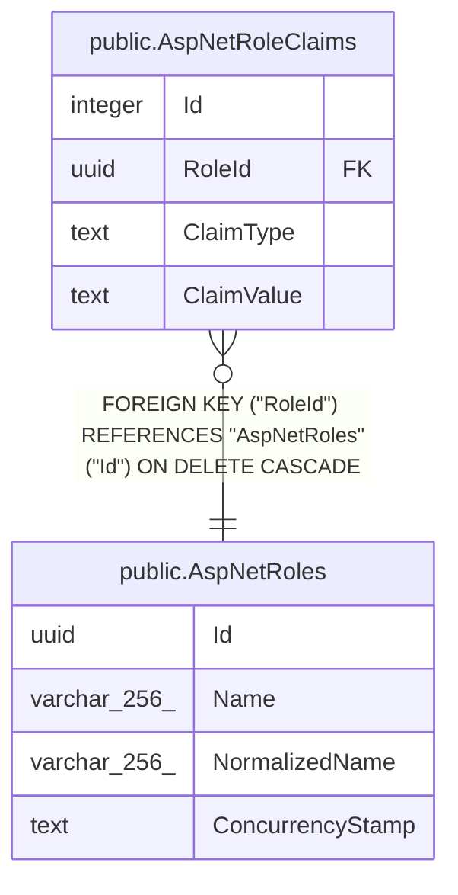

# public.AspNetRoleClaims

## Columns

| Name | Type | Default | Nullable | Children | Parents | Comment |
| ---- | ---- | ------- | -------- | -------- | ------- | ------- |
| Id | integer |  | false |  |  |  |
| RoleId | uuid |  | false |  | [public.AspNetRoles](public.AspNetRoles.md) |  |
| ClaimType | text |  | true |  |  |  |
| ClaimValue | text |  | true |  |  |  |

## Viewpoints

| Name | Definition |
| ---- | ---------- |
| [Identity & access](viewpoint-3.md) | ASP.NET Identity, refresh tokens, per-flock role assignments. |

## Constraints

| Name | Type | Definition |
| ---- | ---- | ---------- |
| AspNetRoleClaims_Id_not_null | n | NOT NULL "Id" |
| AspNetRoleClaims_RoleId_not_null | n | NOT NULL "RoleId" |
| FK_AspNetRoleClaims_AspNetRoles_RoleId | FOREIGN KEY | FOREIGN KEY ("RoleId") REFERENCES "AspNetRoles"("Id") ON DELETE CASCADE |
| PK_AspNetRoleClaims | PRIMARY KEY | PRIMARY KEY ("Id") |

## Indexes

| Name | Definition |
| ---- | ---------- |
| PK_AspNetRoleClaims | CREATE UNIQUE INDEX "PK_AspNetRoleClaims" ON public."AspNetRoleClaims" USING btree ("Id") |
| IX_AspNetRoleClaims_RoleId | CREATE INDEX "IX_AspNetRoleClaims_RoleId" ON public."AspNetRoleClaims" USING btree ("RoleId") |

## Relations

---

> Generated by [tbls](https://github.com/k1LoW/tbls)
