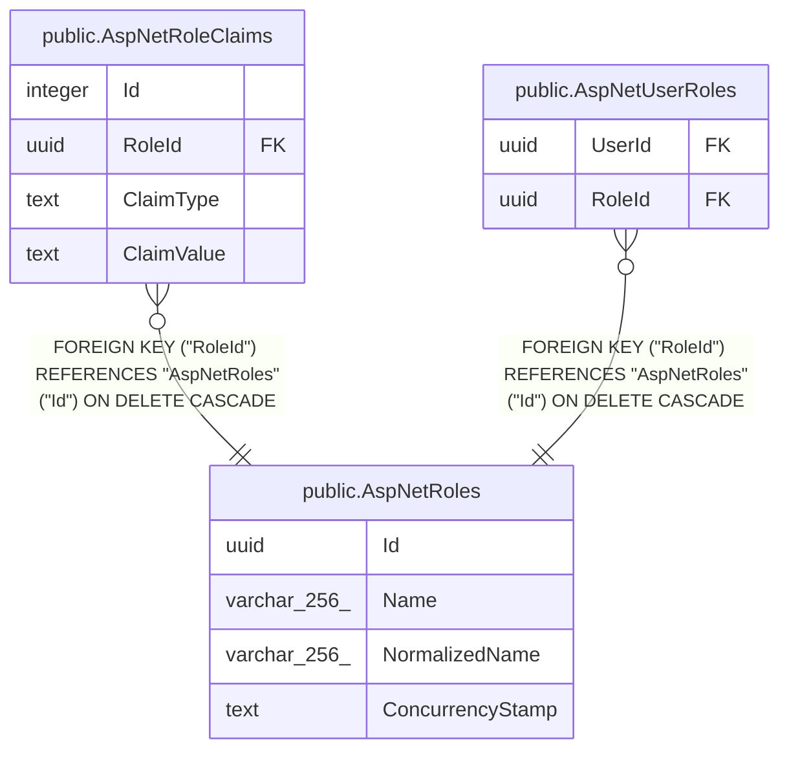

# public.AspNetRoles

## Columns

| Name | Type | Default | Nullable | Children | Parents | Comment |
| ---- | ---- | ------- | -------- | -------- | ------- | ------- |
| Id | uuid |  | false | [public.AspNetRoleClaims](public.AspNetRoleClaims.md) [public.AspNetUserRoles](public.AspNetUserRoles.md) |  |  |
| Name | varchar(256) |  | true |  |  |  |
| NormalizedName | varchar(256) |  | true |  |  |  |
| ConcurrencyStamp | text |  | true |  |  |  |

## Viewpoints

| Name | Definition |
| ---- | ---------- |
| [Identity & access](viewpoint-3.md) | ASP.NET Identity, refresh tokens, per-flock role assignments. |

## Constraints

| Name | Type | Definition |
| ---- | ---- | ---------- |
| AspNetRoles_Id_not_null | n | NOT NULL "Id" |
| PK_AspNetRoles | PRIMARY KEY | PRIMARY KEY ("Id") |

## Indexes

| Name | Definition |
| ---- | ---------- |
| PK_AspNetRoles | CREATE UNIQUE INDEX "PK_AspNetRoles" ON public."AspNetRoles" USING btree ("Id") |
| RoleNameIndex | CREATE UNIQUE INDEX "RoleNameIndex" ON public."AspNetRoles" USING btree ("NormalizedName") |

## Relations

---

> Generated by [tbls](https://github.com/k1LoW/tbls)
