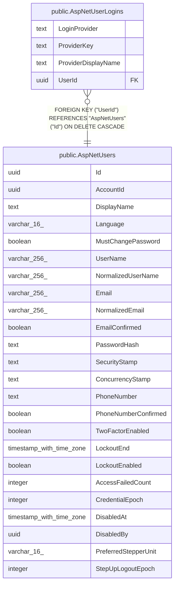

# public.AspNetUserLogins

## Columns

| Name | Type | Default | Nullable | Children | Parents | Comment |
| ---- | ---- | ------- | -------- | -------- | ------- | ------- |
| LoginProvider | text |  | false |  |  |  |
| ProviderKey | text |  | false |  |  |  |
| ProviderDisplayName | text |  | true |  |  |  |
| UserId | uuid |  | false |  | [public.AspNetUsers](public.AspNetUsers.md) |  |

## Viewpoints

| Name | Definition |
| ---- | ---------- |
| [Identity & access](viewpoint-3.md) | ASP.NET Identity, refresh tokens, per-flock role assignments. |

## Constraints

| Name | Type | Definition |
| ---- | ---- | ---------- |
| AspNetUserLogins_LoginProvider_not_null | n | NOT NULL "LoginProvider" |
| AspNetUserLogins_ProviderKey_not_null | n | NOT NULL "ProviderKey" |
| AspNetUserLogins_UserId_not_null | n | NOT NULL "UserId" |
| FK_AspNetUserLogins_AspNetUsers_UserId | FOREIGN KEY | FOREIGN KEY ("UserId") REFERENCES "AspNetUsers"("Id") ON DELETE CASCADE |
| PK_AspNetUserLogins | PRIMARY KEY | PRIMARY KEY ("LoginProvider", "ProviderKey") |

## Indexes

| Name | Definition |
| ---- | ---------- |
| PK_AspNetUserLogins | CREATE UNIQUE INDEX "PK_AspNetUserLogins" ON public."AspNetUserLogins" USING btree ("LoginProvider", "ProviderKey") |
| IX_AspNetUserLogins_UserId | CREATE INDEX "IX_AspNetUserLogins_UserId" ON public."AspNetUserLogins" USING btree ("UserId") |

## Relations

---

> Generated by [tbls](https://github.com/k1LoW/tbls)
