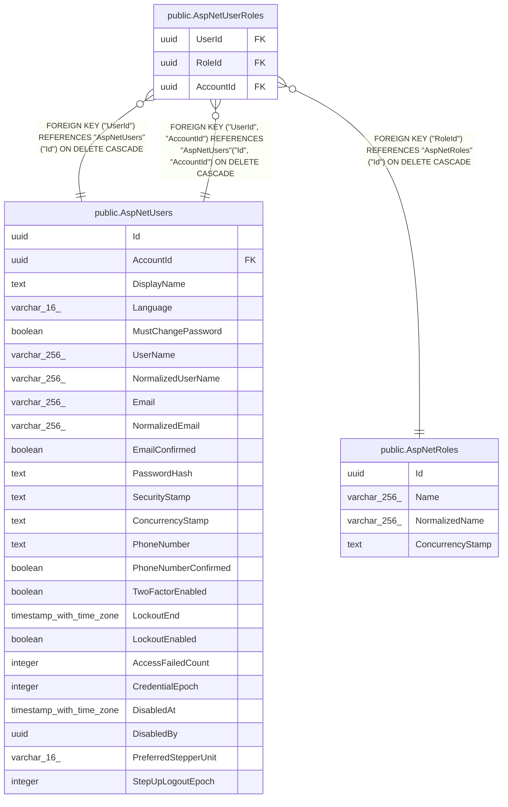

# public.AspNetUserRoles

## Columns

| Name | Type | Default | Nullable | Children | Parents | Comment |
| ---- | ---- | ------- | -------- | -------- | ------- | ------- |
| UserId | uuid |  | false |  | [public.AspNetUsers](public.AspNetUsers.md) |  |
| RoleId | uuid |  | false |  | [public.AspNetRoles](public.AspNetRoles.md) |  |
| AccountId | uuid |  | false |  | [public.AspNetUsers](public.AspNetUsers.md) |  |

## Viewpoints

| Name | Definition |
| ---- | ---------- |
| [Identity & access](viewpoint-3.md) | ASP.NET Identity, refresh tokens, per-flock role assignments. |

## Constraints

| Name | Type | Definition |
| ---- | ---- | ---------- |
| AspNetUserRoles_AccountId_not_null | n | NOT NULL "AccountId" |
| AspNetUserRoles_RoleId_not_null | n | NOT NULL "RoleId" |
| AspNetUserRoles_UserId_not_null | n | NOT NULL "UserId" |
| FK_AspNetUserRoles_AspNetRoles_RoleId | FOREIGN KEY | FOREIGN KEY ("RoleId") REFERENCES "AspNetRoles"("Id") ON DELETE CASCADE |
| FK_AspNetUserRoles_AspNetUsers_UserId | FOREIGN KEY | FOREIGN KEY ("UserId") REFERENCES "AspNetUsers"("Id") ON DELETE CASCADE |
| PK_AspNetUserRoles | PRIMARY KEY | PRIMARY KEY ("UserId", "RoleId") |
| FK_AspNetUserRoles_AspNetUsers_UserId_AccountId | FOREIGN KEY | FOREIGN KEY ("UserId", "AccountId") REFERENCES "AspNetUsers"("Id", "AccountId") ON DELETE CASCADE |

## Indexes

| Name | Definition |
| ---- | ---------- |
| PK_AspNetUserRoles | CREATE UNIQUE INDEX "PK_AspNetUserRoles" ON public."AspNetUserRoles" USING btree ("UserId", "RoleId") |
| IX_AspNetUserRoles_RoleId | CREATE INDEX "IX_AspNetUserRoles_RoleId" ON public."AspNetUserRoles" USING btree ("RoleId") |
| IX_AspNetUserRoles_UserId_AccountId | CREATE INDEX "IX_AspNetUserRoles_UserId_AccountId" ON public."AspNetUserRoles" USING btree ("UserId", "AccountId") |

## Relations

---

> Generated by [tbls](https://github.com/k1LoW/tbls)
