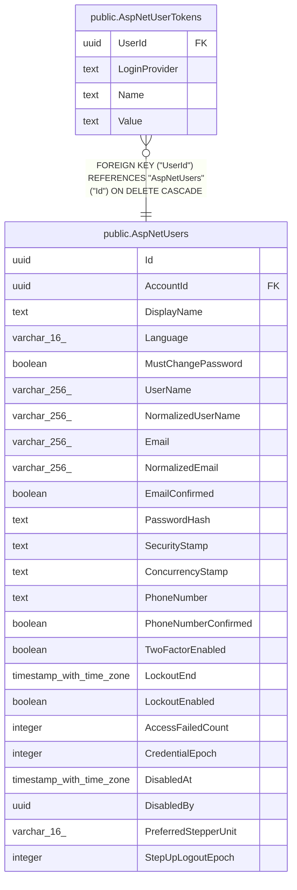

# public.AspNetUserTokens

## Columns

| Name | Type | Default | Nullable | Children | Parents | Comment |
| ---- | ---- | ------- | -------- | -------- | ------- | ------- |
| UserId | uuid |  | false |  | [public.AspNetUsers](public.AspNetUsers.md) |  |
| LoginProvider | text |  | false |  |  |  |
| Name | text |  | false |  |  |  |
| Value | text |  | true |  |  |  |

## Viewpoints

| Name | Definition |
| ---- | ---------- |
| [Identity & access](viewpoint-3.md) | ASP.NET Identity, refresh tokens, per-flock role assignments. |

## Constraints

| Name | Type | Definition |
| ---- | ---- | ---------- |
| AspNetUserTokens_LoginProvider_not_null | n | NOT NULL "LoginProvider" |
| AspNetUserTokens_Name_not_null | n | NOT NULL "Name" |
| AspNetUserTokens_UserId_not_null | n | NOT NULL "UserId" |
| FK_AspNetUserTokens_AspNetUsers_UserId | FOREIGN KEY | FOREIGN KEY ("UserId") REFERENCES "AspNetUsers"("Id") ON DELETE CASCADE |
| PK_AspNetUserTokens | PRIMARY KEY | PRIMARY KEY ("UserId", "LoginProvider", "Name") |

## Indexes

| Name | Definition |
| ---- | ---------- |
| PK_AspNetUserTokens | CREATE UNIQUE INDEX "PK_AspNetUserTokens" ON public."AspNetUserTokens" USING btree ("UserId", "LoginProvider", "Name") |

## Relations

---

> Generated by [tbls](https://github.com/k1LoW/tbls)
