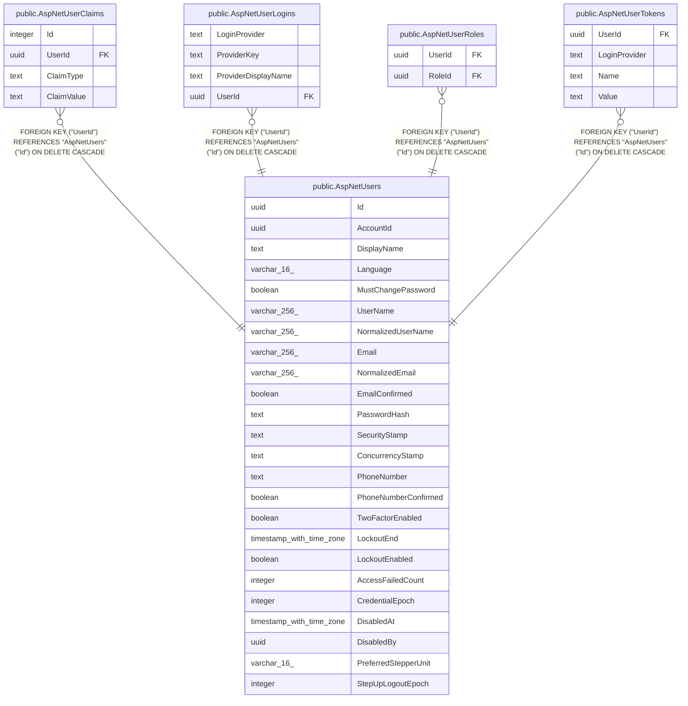

# public.AspNetUsers

## Columns

| Name | Type | Default | Nullable | Children | Parents | Comment |
| ---- | ---- | ------- | -------- | -------- | ------- | ------- |
| Id | uuid |  | false | [public.AspNetUserClaims](public.AspNetUserClaims.md) [public.AspNetUserLogins](public.AspNetUserLogins.md) [public.AspNetUserRoles](public.AspNetUserRoles.md) [public.AspNetUserTokens](public.AspNetUserTokens.md) |  |  |
| AccountId | uuid |  | false |  |  |  |
| DisplayName | text |  | true |  |  |  |
| Language | varchar(16) |  | true |  |  |  |
| MustChangePassword | boolean |  | false |  |  |  |
| UserName | varchar(256) |  | true |  |  |  |
| NormalizedUserName | varchar(256) |  | true |  |  |  |
| Email | varchar(256) |  | true |  |  |  |
| NormalizedEmail | varchar(256) |  | true |  |  |  |
| EmailConfirmed | boolean |  | false |  |  |  |
| PasswordHash | text |  | true |  |  |  |
| SecurityStamp | text |  | true |  |  |  |
| ConcurrencyStamp | text |  | true |  |  |  |
| PhoneNumber | text |  | true |  |  |  |
| PhoneNumberConfirmed | boolean |  | false |  |  |  |
| TwoFactorEnabled | boolean |  | false |  |  |  |
| LockoutEnd | timestamp with time zone |  | true |  |  |  |
| LockoutEnabled | boolean |  | false |  |  |  |
| AccessFailedCount | integer |  | false |  |  |  |
| CredentialEpoch | integer | 1 | false |  |  |  |
| DisabledAt | timestamp with time zone |  | true |  |  |  |
| DisabledBy | uuid |  | true |  |  |  |
| PreferredStepperUnit | varchar(16) |  | true |  |  |  |
| StepUpLogoutEpoch | integer | 0 | false |  |  |  |

## Viewpoints

| Name | Definition |
| ---- | ---------- |
| [Identity & access](viewpoint-3.md) | ASP.NET Identity, refresh tokens, per-flock role assignments. |

## Constraints

| Name | Type | Definition |
| ---- | ---- | ---------- |
| AspNetUsers_AccessFailedCount_not_null | n | NOT NULL "AccessFailedCount" |
| AspNetUsers_AccountId_not_null | n | NOT NULL "AccountId" |
| AspNetUsers_CredentialEpoch_not_null | n | NOT NULL "CredentialEpoch" |
| AspNetUsers_EmailConfirmed_not_null | n | NOT NULL "EmailConfirmed" |
| AspNetUsers_Id_not_null | n | NOT NULL "Id" |
| AspNetUsers_LockoutEnabled_not_null | n | NOT NULL "LockoutEnabled" |
| AspNetUsers_MustChangePassword_not_null | n | NOT NULL "MustChangePassword" |
| AspNetUsers_PhoneNumberConfirmed_not_null | n | NOT NULL "PhoneNumberConfirmed" |
| AspNetUsers_StepUpLogoutEpoch_not_null | n | NOT NULL "StepUpLogoutEpoch" |
| AspNetUsers_TwoFactorEnabled_not_null | n | NOT NULL "TwoFactorEnabled" |
| PK_AspNetUsers | PRIMARY KEY | PRIMARY KEY ("Id") |

## Indexes

| Name | Definition |
| ---- | ---------- |
| PK_AspNetUsers | CREATE UNIQUE INDEX "PK_AspNetUsers" ON public."AspNetUsers" USING btree ("Id") |
| EmailIndex | CREATE INDEX "EmailIndex" ON public."AspNetUsers" USING btree ("NormalizedEmail") |
| UserNameIndex | CREATE UNIQUE INDEX "UserNameIndex" ON public."AspNetUsers" USING btree ("NormalizedUserName") |

## Relations

---

> Generated by [tbls](https://github.com/k1LoW/tbls)
