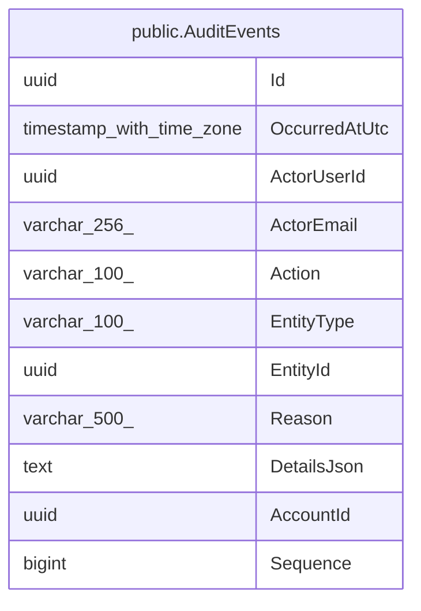

# public.AuditEvents

## Columns

| Name | Type | Default | Nullable | Children | Parents | Comment |
| ---- | ---- | ------- | -------- | -------- | ------- | ------- |
| Id | uuid |  | false |  |  |  |
| OccurredAtUtc | timestamp with time zone |  | false |  |  |  |
| ActorUserId | uuid |  | false |  |  |  |
| ActorEmail | varchar(256) |  | false |  |  |  |
| Action | varchar(100) |  | false |  |  |  |
| EntityType | varchar(100) |  | false |  |  |  |
| EntityId | uuid |  | false |  |  |  |
| Reason | varchar(500) |  | true |  |  |  |
| DetailsJson | text |  | true |  |  |  |
| AccountId | uuid |  | false |  |  |  |
| Sequence | bigint |  | false |  |  |  |

## Viewpoints

| Name | Definition |
| ---- | ---------- |
| [Platform & operations](viewpoint-4.md) | Tenancy root, audit, jobs, idempotency, seeding bookkeeping. |

## Constraints

| Name | Type | Definition |
| ---- | ---- | ---------- |
| AuditEvents_AccountId_not_null | n | NOT NULL "AccountId" |
| AuditEvents_Action_not_null | n | NOT NULL "Action" |
| AuditEvents_ActorEmail_not_null | n | NOT NULL "ActorEmail" |
| AuditEvents_ActorUserId_not_null | n | NOT NULL "ActorUserId" |
| AuditEvents_EntityId_not_null | n | NOT NULL "EntityId" |
| AuditEvents_EntityType_not_null | n | NOT NULL "EntityType" |
| AuditEvents_Id_not_null | n | NOT NULL "Id" |
| AuditEvents_OccurredAtUtc_not_null | n | NOT NULL "OccurredAtUtc" |
| AuditEvents_Sequence_not_null | n | NOT NULL "Sequence" |
| PK_AuditEvents | PRIMARY KEY | PRIMARY KEY ("Id") |

## Indexes

| Name | Definition |
| ---- | ---------- |
| PK_AuditEvents | CREATE UNIQUE INDEX "PK_AuditEvents" ON public."AuditEvents" USING btree ("Id") |
| IX_AuditEvents_AccountId_EntityId | CREATE INDEX "IX_AuditEvents_AccountId_EntityId" ON public."AuditEvents" USING btree ("AccountId", "EntityId") |
| IX_AuditEvents_AccountId_OccurredAtUtc | CREATE INDEX "IX_AuditEvents_AccountId_OccurredAtUtc" ON public."AuditEvents" USING btree ("AccountId", "OccurredAtUtc") |

## Relations

---

> Generated by [tbls](https://github.com/k1LoW/tbls)
