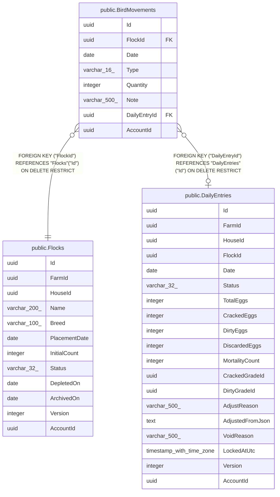

# public.BirdMovements

## Columns

| Name | Type | Default | Nullable | Children | Parents | Comment |
| ---- | ---- | ------- | -------- | -------- | ------- | ------- |
| Id | uuid |  | false |  |  |  |
| FlockId | uuid |  | false |  | [public.Flocks](public.Flocks.md) |  |
| Date | date |  | false |  |  |  |
| Type | varchar(16) |  | false |  |  |  |
| Quantity | integer |  | false |  |  |  |
| Note | varchar(500) |  | true |  |  |  |
| DailyEntryId | uuid |  | true |  | [public.DailyEntries](public.DailyEntries.md) |  |
| AccountId | uuid |  | false |  |  |  |

## Viewpoints

| Name | Definition |
| ---- | ---------- |
| [Flocks & egg production](viewpoint-0.md) | The daily egg loop — flocks, daily entries, grading, lots, movements. |

## Constraints

| Name | Type | Definition |
| ---- | ---- | ---------- |
| BirdMovements_AccountId_not_null | n | NOT NULL "AccountId" |
| BirdMovements_Date_not_null | n | NOT NULL "Date" |
| BirdMovements_FlockId_not_null | n | NOT NULL "FlockId" |
| BirdMovements_Id_not_null | n | NOT NULL "Id" |
| BirdMovements_Quantity_not_null | n | NOT NULL "Quantity" |
| BirdMovements_Type_not_null | n | NOT NULL "Type" |
| FK_BirdMovements_DailyEntries_DailyEntryId | FOREIGN KEY | FOREIGN KEY ("DailyEntryId") REFERENCES "DailyEntries"("Id") ON DELETE RESTRICT |
| FK_BirdMovements_Flocks_FlockId | FOREIGN KEY | FOREIGN KEY ("FlockId") REFERENCES "Flocks"("Id") ON DELETE RESTRICT |
| PK_BirdMovements | PRIMARY KEY | PRIMARY KEY ("Id") |

## Indexes

| Name | Definition |
| ---- | ---------- |
| PK_BirdMovements | CREATE UNIQUE INDEX "PK_BirdMovements" ON public."BirdMovements" USING btree ("Id") |
| IX_BirdMovements_AccountId_FlockId_Date | CREATE INDEX "IX_BirdMovements_AccountId_FlockId_Date" ON public."BirdMovements" USING btree ("AccountId", "FlockId", "Date") |
| IX_BirdMovements_DailyEntryId | CREATE INDEX "IX_BirdMovements_DailyEntryId" ON public."BirdMovements" USING btree ("DailyEntryId") |
| IX_BirdMovements_FlockId | CREATE INDEX "IX_BirdMovements_FlockId" ON public."BirdMovements" USING btree ("FlockId") |

## Relations

---

> Generated by [tbls](https://github.com/k1LoW/tbls)
