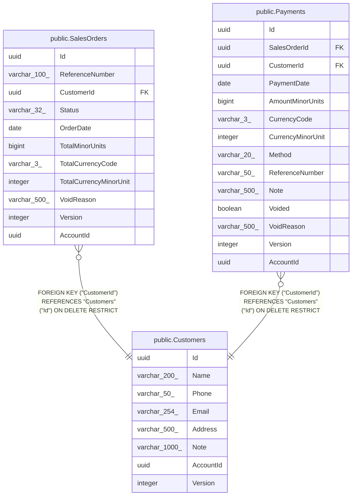

# public.Customers

## Columns

| Name | Type | Default | Nullable | Children | Parents | Comment |
| ---- | ---- | ------- | -------- | -------- | ------- | ------- |
| Id | uuid |  | false | [public.SalesOrders](public.SalesOrders.md) [public.Payments](public.Payments.md) |  |  |
| Name | varchar(200) |  | false |  |  |  |
| Phone | varchar(50) |  | false |  |  |  |
| Email | varchar(254) |  | true |  |  |  |
| Address | varchar(500) |  | true |  |  |  |
| Note | varchar(1000) |  | true |  |  |  |
| AccountId | uuid |  | false |  |  |  |
| Version | integer | 0 | false |  |  |  |

## Viewpoints

| Name | Definition |
| ---- | ---------- |
| [Sales & finance](viewpoint-2.md) | Customers, orders, FIFO allocations, payments, expenses, products. |

## Constraints

| Name | Type | Definition |
| ---- | ---- | ---------- |
| Customers_AccountId_not_null | n | NOT NULL "AccountId" |
| Customers_Id_not_null | n | NOT NULL "Id" |
| Customers_Name_not_null | n | NOT NULL "Name" |
| Customers_Phone_not_null | n | NOT NULL "Phone" |
| Customers_Version_not_null | n | NOT NULL "Version" |
| PK_Customers | PRIMARY KEY | PRIMARY KEY ("Id") |

## Indexes

| Name | Definition |
| ---- | ---------- |
| PK_Customers | CREATE UNIQUE INDEX "PK_Customers" ON public."Customers" USING btree ("Id") |
| IX_Customers_AccountId_Name | CREATE INDEX "IX_Customers_AccountId_Name" ON public."Customers" USING btree ("AccountId", "Name") |

## Relations

---

> Generated by [tbls](https://github.com/k1LoW/tbls)
