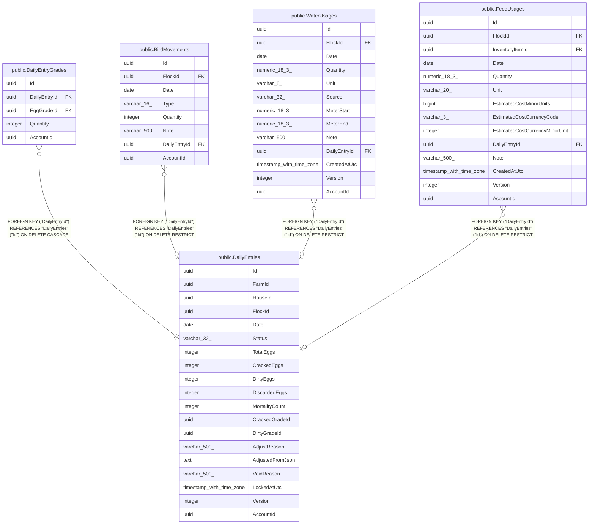

# public.DailyEntries

## Columns

| Name | Type | Default | Nullable | Children | Parents | Comment |
| ---- | ---- | ------- | -------- | -------- | ------- | ------- |
| Id | uuid |  | false | [public.DailyEntryGrades](public.DailyEntryGrades.md) [public.BirdMovements](public.BirdMovements.md) [public.WaterUsages](public.WaterUsages.md) [public.FeedUsages](public.FeedUsages.md) |  |  |
| FarmId | uuid |  | false |  |  |  |
| HouseId | uuid |  | false |  |  |  |
| FlockId | uuid |  | false |  |  |  |
| Date | date |  | false |  |  |  |
| Status | varchar(32) |  | false |  |  |  |
| TotalEggs | integer |  | false |  |  |  |
| CrackedEggs | integer |  | false |  |  |  |
| DirtyEggs | integer |  | false |  |  |  |
| DiscardedEggs | integer |  | false |  |  |  |
| MortalityCount | integer |  | false |  |  |  |
| CrackedGradeId | uuid |  | true |  |  |  |
| DirtyGradeId | uuid |  | true |  |  |  |
| AdjustReason | varchar(500) |  | true |  |  |  |
| AdjustedFromJson | text |  | true |  |  |  |
| VoidReason | varchar(500) |  | true |  |  |  |
| LockedAtUtc | timestamp with time zone |  | true |  |  |  |
| Version | integer |  | false |  |  |  |
| AccountId | uuid |  | false |  |  |  |

## Viewpoints

| Name | Definition |
| ---- | ---------- |
| [Flocks & egg production](viewpoint-0.md) | The daily egg loop — flocks, daily entries, grading, lots, movements. |

## Constraints

| Name | Type | Definition |
| ---- | ---- | ---------- |
| DailyEntries_AccountId_not_null | n | NOT NULL "AccountId" |
| DailyEntries_CrackedEggs_not_null | n | NOT NULL "CrackedEggs" |
| DailyEntries_Date_not_null | n | NOT NULL "Date" |
| DailyEntries_DirtyEggs_not_null | n | NOT NULL "DirtyEggs" |
| DailyEntries_DiscardedEggs_not_null | n | NOT NULL "DiscardedEggs" |
| DailyEntries_FarmId_not_null | n | NOT NULL "FarmId" |
| DailyEntries_FlockId_not_null | n | NOT NULL "FlockId" |
| DailyEntries_HouseId_not_null | n | NOT NULL "HouseId" |
| DailyEntries_Id_not_null | n | NOT NULL "Id" |
| DailyEntries_MortalityCount_not_null | n | NOT NULL "MortalityCount" |
| DailyEntries_Status_not_null | n | NOT NULL "Status" |
| DailyEntries_TotalEggs_not_null | n | NOT NULL "TotalEggs" |
| DailyEntries_Version_not_null | n | NOT NULL "Version" |
| PK_DailyEntries | PRIMARY KEY | PRIMARY KEY ("Id") |

## Indexes

| Name | Definition |
| ---- | ---------- |
| PK_DailyEntries | CREATE UNIQUE INDEX "PK_DailyEntries" ON public."DailyEntries" USING btree ("Id") |
| IX_DailyEntries_NaturalKey | CREATE UNIQUE INDEX "IX_DailyEntries_NaturalKey" ON public."DailyEntries" USING btree ("AccountId", "FarmId", "HouseId", "FlockId", "Date") WHERE (("Status")::text <> 'Voided'::text) |

## Relations

---

> Generated by [tbls](https://github.com/k1LoW/tbls)
