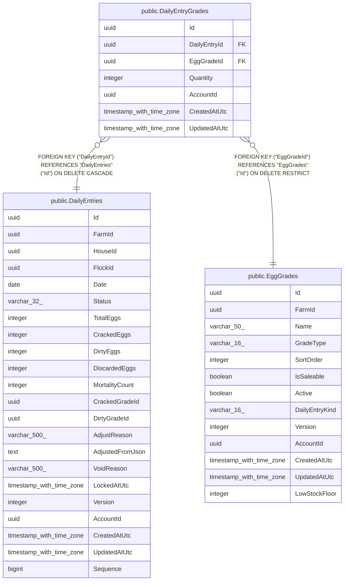

# public.DailyEntryGrades

## Columns

| Name | Type | Default | Nullable | Children | Parents | Comment |
| ---- | ---- | ------- | -------- | -------- | ------- | ------- |
| Id | uuid |  | false |  |  |  |
| DailyEntryId | uuid |  | false |  | [public.DailyEntries](public.DailyEntries.md) |  |
| EggGradeId | uuid |  | false |  | [public.EggGrades](public.EggGrades.md) |  |
| Quantity | integer |  | false |  |  |  |
| AccountId | uuid |  | false |  |  |  |
| CreatedAtUtc | timestamp with time zone |  | false |  |  |  |
| UpdatedAtUtc | timestamp with time zone |  | false |  |  |  |

## Viewpoints

| Name | Definition |
| ---- | ---------- |
| [Flocks & egg production](viewpoint-0.md) | The daily egg loop — flocks, daily entries, grading, lots, movements. |

## Constraints

| Name | Type | Definition |
| ---- | ---- | ---------- |
| DailyEntryGrades_AccountId_not_null | n | NOT NULL "AccountId" |
| DailyEntryGrades_CreatedAtUtc_not_null | n | NOT NULL "CreatedAtUtc" |
| DailyEntryGrades_DailyEntryId_not_null | n | NOT NULL "DailyEntryId" |
| DailyEntryGrades_EggGradeId_not_null | n | NOT NULL "EggGradeId" |
| DailyEntryGrades_Id_not_null | n | NOT NULL "Id" |
| DailyEntryGrades_Quantity_not_null | n | NOT NULL "Quantity" |
| DailyEntryGrades_UpdatedAtUtc_not_null | n | NOT NULL "UpdatedAtUtc" |
| FK_DailyEntryGrades_DailyEntries_DailyEntryId | FOREIGN KEY | FOREIGN KEY ("DailyEntryId") REFERENCES "DailyEntries"("Id") ON DELETE CASCADE |
| FK_DailyEntryGrades_EggGrades_EggGradeId | FOREIGN KEY | FOREIGN KEY ("EggGradeId") REFERENCES "EggGrades"("Id") ON DELETE RESTRICT |
| PK_DailyEntryGrades | PRIMARY KEY | PRIMARY KEY ("Id") |

## Indexes

| Name | Definition |
| ---- | ---------- |
| PK_DailyEntryGrades | CREATE UNIQUE INDEX "PK_DailyEntryGrades" ON public."DailyEntryGrades" USING btree ("Id") |
| IX_DailyEntryGrades_AccountId | CREATE INDEX "IX_DailyEntryGrades_AccountId" ON public."DailyEntryGrades" USING btree ("AccountId") |
| IX_DailyEntryGrades_DailyEntryId_EggGradeId | CREATE UNIQUE INDEX "IX_DailyEntryGrades_DailyEntryId_EggGradeId" ON public."DailyEntryGrades" USING btree ("DailyEntryId", "EggGradeId") |
| IX_DailyEntryGrades_EggGradeId | CREATE INDEX "IX_DailyEntryGrades_EggGradeId" ON public."DailyEntryGrades" USING btree ("EggGradeId") |

## Triggers

| Name | Definition |
| ---- | ---------- |
| TR_DailyEntryGrades_BusinessRecordTimestamps | CREATE TRIGGER "TR_DailyEntryGrades_BusinessRecordTimestamps" BEFORE INSERT OR UPDATE ON public."DailyEntryGrades" FOR EACH ROW EXECUTE FUNCTION "StampMutableBusinessRecord"() |

## Relations

---

> Generated by [tbls](https://github.com/k1LoW/tbls)
