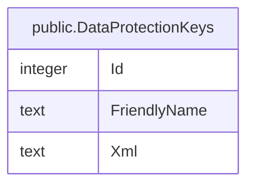

# public.DataProtectionKeys

## Columns

| Name | Type | Default | Nullable | Children | Parents | Comment |
| ---- | ---- | ------- | -------- | -------- | ------- | ------- |
| Id | integer |  | false |  |  |  |
| FriendlyName | text |  | true |  |  |  |
| Xml | text |  | true |  |  |  |

## Constraints

| Name | Type | Definition |
| ---- | ---- | ---------- |
| DataProtectionKeys_Id_not_null | n | NOT NULL "Id" |
| PK_DataProtectionKeys | PRIMARY KEY | PRIMARY KEY ("Id") |

## Indexes

| Name | Definition |
| ---- | ---------- |
| PK_DataProtectionKeys | CREATE UNIQUE INDEX "PK_DataProtectionKeys" ON public."DataProtectionKeys" USING btree ("Id") |

## Relations

---

> Generated by [tbls](https://github.com/k1LoW/tbls)
