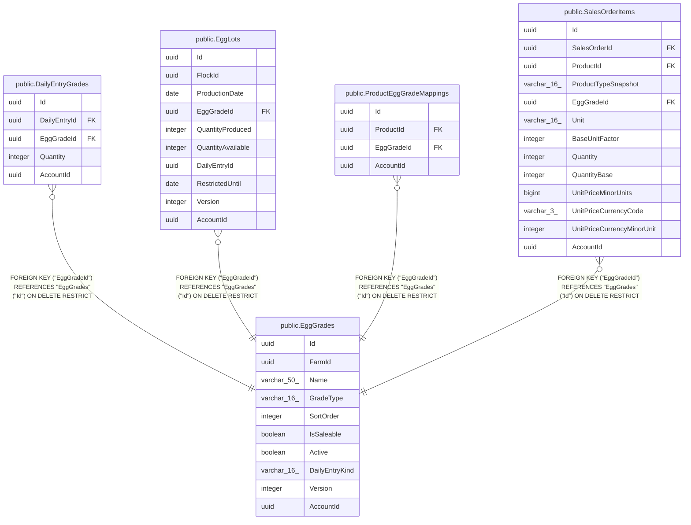

# public.EggGrades

## Columns

| Name | Type | Default | Nullable | Children | Parents | Comment |
| ---- | ---- | ------- | -------- | -------- | ------- | ------- |
| Id | uuid |  | false | [public.DailyEntryGrades](public.DailyEntryGrades.md) [public.EggLots](public.EggLots.md) [public.ProductEggGradeMappings](public.ProductEggGradeMappings.md) [public.SalesOrderItems](public.SalesOrderItems.md) |  |  |
| FarmId | uuid |  | false |  |  |  |
| Name | varchar(50) |  | false |  |  |  |
| GradeType | varchar(16) |  | false |  |  |  |
| SortOrder | integer |  | false |  |  |  |
| IsSaleable | boolean |  | false |  |  |  |
| Active | boolean |  | false |  |  |  |
| DailyEntryKind | varchar(16) | 'Manual'::character varying | false |  |  |  |
| Version | integer |  | false |  |  |  |
| AccountId | uuid |  | false |  |  |  |

## Viewpoints

| Name | Definition |
| ---- | ---------- |
| [Flocks & egg production](viewpoint-0.md) | The daily egg loop — flocks, daily entries, grading, lots, movements. |
| [Sales & finance](viewpoint-2.md) | Customers, orders, FIFO allocations, payments, expenses, products. |

## Constraints

| Name | Type | Definition |
| ---- | ---- | ---------- |
| EggGrades_AccountId_not_null | n | NOT NULL "AccountId" |
| EggGrades_Active_not_null | n | NOT NULL "Active" |
| EggGrades_DailyEntryKind_not_null | n | NOT NULL "DailyEntryKind" |
| EggGrades_FarmId_not_null | n | NOT NULL "FarmId" |
| EggGrades_GradeType_not_null | n | NOT NULL "GradeType" |
| EggGrades_Id_not_null | n | NOT NULL "Id" |
| EggGrades_IsSaleable_not_null | n | NOT NULL "IsSaleable" |
| EggGrades_Name_not_null | n | NOT NULL "Name" |
| EggGrades_SortOrder_not_null | n | NOT NULL "SortOrder" |
| EggGrades_Version_not_null | n | NOT NULL "Version" |
| PK_EggGrades | PRIMARY KEY | PRIMARY KEY ("Id") |

## Indexes

| Name | Definition |
| ---- | ---------- |
| PK_EggGrades | CREATE UNIQUE INDEX "PK_EggGrades" ON public."EggGrades" USING btree ("Id") |
| IX_EggGrades_AccountId_FarmId_DailyEntryKind | CREATE UNIQUE INDEX "IX_EggGrades_AccountId_FarmId_DailyEntryKind" ON public."EggGrades" USING btree ("AccountId", "FarmId", "DailyEntryKind") WHERE (("DailyEntryKind")::text <> 'Manual'::text) |
| IX_EggGrades_AccountId_FarmId_LowerName | CREATE UNIQUE INDEX "IX_EggGrades_AccountId_FarmId_LowerName" ON public."EggGrades" USING btree ("AccountId", "FarmId", lower(("Name")::text)) |

## Relations

---

> Generated by [tbls](https://github.com/k1LoW/tbls)
