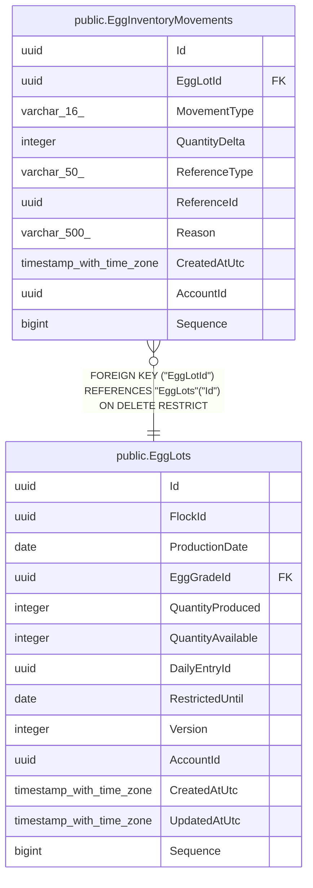

# public.EggInventoryMovements

## Columns

| Name | Type | Default | Nullable | Children | Parents | Comment |
| ---- | ---- | ------- | -------- | -------- | ------- | ------- |
| Id | uuid |  | false |  |  |  |
| EggLotId | uuid |  | false |  | [public.EggLots](public.EggLots.md) |  |
| MovementType | varchar(16) |  | false |  |  |  |
| QuantityDelta | integer |  | false |  |  |  |
| ReferenceType | varchar(50) |  | false |  |  |  |
| ReferenceId | uuid |  | false |  |  |  |
| Reason | varchar(500) |  | true |  |  |  |
| CreatedAtUtc | timestamp with time zone |  | false |  |  |  |
| AccountId | uuid |  | false |  |  |  |
| Sequence | bigint |  | false |  |  |  |

## Viewpoints

| Name | Definition |
| ---- | ---------- |
| [Flocks & egg production](viewpoint-0.md) | The daily egg loop — flocks, daily entries, grading, lots, movements. |

## Constraints

| Name | Type | Definition |
| ---- | ---- | ---------- |
| EggInventoryMovements_AccountId_not_null | n | NOT NULL "AccountId" |
| EggInventoryMovements_CreatedAtUtc_not_null | n | NOT NULL "CreatedAtUtc" |
| EggInventoryMovements_EggLotId_not_null | n | NOT NULL "EggLotId" |
| EggInventoryMovements_Id_not_null | n | NOT NULL "Id" |
| EggInventoryMovements_MovementType_not_null | n | NOT NULL "MovementType" |
| EggInventoryMovements_QuantityDelta_not_null | n | NOT NULL "QuantityDelta" |
| EggInventoryMovements_ReferenceId_not_null | n | NOT NULL "ReferenceId" |
| EggInventoryMovements_ReferenceType_not_null | n | NOT NULL "ReferenceType" |
| EggInventoryMovements_Sequence_not_null | n | NOT NULL "Sequence" |
| FK_EggInventoryMovements_EggLots_EggLotId | FOREIGN KEY | FOREIGN KEY ("EggLotId") REFERENCES "EggLots"("Id") ON DELETE RESTRICT |
| PK_EggInventoryMovements | PRIMARY KEY | PRIMARY KEY ("Id") |

## Indexes

| Name | Definition |
| ---- | ---------- |
| PK_EggInventoryMovements | CREATE UNIQUE INDEX "PK_EggInventoryMovements" ON public."EggInventoryMovements" USING btree ("Id") |
| IX_EggInventoryMovements_AccountId_EggLotId_CreatedAtUtc | CREATE INDEX "IX_EggInventoryMovements_AccountId_EggLotId_CreatedAtUtc" ON public."EggInventoryMovements" USING btree ("AccountId", "EggLotId", "CreatedAtUtc") |
| IX_EggInventoryMovements_EggLotId | CREATE INDEX "IX_EggInventoryMovements_EggLotId" ON public."EggInventoryMovements" USING btree ("EggLotId") |
| IX_EggInventoryMovements_Sequence | CREATE UNIQUE INDEX "IX_EggInventoryMovements_Sequence" ON public."EggInventoryMovements" USING btree ("Sequence") |

## Triggers

| Name | Definition |
| ---- | ---------- |
| TR_EggInventoryMovements_BusinessRecordTimestamps | CREATE TRIGGER "TR_EggInventoryMovements_BusinessRecordTimestamps" BEFORE INSERT OR UPDATE ON public."EggInventoryMovements" FOR EACH ROW EXECUTE FUNCTION "StampCreatedBusinessRecord"() |

## Relations

---

> Generated by [tbls](https://github.com/k1LoW/tbls)
