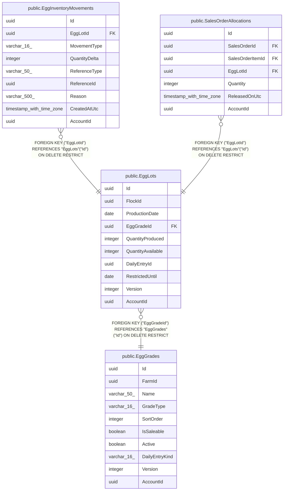

# public.EggLots

## Columns

| Name | Type | Default | Nullable | Children | Parents | Comment |
| ---- | ---- | ------- | -------- | -------- | ------- | ------- |
| Id | uuid |  | false | [public.EggInventoryMovements](public.EggInventoryMovements.md) [public.SalesOrderAllocations](public.SalesOrderAllocations.md) |  |  |
| FlockId | uuid |  | false |  |  |  |
| ProductionDate | date |  | false |  |  |  |
| EggGradeId | uuid |  | false |  | [public.EggGrades](public.EggGrades.md) |  |
| QuantityProduced | integer |  | false |  |  |  |
| QuantityAvailable | integer |  | false |  |  |  |
| DailyEntryId | uuid |  | true |  |  |  |
| RestrictedUntil | date |  | true |  |  |  |
| Version | integer |  | false |  |  |  |
| AccountId | uuid |  | false |  |  |  |

## Viewpoints

| Name | Definition |
| ---- | ---------- |
| [Flocks & egg production](viewpoint-0.md) | The daily egg loop — flocks, daily entries, grading, lots, movements. |
| [Sales & finance](viewpoint-2.md) | Customers, orders, FIFO allocations, payments, expenses, products. |

## Constraints

| Name | Type | Definition |
| ---- | ---- | ---------- |
| EggLots_AccountId_not_null | n | NOT NULL "AccountId" |
| EggLots_EggGradeId_not_null | n | NOT NULL "EggGradeId" |
| EggLots_FlockId_not_null | n | NOT NULL "FlockId" |
| EggLots_Id_not_null | n | NOT NULL "Id" |
| EggLots_ProductionDate_not_null | n | NOT NULL "ProductionDate" |
| EggLots_QuantityAvailable_not_null | n | NOT NULL "QuantityAvailable" |
| EggLots_QuantityProduced_not_null | n | NOT NULL "QuantityProduced" |
| EggLots_Version_not_null | n | NOT NULL "Version" |
| FK_EggLots_EggGrades_EggGradeId | FOREIGN KEY | FOREIGN KEY ("EggGradeId") REFERENCES "EggGrades"("Id") ON DELETE RESTRICT |
| PK_EggLots | PRIMARY KEY | PRIMARY KEY ("Id") |

## Indexes

| Name | Definition |
| ---- | ---------- |
| PK_EggLots | CREATE UNIQUE INDEX "PK_EggLots" ON public."EggLots" USING btree ("Id") |
| IX_EggLots_Allocation | CREATE INDEX "IX_EggLots_Allocation" ON public."EggLots" USING btree ("AccountId", "EggGradeId", "ProductionDate", "QuantityAvailable") |
| IX_EggLots_DailyEntryId | CREATE INDEX "IX_EggLots_DailyEntryId" ON public."EggLots" USING btree ("DailyEntryId") |
| IX_EggLots_EggGradeId | CREATE INDEX "IX_EggLots_EggGradeId" ON public."EggLots" USING btree ("EggGradeId") |

## Relations

---

> Generated by [tbls](https://github.com/k1LoW/tbls)
