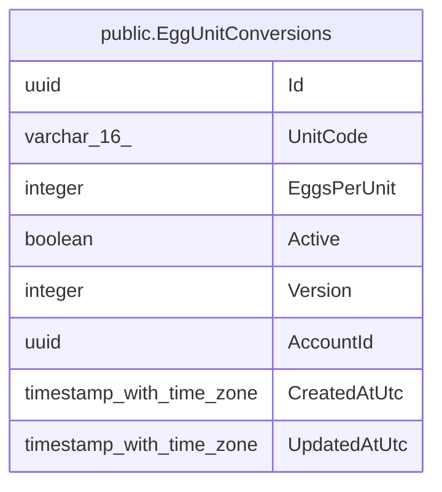

# public.EggUnitConversions

## Columns

| Name | Type | Default | Nullable | Children | Parents | Comment |
| ---- | ---- | ------- | -------- | -------- | ------- | ------- |
| Id | uuid |  | false |  |  |  |
| UnitCode | varchar(16) |  | false |  |  |  |
| EggsPerUnit | integer |  | false |  |  |  |
| Active | boolean |  | false |  |  |  |
| Version | integer |  | false |  |  |  |
| AccountId | uuid |  | false |  |  |  |
| CreatedAtUtc | timestamp with time zone |  | false |  |  |  |
| UpdatedAtUtc | timestamp with time zone |  | false |  |  |  |

## Viewpoints

| Name | Definition |
| ---- | ---------- |
| [Flocks & egg production](viewpoint-0.md) | The daily egg loop — flocks, daily entries, grading, lots, movements. |

## Constraints

| Name | Type | Definition |
| ---- | ---- | ---------- |
| EggUnitConversions_AccountId_not_null | n | NOT NULL "AccountId" |
| EggUnitConversions_Active_not_null | n | NOT NULL "Active" |
| EggUnitConversions_CreatedAtUtc_not_null | n | NOT NULL "CreatedAtUtc" |
| EggUnitConversions_EggsPerUnit_not_null | n | NOT NULL "EggsPerUnit" |
| EggUnitConversions_Id_not_null | n | NOT NULL "Id" |
| EggUnitConversions_UnitCode_not_null | n | NOT NULL "UnitCode" |
| EggUnitConversions_UpdatedAtUtc_not_null | n | NOT NULL "UpdatedAtUtc" |
| EggUnitConversions_Version_not_null | n | NOT NULL "Version" |
| PK_EggUnitConversions | PRIMARY KEY | PRIMARY KEY ("Id") |

## Indexes

| Name | Definition |
| ---- | ---------- |
| PK_EggUnitConversions | CREATE UNIQUE INDEX "PK_EggUnitConversions" ON public."EggUnitConversions" USING btree ("Id") |
| IX_EggUnitConversions_AccountId_UnitCode | CREATE UNIQUE INDEX "IX_EggUnitConversions_AccountId_UnitCode" ON public."EggUnitConversions" USING btree ("AccountId", "UnitCode") |

## Triggers

| Name | Definition |
| ---- | ---------- |
| TR_EggUnitConversions_BusinessRecordTimestamps | CREATE TRIGGER "TR_EggUnitConversions_BusinessRecordTimestamps" BEFORE INSERT OR UPDATE ON public."EggUnitConversions" FOR EACH ROW EXECUTE FUNCTION "StampMutableBusinessRecord"() |

## Relations

---

> Generated by [tbls](https://github.com/k1LoW/tbls)
