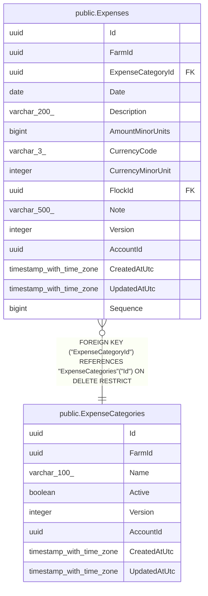

# public.ExpenseCategories

## Columns

| Name | Type | Default | Nullable | Children | Parents | Comment |
| ---- | ---- | ------- | -------- | -------- | ------- | ------- |
| Id | uuid |  | false | [public.Expenses](public.Expenses.md) |  |  |
| FarmId | uuid |  | false |  |  |  |
| Name | varchar(100) |  | false |  |  |  |
| Active | boolean |  | false |  |  |  |
| Version | integer |  | false |  |  |  |
| AccountId | uuid |  | false |  |  |  |
| CreatedAtUtc | timestamp with time zone |  | false |  |  |  |
| UpdatedAtUtc | timestamp with time zone |  | false |  |  |  |

## Viewpoints

| Name | Definition |
| ---- | ---------- |
| [Sales & finance](viewpoint-2.md) | Customers, orders, FIFO allocations, payments, expenses, products. |

## Constraints

| Name | Type | Definition |
| ---- | ---- | ---------- |
| ExpenseCategories_AccountId_not_null | n | NOT NULL "AccountId" |
| ExpenseCategories_Active_not_null | n | NOT NULL "Active" |
| ExpenseCategories_CreatedAtUtc_not_null | n | NOT NULL "CreatedAtUtc" |
| ExpenseCategories_FarmId_not_null | n | NOT NULL "FarmId" |
| ExpenseCategories_Id_not_null | n | NOT NULL "Id" |
| ExpenseCategories_Name_not_null | n | NOT NULL "Name" |
| ExpenseCategories_UpdatedAtUtc_not_null | n | NOT NULL "UpdatedAtUtc" |
| ExpenseCategories_Version_not_null | n | NOT NULL "Version" |
| PK_ExpenseCategories | PRIMARY KEY | PRIMARY KEY ("Id") |

## Indexes

| Name | Definition |
| ---- | ---------- |
| PK_ExpenseCategories | CREATE UNIQUE INDEX "PK_ExpenseCategories" ON public."ExpenseCategories" USING btree ("Id") |
| IX_ExpenseCategories_NameCi | CREATE UNIQUE INDEX "IX_ExpenseCategories_NameCi" ON public."ExpenseCategories" USING btree ("AccountId", "FarmId", lower(("Name")::text)) |

## Triggers

| Name | Definition |
| ---- | ---------- |
| TR_ExpenseCategories_BusinessRecordTimestamps | CREATE TRIGGER "TR_ExpenseCategories_BusinessRecordTimestamps" BEFORE INSERT OR UPDATE ON public."ExpenseCategories" FOR EACH ROW EXECUTE FUNCTION "StampMutableBusinessRecord"() |

## Relations

---

> Generated by [tbls](https://github.com/k1LoW/tbls)
