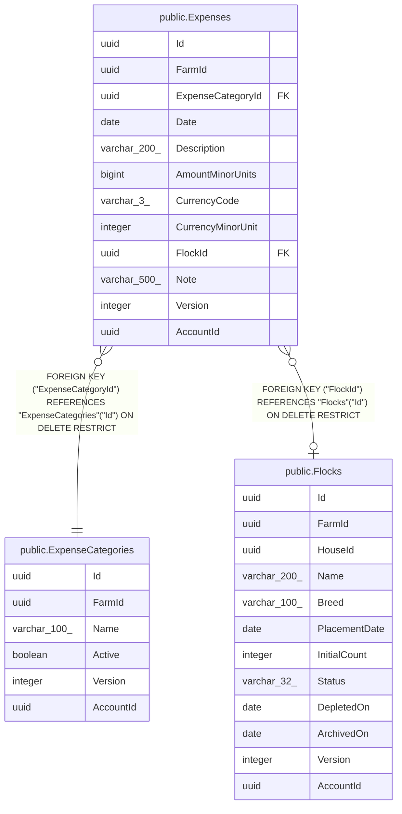

# public.Expenses

## Columns

| Name | Type | Default | Nullable | Children | Parents | Comment |
| ---- | ---- | ------- | -------- | -------- | ------- | ------- |
| Id | uuid |  | false |  |  |  |
| FarmId | uuid |  | false |  |  |  |
| ExpenseCategoryId | uuid |  | false |  | [public.ExpenseCategories](public.ExpenseCategories.md) |  |
| Date | date |  | false |  |  |  |
| Description | varchar(200) |  | false |  |  |  |
| AmountMinorUnits | bigint |  | false |  |  |  |
| CurrencyCode | varchar(3) |  | false |  |  |  |
| CurrencyMinorUnit | integer |  | false |  |  |  |
| FlockId | uuid |  | true |  | [public.Flocks](public.Flocks.md) |  |
| Note | varchar(500) |  | true |  |  |  |
| Version | integer |  | false |  |  |  |
| AccountId | uuid |  | false |  |  |  |

## Viewpoints

| Name | Definition |
| ---- | ---------- |
| [Sales & finance](viewpoint-2.md) | Customers, orders, FIFO allocations, payments, expenses, products. |

## Constraints

| Name | Type | Definition |
| ---- | ---- | ---------- |
| Expenses_AccountId_not_null | n | NOT NULL "AccountId" |
| Expenses_AmountMinorUnits_not_null | n | NOT NULL "AmountMinorUnits" |
| Expenses_CurrencyCode_not_null | n | NOT NULL "CurrencyCode" |
| Expenses_CurrencyMinorUnit_not_null | n | NOT NULL "CurrencyMinorUnit" |
| Expenses_Date_not_null | n | NOT NULL "Date" |
| Expenses_Description_not_null | n | NOT NULL "Description" |
| Expenses_ExpenseCategoryId_not_null | n | NOT NULL "ExpenseCategoryId" |
| Expenses_FarmId_not_null | n | NOT NULL "FarmId" |
| Expenses_Id_not_null | n | NOT NULL "Id" |
| Expenses_Version_not_null | n | NOT NULL "Version" |
| FK_Expenses_ExpenseCategories_ExpenseCategoryId | FOREIGN KEY | FOREIGN KEY ("ExpenseCategoryId") REFERENCES "ExpenseCategories"("Id") ON DELETE RESTRICT |
| FK_Expenses_Flocks_FlockId | FOREIGN KEY | FOREIGN KEY ("FlockId") REFERENCES "Flocks"("Id") ON DELETE RESTRICT |
| PK_Expenses | PRIMARY KEY | PRIMARY KEY ("Id") |

## Indexes

| Name | Definition |
| ---- | ---------- |
| PK_Expenses | CREATE UNIQUE INDEX "PK_Expenses" ON public."Expenses" USING btree ("Id") |
| IX_Expenses_AccountId_Date | CREATE INDEX "IX_Expenses_AccountId_Date" ON public."Expenses" USING btree ("AccountId", "Date") |
| IX_Expenses_AccountId_ExpenseCategoryId | CREATE INDEX "IX_Expenses_AccountId_ExpenseCategoryId" ON public."Expenses" USING btree ("AccountId", "ExpenseCategoryId") |
| IX_Expenses_ExpenseCategoryId | CREATE INDEX "IX_Expenses_ExpenseCategoryId" ON public."Expenses" USING btree ("ExpenseCategoryId") |
| IX_Expenses_FlockId | CREATE INDEX "IX_Expenses_FlockId" ON public."Expenses" USING btree ("FlockId") |

## Relations

---

> Generated by [tbls](https://github.com/k1LoW/tbls)
