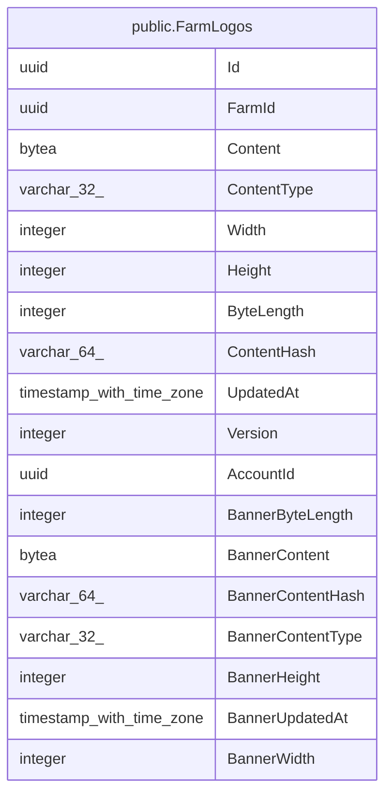

# public.FarmLogos

## Columns

| Name | Type | Default | Nullable | Children | Parents | Comment |
| ---- | ---- | ------- | -------- | -------- | ------- | ------- |
| Id | uuid |  | false |  |  |  |
| FarmId | uuid |  | false |  |  |  |
| Content | bytea |  | true |  |  |  |
| ContentType | varchar(32) |  | true |  |  |  |
| Width | integer |  | true |  |  |  |
| Height | integer |  | true |  |  |  |
| ByteLength | integer |  | true |  |  |  |
| ContentHash | varchar(64) |  | true |  |  |  |
| UpdatedAt | timestamp with time zone |  | true |  |  |  |
| Version | integer |  | false |  |  |  |
| AccountId | uuid |  | false |  |  |  |
| BannerByteLength | integer |  | true |  |  |  |
| BannerContent | bytea |  | true |  |  |  |
| BannerContentHash | varchar(64) |  | true |  |  |  |
| BannerContentType | varchar(32) |  | true |  |  |  |
| BannerHeight | integer |  | true |  |  |  |
| BannerUpdatedAt | timestamp with time zone |  | true |  |  |  |
| BannerWidth | integer |  | true |  |  |  |

## Viewpoints

| Name | Definition |
| ---- | ---------- |
| [Platform & operations](viewpoint-4.md) | Tenancy root, audit, jobs, idempotency, seeding bookkeeping. |

## Constraints

| Name | Type | Definition |
| ---- | ---- | ---------- |
| FarmLogos_AccountId_not_null | n | NOT NULL "AccountId" |
| FarmLogos_FarmId_not_null | n | NOT NULL "FarmId" |
| FarmLogos_Id_not_null | n | NOT NULL "Id" |
| FarmLogos_Version_not_null | n | NOT NULL "Version" |
| ck_farm_logos_banner_content_length | CHECK | CHECK ((("BannerContent" IS NULL) OR ((octet_length("BannerContent") > 0) AND (octet_length("BannerContent") <= 15728640)))) |
| ck_farm_logos_content_length | CHECK | CHECK ((("Content" IS NULL) OR ((octet_length("Content") > 0) AND (octet_length("Content") <= 5242880)))) |
| PK_FarmLogos | PRIMARY KEY | PRIMARY KEY ("Id") |

## Indexes

| Name | Definition |
| ---- | ---------- |
| PK_FarmLogos | CREATE UNIQUE INDEX "PK_FarmLogos" ON public."FarmLogos" USING btree ("Id") |
| IX_FarmLogos_AccountId_FarmId | CREATE UNIQUE INDEX "IX_FarmLogos_AccountId_FarmId" ON public."FarmLogos" USING btree ("AccountId", "FarmId") |

## Relations

---

> Generated by [tbls](https://github.com/k1LoW/tbls)
