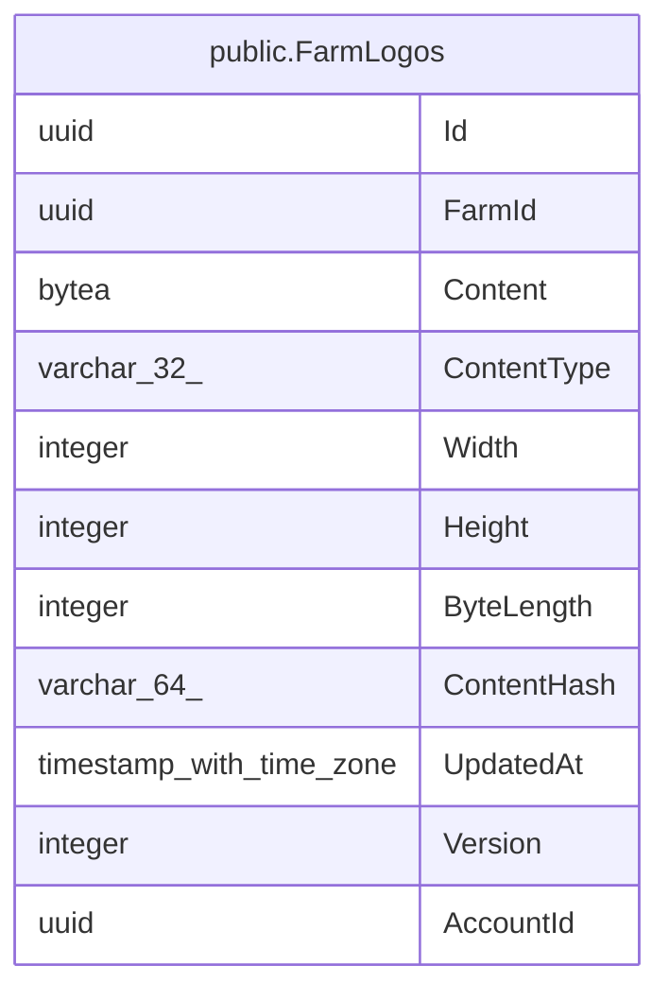

# public.FarmLogos

## Columns

| Name | Type | Default | Nullable | Children | Parents | Comment |
| ---- | ---- | ------- | -------- | -------- | ------- | ------- |
| Id | uuid |  | false |  |  |  |
| FarmId | uuid |  | false |  |  |  |
| Content | bytea |  | false |  |  |  |
| ContentType | varchar(32) |  | false |  |  |  |
| Width | integer |  | false |  |  |  |
| Height | integer |  | false |  |  |  |
| ByteLength | integer |  | false |  |  |  |
| ContentHash | varchar(64) |  | false |  |  |  |
| UpdatedAt | timestamp with time zone |  | false |  |  |  |
| Version | integer |  | false |  |  |  |
| AccountId | uuid |  | false |  |  |  |

## Viewpoints

| Name | Definition |
| ---- | ---------- |
| [Platform & operations](viewpoint-4.md) | Tenancy root, audit, jobs, idempotency, seeding bookkeeping. |

## Constraints

| Name | Type | Definition |
| ---- | ---- | ---------- |
| FarmLogos_AccountId_not_null | n | NOT NULL "AccountId" |
| FarmLogos_ByteLength_not_null | n | NOT NULL "ByteLength" |
| FarmLogos_ContentHash_not_null | n | NOT NULL "ContentHash" |
| FarmLogos_ContentType_not_null | n | NOT NULL "ContentType" |
| FarmLogos_Content_not_null | n | NOT NULL "Content" |
| FarmLogos_FarmId_not_null | n | NOT NULL "FarmId" |
| FarmLogos_Height_not_null | n | NOT NULL "Height" |
| FarmLogos_Id_not_null | n | NOT NULL "Id" |
| FarmLogos_UpdatedAt_not_null | n | NOT NULL "UpdatedAt" |
| FarmLogos_Version_not_null | n | NOT NULL "Version" |
| FarmLogos_Width_not_null | n | NOT NULL "Width" |
| ck_farm_logos_content_length | CHECK | CHECK (((octet_length("Content") > 0) AND (octet_length("Content") <= 5242880))) |
| PK_FarmLogos | PRIMARY KEY | PRIMARY KEY ("Id") |

## Indexes

| Name | Definition |
| ---- | ---------- |
| PK_FarmLogos | CREATE UNIQUE INDEX "PK_FarmLogos" ON public."FarmLogos" USING btree ("Id") |
| IX_FarmLogos_AccountId_FarmId | CREATE UNIQUE INDEX "IX_FarmLogos_AccountId_FarmId" ON public."FarmLogos" USING btree ("AccountId", "FarmId") |

## Relations

---

> Generated by [tbls](https://github.com/k1LoW/tbls)
