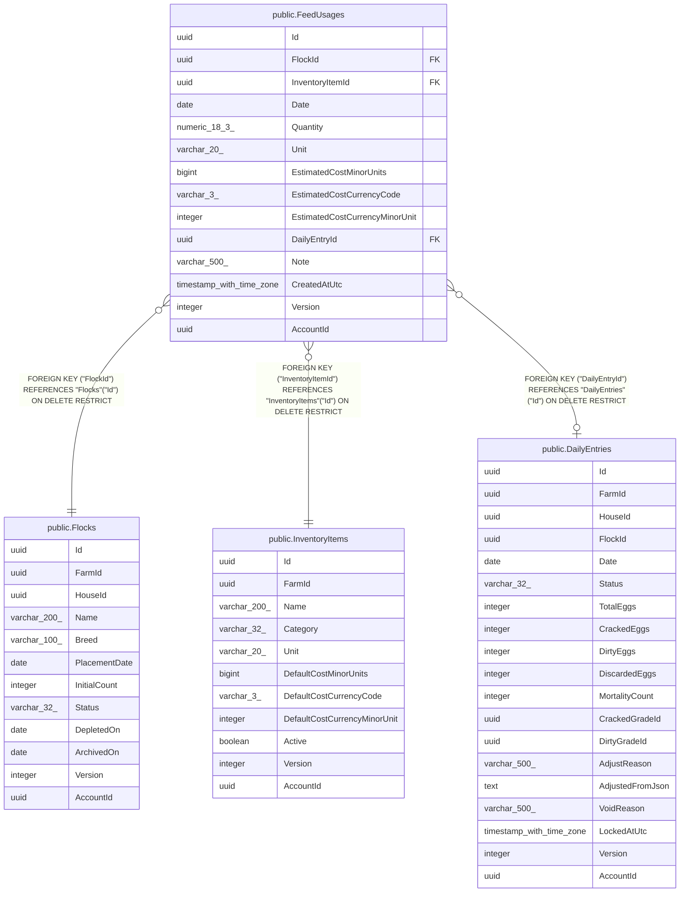

# public.FeedUsages

## Columns

| Name | Type | Default | Nullable | Children | Parents | Comment |
| ---- | ---- | ------- | -------- | -------- | ------- | ------- |
| Id | uuid |  | false |  |  |  |
| FlockId | uuid |  | false |  | [public.Flocks](public.Flocks.md) |  |
| InventoryItemId | uuid |  | false |  | [public.InventoryItems](public.InventoryItems.md) |  |
| Date | date |  | false |  |  |  |
| Quantity | numeric(18,3) |  | false |  |  |  |
| Unit | varchar(20) |  | false |  |  |  |
| EstimatedCostMinorUnits | bigint |  | false |  |  |  |
| EstimatedCostCurrencyCode | varchar(3) |  | false |  |  |  |
| EstimatedCostCurrencyMinorUnit | integer |  | false |  |  |  |
| DailyEntryId | uuid |  | true |  | [public.DailyEntries](public.DailyEntries.md) |  |
| Note | varchar(500) |  | true |  |  |  |
| CreatedAtUtc | timestamp with time zone |  | false |  |  |  |
| Version | integer |  | false |  |  |  |
| AccountId | uuid |  | false |  |  |  |

## Viewpoints

| Name | Definition |
| ---- | ---------- |
| [Flocks & egg production](viewpoint-0.md) | The daily egg loop — flocks, daily entries, grading, lots, movements. |
| [Feed & supply inventory](viewpoint-1.md) | Purchasable supplies, FIFO lots, and the movement ledger. |

## Constraints

| Name | Type | Definition |
| ---- | ---- | ---------- |
| FeedUsages_AccountId_not_null | n | NOT NULL "AccountId" |
| FeedUsages_CreatedAtUtc_not_null | n | NOT NULL "CreatedAtUtc" |
| FeedUsages_Date_not_null | n | NOT NULL "Date" |
| FeedUsages_EstimatedCostCurrencyCode_not_null | n | NOT NULL "EstimatedCostCurrencyCode" |
| FeedUsages_EstimatedCostCurrencyMinorUnit_not_null | n | NOT NULL "EstimatedCostCurrencyMinorUnit" |
| FeedUsages_EstimatedCostMinorUnits_not_null | n | NOT NULL "EstimatedCostMinorUnits" |
| FeedUsages_FlockId_not_null | n | NOT NULL "FlockId" |
| FeedUsages_Id_not_null | n | NOT NULL "Id" |
| FeedUsages_InventoryItemId_not_null | n | NOT NULL "InventoryItemId" |
| FeedUsages_Quantity_not_null | n | NOT NULL "Quantity" |
| FeedUsages_Unit_not_null | n | NOT NULL "Unit" |
| FeedUsages_Version_not_null | n | NOT NULL "Version" |
| FK_FeedUsages_DailyEntries_DailyEntryId | FOREIGN KEY | FOREIGN KEY ("DailyEntryId") REFERENCES "DailyEntries"("Id") ON DELETE RESTRICT |
| FK_FeedUsages_Flocks_FlockId | FOREIGN KEY | FOREIGN KEY ("FlockId") REFERENCES "Flocks"("Id") ON DELETE RESTRICT |
| FK_FeedUsages_InventoryItems_InventoryItemId | FOREIGN KEY | FOREIGN KEY ("InventoryItemId") REFERENCES "InventoryItems"("Id") ON DELETE RESTRICT |
| PK_FeedUsages | PRIMARY KEY | PRIMARY KEY ("Id") |

## Indexes

| Name | Definition |
| ---- | ---------- |
| PK_FeedUsages | CREATE UNIQUE INDEX "PK_FeedUsages" ON public."FeedUsages" USING btree ("Id") |
| IX_FeedUsages_DailyEntryId | CREATE INDEX "IX_FeedUsages_DailyEntryId" ON public."FeedUsages" USING btree ("DailyEntryId") |
| IX_FeedUsages_FlockId_Date | CREATE INDEX "IX_FeedUsages_FlockId_Date" ON public."FeedUsages" USING btree ("FlockId", "Date") |
| IX_FeedUsages_InventoryItemId_Date | CREATE INDEX "IX_FeedUsages_InventoryItemId_Date" ON public."FeedUsages" USING btree ("InventoryItemId", "Date") |

## Relations

---

> Generated by [tbls](https://github.com/k1LoW/tbls)
