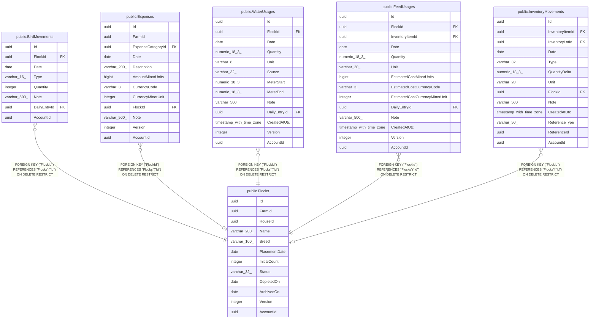

# public.Flocks

## Columns

| Name | Type | Default | Nullable | Children | Parents | Comment |
| ---- | ---- | ------- | -------- | -------- | ------- | ------- |
| Id | uuid |  | false | [public.BirdMovements](public.BirdMovements.md) [public.Expenses](public.Expenses.md) [public.WaterUsages](public.WaterUsages.md) [public.FeedUsages](public.FeedUsages.md) [public.InventoryMovements](public.InventoryMovements.md) |  |  |
| FarmId | uuid |  | false |  |  |  |
| HouseId | uuid |  | false |  |  |  |
| Name | varchar(200) |  | false |  |  |  |
| Breed | varchar(100) |  | false |  |  |  |
| PlacementDate | date |  | false |  |  |  |
| InitialCount | integer |  | false |  |  |  |
| Status | varchar(32) |  | false |  |  |  |
| DepletedOn | date |  | true |  |  |  |
| ArchivedOn | date |  | true |  |  |  |
| Version | integer |  | false |  |  |  |
| AccountId | uuid |  | false |  |  |  |

## Viewpoints

| Name | Definition |
| ---- | ---------- |
| [Flocks & egg production](viewpoint-0.md) | The daily egg loop — flocks, daily entries, grading, lots, movements. |
| [Feed & supply inventory](viewpoint-1.md) | Purchasable supplies, FIFO lots, and the movement ledger. |

## Constraints

| Name | Type | Definition |
| ---- | ---- | ---------- |
| Flocks_AccountId_not_null | n | NOT NULL "AccountId" |
| Flocks_Breed_not_null | n | NOT NULL "Breed" |
| Flocks_FarmId_not_null | n | NOT NULL "FarmId" |
| Flocks_HouseId_not_null | n | NOT NULL "HouseId" |
| Flocks_Id_not_null | n | NOT NULL "Id" |
| Flocks_InitialCount_not_null | n | NOT NULL "InitialCount" |
| Flocks_Name_not_null | n | NOT NULL "Name" |
| Flocks_PlacementDate_not_null | n | NOT NULL "PlacementDate" |
| Flocks_Status_not_null | n | NOT NULL "Status" |
| Flocks_Version_not_null | n | NOT NULL "Version" |
| PK_Flocks | PRIMARY KEY | PRIMARY KEY ("Id") |

## Indexes

| Name | Definition |
| ---- | ---------- |
| PK_Flocks | CREATE UNIQUE INDEX "PK_Flocks" ON public."Flocks" USING btree ("Id") |
| IX_Flocks_AccountId_FarmId_HouseId | CREATE INDEX "IX_Flocks_AccountId_FarmId_HouseId" ON public."Flocks" USING btree ("AccountId", "FarmId", "HouseId") |

## Relations

---

> Generated by [tbls](https://github.com/k1LoW/tbls)
