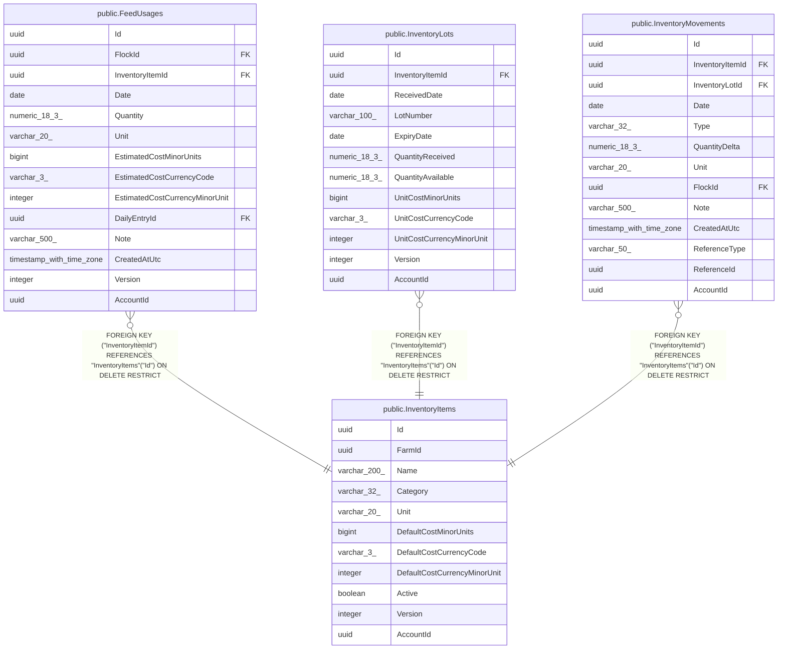

# public.InventoryItems

## Columns

| Name | Type | Default | Nullable | Children | Parents | Comment |
| ---- | ---- | ------- | -------- | -------- | ------- | ------- |
| Id | uuid |  | false | [public.FeedUsages](public.FeedUsages.md) [public.InventoryLots](public.InventoryLots.md) [public.InventoryMovements](public.InventoryMovements.md) |  |  |
| FarmId | uuid |  | false |  |  |  |
| Name | varchar(200) |  | false |  |  |  |
| Category | varchar(32) |  | false |  |  |  |
| Unit | varchar(20) |  | false |  |  |  |
| DefaultCostMinorUnits | bigint |  | true |  |  |  |
| DefaultCostCurrencyCode | varchar(3) |  | true |  |  |  |
| DefaultCostCurrencyMinorUnit | integer |  | true |  |  |  |
| Active | boolean |  | false |  |  |  |
| Version | integer |  | false |  |  |  |
| AccountId | uuid |  | false |  |  |  |

## Viewpoints

| Name | Definition |
| ---- | ---------- |
| [Feed & supply inventory](viewpoint-1.md) | Purchasable supplies, FIFO lots, and the movement ledger. |

## Constraints

| Name | Type | Definition |
| ---- | ---- | ---------- |
| InventoryItems_AccountId_not_null | n | NOT NULL "AccountId" |
| InventoryItems_Active_not_null | n | NOT NULL "Active" |
| InventoryItems_Category_not_null | n | NOT NULL "Category" |
| InventoryItems_FarmId_not_null | n | NOT NULL "FarmId" |
| InventoryItems_Id_not_null | n | NOT NULL "Id" |
| InventoryItems_Name_not_null | n | NOT NULL "Name" |
| InventoryItems_Unit_not_null | n | NOT NULL "Unit" |
| InventoryItems_Version_not_null | n | NOT NULL "Version" |
| PK_InventoryItems | PRIMARY KEY | PRIMARY KEY ("Id") |

## Indexes

| Name | Definition |
| ---- | ---------- |
| PK_InventoryItems | CREATE UNIQUE INDEX "PK_InventoryItems" ON public."InventoryItems" USING btree ("Id") |
| IX_InventoryItems_AccountId_FarmId | CREATE INDEX "IX_InventoryItems_AccountId_FarmId" ON public."InventoryItems" USING btree ("AccountId", "FarmId") |
| UX_InventoryItems_Account_Farm_LowerName | CREATE UNIQUE INDEX "UX_InventoryItems_Account_Farm_LowerName" ON public."InventoryItems" USING btree ("AccountId", "FarmId", lower(("Name")::text)) |

## Relations

---

> Generated by [tbls](https://github.com/k1LoW/tbls)
