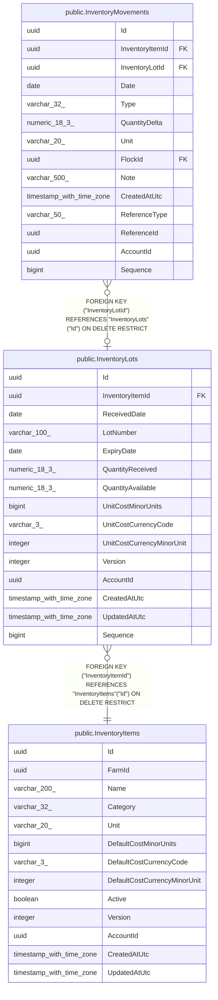

# public.InventoryLots

## Columns

| Name | Type | Default | Nullable | Children | Parents | Comment |
| ---- | ---- | ------- | -------- | -------- | ------- | ------- |
| Id | uuid |  | false | [public.InventoryMovements](public.InventoryMovements.md) |  |  |
| InventoryItemId | uuid |  | false |  | [public.InventoryItems](public.InventoryItems.md) |  |
| ReceivedDate | date |  | false |  |  |  |
| LotNumber | varchar(100) |  | true |  |  |  |
| ExpiryDate | date |  | true |  |  |  |
| QuantityReceived | numeric(18,3) |  | false |  |  |  |
| QuantityAvailable | numeric(18,3) |  | false |  |  |  |
| UnitCostMinorUnits | bigint |  | false |  |  |  |
| UnitCostCurrencyCode | varchar(3) |  | false |  |  |  |
| UnitCostCurrencyMinorUnit | integer |  | false |  |  |  |
| Version | integer |  | false |  |  |  |
| AccountId | uuid |  | false |  |  |  |
| CreatedAtUtc | timestamp with time zone |  | false |  |  |  |
| UpdatedAtUtc | timestamp with time zone |  | false |  |  |  |
| Sequence | bigint |  | false |  |  |  |

## Viewpoints

| Name | Definition |
| ---- | ---------- |
| [Feed & supply inventory](viewpoint-1.md) | Purchasable supplies, FIFO lots, and the movement ledger. |

## Constraints

| Name | Type | Definition |
| ---- | ---- | ---------- |
| InventoryLots_AccountId_not_null | n | NOT NULL "AccountId" |
| InventoryLots_CreatedAtUtc_not_null | n | NOT NULL "CreatedAtUtc" |
| InventoryLots_Id_not_null | n | NOT NULL "Id" |
| InventoryLots_InventoryItemId_not_null | n | NOT NULL "InventoryItemId" |
| InventoryLots_QuantityAvailable_not_null | n | NOT NULL "QuantityAvailable" |
| InventoryLots_QuantityReceived_not_null | n | NOT NULL "QuantityReceived" |
| InventoryLots_ReceivedDate_not_null | n | NOT NULL "ReceivedDate" |
| InventoryLots_Sequence_not_null | n | NOT NULL "Sequence" |
| InventoryLots_UnitCostCurrencyCode_not_null | n | NOT NULL "UnitCostCurrencyCode" |
| InventoryLots_UnitCostCurrencyMinorUnit_not_null | n | NOT NULL "UnitCostCurrencyMinorUnit" |
| InventoryLots_UnitCostMinorUnits_not_null | n | NOT NULL "UnitCostMinorUnits" |
| InventoryLots_UpdatedAtUtc_not_null | n | NOT NULL "UpdatedAtUtc" |
| InventoryLots_Version_not_null | n | NOT NULL "Version" |
| FK_InventoryLots_InventoryItems_InventoryItemId | FOREIGN KEY | FOREIGN KEY ("InventoryItemId") REFERENCES "InventoryItems"("Id") ON DELETE RESTRICT |
| PK_InventoryLots | PRIMARY KEY | PRIMARY KEY ("Id") |

## Indexes

| Name | Definition |
| ---- | ---------- |
| PK_InventoryLots | CREATE UNIQUE INDEX "PK_InventoryLots" ON public."InventoryLots" USING btree ("Id") |
| IX_InventoryLots_InventoryItemId_ReceivedDate | CREATE INDEX "IX_InventoryLots_InventoryItemId_ReceivedDate" ON public."InventoryLots" USING btree ("InventoryItemId", "ReceivedDate") |
| IX_InventoryLots_Sequence | CREATE UNIQUE INDEX "IX_InventoryLots_Sequence" ON public."InventoryLots" USING btree ("Sequence") |

## Triggers

| Name | Definition |
| ---- | ---------- |
| TR_InventoryLots_BusinessRecordTimestamps | CREATE TRIGGER "TR_InventoryLots_BusinessRecordTimestamps" BEFORE INSERT OR UPDATE ON public."InventoryLots" FOR EACH ROW EXECUTE FUNCTION "StampMutableBusinessRecord"() |

## Relations

---

> Generated by [tbls](https://github.com/k1LoW/tbls)
