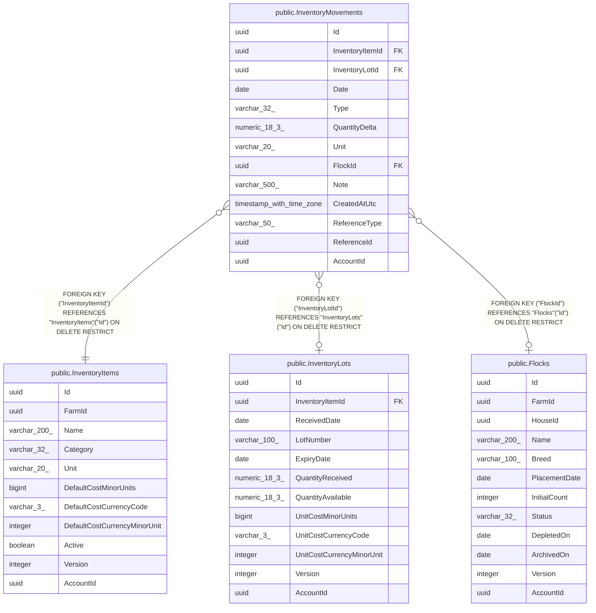

# public.InventoryMovements

## Columns

| Name | Type | Default | Nullable | Children | Parents | Comment |
| ---- | ---- | ------- | -------- | -------- | ------- | ------- |
| Id | uuid |  | false |  |  |  |
| InventoryItemId | uuid |  | false |  | [public.InventoryItems](public.InventoryItems.md) |  |
| InventoryLotId | uuid |  | true |  | [public.InventoryLots](public.InventoryLots.md) |  |
| Date | date |  | false |  |  |  |
| Type | varchar(32) |  | false |  |  |  |
| QuantityDelta | numeric(18,3) |  | false |  |  |  |
| Unit | varchar(20) |  | false |  |  |  |
| FlockId | uuid |  | true |  | [public.Flocks](public.Flocks.md) |  |
| Note | varchar(500) |  | true |  |  |  |
| CreatedAtUtc | timestamp with time zone |  | false |  |  |  |
| ReferenceType | varchar(50) |  | true |  |  |  |
| ReferenceId | uuid |  | true |  |  |  |
| AccountId | uuid |  | false |  |  |  |

## Viewpoints

| Name | Definition |
| ---- | ---------- |
| [Feed & supply inventory](viewpoint-1.md) | Purchasable supplies, FIFO lots, and the movement ledger. |

## Constraints

| Name | Type | Definition |
| ---- | ---- | ---------- |
| InventoryMovements_AccountId_not_null | n | NOT NULL "AccountId" |
| InventoryMovements_CreatedAtUtc_not_null | n | NOT NULL "CreatedAtUtc" |
| InventoryMovements_Date_not_null | n | NOT NULL "Date" |
| InventoryMovements_Id_not_null | n | NOT NULL "Id" |
| InventoryMovements_InventoryItemId_not_null | n | NOT NULL "InventoryItemId" |
| InventoryMovements_QuantityDelta_not_null | n | NOT NULL "QuantityDelta" |
| InventoryMovements_Type_not_null | n | NOT NULL "Type" |
| InventoryMovements_Unit_not_null | n | NOT NULL "Unit" |
| FK_InventoryMovements_Flocks_FlockId | FOREIGN KEY | FOREIGN KEY ("FlockId") REFERENCES "Flocks"("Id") ON DELETE RESTRICT |
| FK_InventoryMovements_InventoryItems_InventoryItemId | FOREIGN KEY | FOREIGN KEY ("InventoryItemId") REFERENCES "InventoryItems"("Id") ON DELETE RESTRICT |
| FK_InventoryMovements_InventoryLots_InventoryLotId | FOREIGN KEY | FOREIGN KEY ("InventoryLotId") REFERENCES "InventoryLots"("Id") ON DELETE RESTRICT |
| PK_InventoryMovements | PRIMARY KEY | PRIMARY KEY ("Id") |

## Indexes

| Name | Definition |
| ---- | ---------- |
| PK_InventoryMovements | CREATE UNIQUE INDEX "PK_InventoryMovements" ON public."InventoryMovements" USING btree ("Id") |
| IX_InventoryMovements_FlockId | CREATE INDEX "IX_InventoryMovements_FlockId" ON public."InventoryMovements" USING btree ("FlockId") |
| IX_InventoryMovements_InventoryItemId_Date | CREATE INDEX "IX_InventoryMovements_InventoryItemId_Date" ON public."InventoryMovements" USING btree ("InventoryItemId", "Date") |
| IX_InventoryMovements_InventoryLotId | CREATE INDEX "IX_InventoryMovements_InventoryLotId" ON public."InventoryMovements" USING btree ("InventoryLotId") |

## Relations

---

> Generated by [tbls](https://github.com/k1LoW/tbls)
