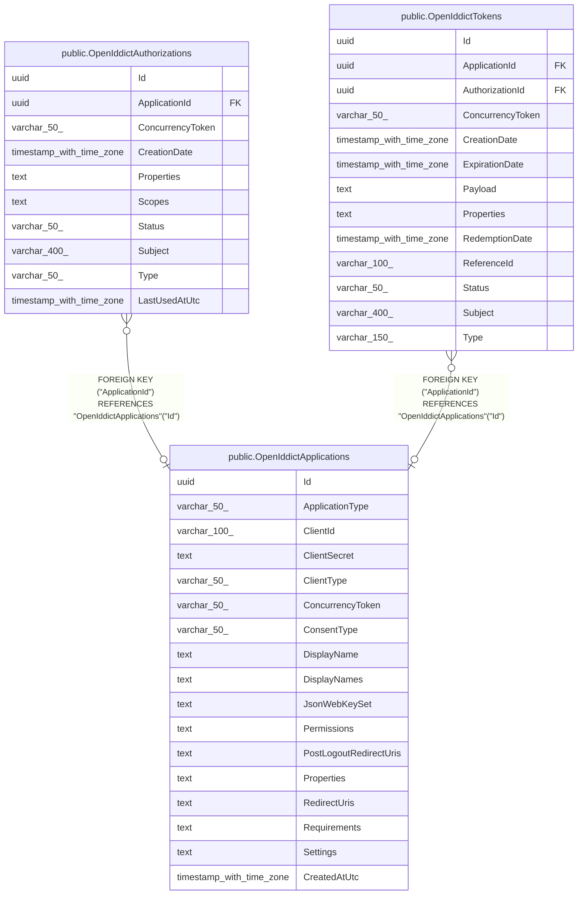

# public.OpenIddictApplications

## Columns

| Name | Type | Default | Nullable | Children | Parents | Comment |
| ---- | ---- | ------- | -------- | -------- | ------- | ------- |
| Id | uuid |  | false | [public.OpenIddictAuthorizations](public.OpenIddictAuthorizations.md) [public.OpenIddictTokens](public.OpenIddictTokens.md) |  |  |
| ApplicationType | varchar(50) |  | true |  |  |  |
| ClientId | varchar(100) |  | true |  |  |  |
| ClientSecret | text |  | true |  |  |  |
| ClientType | varchar(50) |  | true |  |  |  |
| ConcurrencyToken | varchar(50) |  | true |  |  |  |
| ConsentType | varchar(50) |  | true |  |  |  |
| DisplayName | text |  | true |  |  |  |
| DisplayNames | text |  | true |  |  |  |
| JsonWebKeySet | text |  | true |  |  |  |
| Permissions | text |  | true |  |  |  |
| PostLogoutRedirectUris | text |  | true |  |  |  |
| Properties | text |  | true |  |  |  |
| RedirectUris | text |  | true |  |  |  |
| Requirements | text |  | true |  |  |  |
| Settings | text |  | true |  |  |  |
| CreatedAtUtc | timestamp with time zone |  | false |  |  |  |

## Constraints

| Name | Type | Definition |
| ---- | ---- | ---------- |
| OpenIddictApplications_CreatedAtUtc_not_null | n | NOT NULL "CreatedAtUtc" |
| OpenIddictApplications_Id_not_null | n | NOT NULL "Id" |
| PK_OpenIddictApplications | PRIMARY KEY | PRIMARY KEY ("Id") |

## Indexes

| Name | Definition |
| ---- | ---------- |
| PK_OpenIddictApplications | CREATE UNIQUE INDEX "PK_OpenIddictApplications" ON public."OpenIddictApplications" USING btree ("Id") |
| IX_OpenIddictApplications_ClientId | CREATE UNIQUE INDEX "IX_OpenIddictApplications_ClientId" ON public."OpenIddictApplications" USING btree ("ClientId") |

## Triggers

| Name | Definition |
| ---- | ---------- |
| TR_OpenIddictApplications_BusinessRecordTimestamps | CREATE TRIGGER "TR_OpenIddictApplications_BusinessRecordTimestamps" BEFORE INSERT OR UPDATE ON public."OpenIddictApplications" FOR EACH ROW EXECUTE FUNCTION "StampCreatedBusinessRecord"() |

## Relations

---

> Generated by [tbls](https://github.com/k1LoW/tbls)
