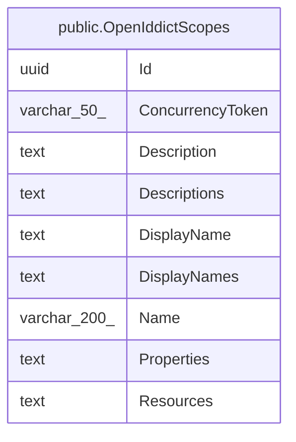

# public.OpenIddictScopes

## Columns

| Name | Type | Default | Nullable | Children | Parents | Comment |
| ---- | ---- | ------- | -------- | -------- | ------- | ------- |
| Id | uuid |  | false |  |  |  |
| ConcurrencyToken | varchar(50) |  | true |  |  |  |
| Description | text |  | true |  |  |  |
| Descriptions | text |  | true |  |  |  |
| DisplayName | text |  | true |  |  |  |
| DisplayNames | text |  | true |  |  |  |
| Name | varchar(200) |  | true |  |  |  |
| Properties | text |  | true |  |  |  |
| Resources | text |  | true |  |  |  |

## Constraints

| Name | Type | Definition |
| ---- | ---- | ---------- |
| OpenIddictScopes_Id_not_null | n | NOT NULL "Id" |
| PK_OpenIddictScopes | PRIMARY KEY | PRIMARY KEY ("Id") |

## Indexes

| Name | Definition |
| ---- | ---------- |
| PK_OpenIddictScopes | CREATE UNIQUE INDEX "PK_OpenIddictScopes" ON public."OpenIddictScopes" USING btree ("Id") |
| IX_OpenIddictScopes_Name | CREATE UNIQUE INDEX "IX_OpenIddictScopes_Name" ON public."OpenIddictScopes" USING btree ("Name") |

## Relations

---

> Generated by [tbls](https://github.com/k1LoW/tbls)
