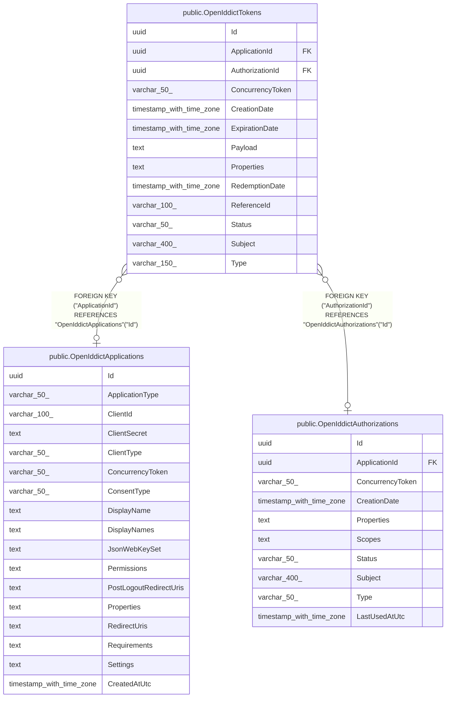

# public.OpenIddictTokens

## Columns

| Name | Type | Default | Nullable | Children | Parents | Comment |
| ---- | ---- | ------- | -------- | -------- | ------- | ------- |
| Id | uuid |  | false |  |  |  |
| ApplicationId | uuid |  | true |  | [public.OpenIddictApplications](public.OpenIddictApplications.md) |  |
| AuthorizationId | uuid |  | true |  | [public.OpenIddictAuthorizations](public.OpenIddictAuthorizations.md) |  |
| ConcurrencyToken | varchar(50) |  | true |  |  |  |
| CreationDate | timestamp with time zone |  | true |  |  |  |
| ExpirationDate | timestamp with time zone |  | true |  |  |  |
| Payload | text |  | true |  |  |  |
| Properties | text |  | true |  |  |  |
| RedemptionDate | timestamp with time zone |  | true |  |  |  |
| ReferenceId | varchar(100) |  | true |  |  |  |
| Status | varchar(50) |  | true |  |  |  |
| Subject | varchar(400) |  | true |  |  |  |
| Type | varchar(150) |  | true |  |  |  |

## Constraints

| Name | Type | Definition |
| ---- | ---- | ---------- |
| OpenIddictTokens_Id_not_null | n | NOT NULL "Id" |
| FK_OpenIddictTokens_OpenIddictApplications_ApplicationId | FOREIGN KEY | FOREIGN KEY ("ApplicationId") REFERENCES "OpenIddictApplications"("Id") |
| FK_OpenIddictTokens_OpenIddictAuthorizations_AuthorizationId | FOREIGN KEY | FOREIGN KEY ("AuthorizationId") REFERENCES "OpenIddictAuthorizations"("Id") |
| PK_OpenIddictTokens | PRIMARY KEY | PRIMARY KEY ("Id") |

## Indexes

| Name | Definition |
| ---- | ---------- |
| PK_OpenIddictTokens | CREATE UNIQUE INDEX "PK_OpenIddictTokens" ON public."OpenIddictTokens" USING btree ("Id") |
| IX_OpenIddictTokens_ApplicationId_Status_Subject_Type | CREATE INDEX "IX_OpenIddictTokens_ApplicationId_Status_Subject_Type" ON public."OpenIddictTokens" USING btree ("ApplicationId", "Status", "Subject", "Type") |
| IX_OpenIddictTokens_AuthorizationId | CREATE INDEX "IX_OpenIddictTokens_AuthorizationId" ON public."OpenIddictTokens" USING btree ("AuthorizationId") |
| IX_OpenIddictTokens_ReferenceId | CREATE UNIQUE INDEX "IX_OpenIddictTokens_ReferenceId" ON public."OpenIddictTokens" USING btree ("ReferenceId") |

## Relations

---

> Generated by [tbls](https://github.com/k1LoW/tbls)
