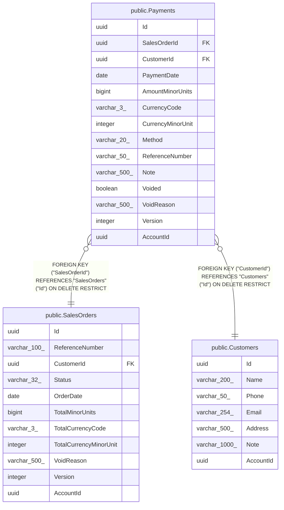

# public.Payments

## Columns

| Name | Type | Default | Nullable | Children | Parents | Comment |
| ---- | ---- | ------- | -------- | -------- | ------- | ------- |
| Id | uuid |  | false |  |  |  |
| SalesOrderId | uuid |  | false |  | [public.SalesOrders](public.SalesOrders.md) |  |
| CustomerId | uuid |  | false |  | [public.Customers](public.Customers.md) |  |
| PaymentDate | date |  | false |  |  |  |
| AmountMinorUnits | bigint |  | false |  |  |  |
| CurrencyCode | varchar(3) |  | false |  |  |  |
| CurrencyMinorUnit | integer |  | false |  |  |  |
| Method | varchar(20) |  | false |  |  |  |
| ReferenceNumber | varchar(50) |  | true |  |  |  |
| Note | varchar(500) |  | true |  |  |  |
| Voided | boolean |  | false |  |  |  |
| VoidReason | varchar(500) |  | true |  |  |  |
| Version | integer |  | false |  |  |  |
| AccountId | uuid |  | false |  |  |  |

## Viewpoints

| Name | Definition |
| ---- | ---------- |
| [Sales & finance](viewpoint-2.md) | Customers, orders, FIFO allocations, payments, expenses, products. |

## Constraints

| Name | Type | Definition |
| ---- | ---- | ---------- |
| Payments_AccountId_not_null | n | NOT NULL "AccountId" |
| Payments_AmountMinorUnits_not_null | n | NOT NULL "AmountMinorUnits" |
| Payments_CurrencyCode_not_null | n | NOT NULL "CurrencyCode" |
| Payments_CurrencyMinorUnit_not_null | n | NOT NULL "CurrencyMinorUnit" |
| Payments_CustomerId_not_null | n | NOT NULL "CustomerId" |
| Payments_Id_not_null | n | NOT NULL "Id" |
| Payments_Method_not_null | n | NOT NULL "Method" |
| Payments_PaymentDate_not_null | n | NOT NULL "PaymentDate" |
| Payments_SalesOrderId_not_null | n | NOT NULL "SalesOrderId" |
| Payments_Version_not_null | n | NOT NULL "Version" |
| Payments_Voided_not_null | n | NOT NULL "Voided" |
| FK_Payments_Customers_CustomerId | FOREIGN KEY | FOREIGN KEY ("CustomerId") REFERENCES "Customers"("Id") ON DELETE RESTRICT |
| FK_Payments_SalesOrders_SalesOrderId | FOREIGN KEY | FOREIGN KEY ("SalesOrderId") REFERENCES "SalesOrders"("Id") ON DELETE RESTRICT |
| PK_Payments | PRIMARY KEY | PRIMARY KEY ("Id") |

## Indexes

| Name | Definition |
| ---- | ---------- |
| PK_Payments | CREATE UNIQUE INDEX "PK_Payments" ON public."Payments" USING btree ("Id") |
| IX_Payments_AccountId_CustomerId | CREATE INDEX "IX_Payments_AccountId_CustomerId" ON public."Payments" USING btree ("AccountId", "CustomerId") |
| IX_Payments_AccountId_SalesOrderId | CREATE INDEX "IX_Payments_AccountId_SalesOrderId" ON public."Payments" USING btree ("AccountId", "SalesOrderId") |
| IX_Payments_CustomerId | CREATE INDEX "IX_Payments_CustomerId" ON public."Payments" USING btree ("CustomerId") |
| IX_Payments_SalesOrderId | CREATE INDEX "IX_Payments_SalesOrderId" ON public."Payments" USING btree ("SalesOrderId") |

## Relations

---

> Generated by [tbls](https://github.com/k1LoW/tbls)
