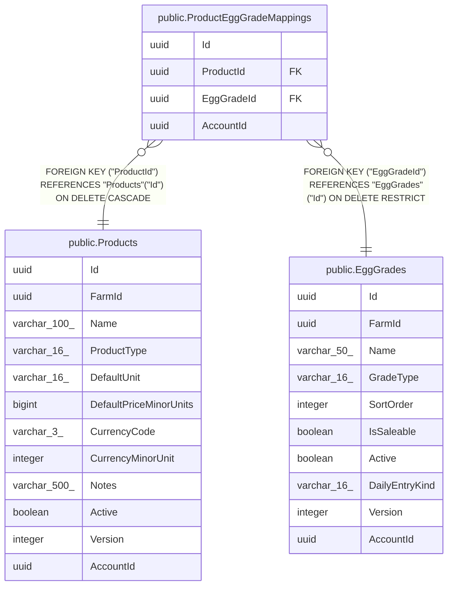

# public.ProductEggGradeMappings

## Columns

| Name | Type | Default | Nullable | Children | Parents | Comment |
| ---- | ---- | ------- | -------- | -------- | ------- | ------- |
| Id | uuid |  | false |  |  |  |
| ProductId | uuid |  | false |  | [public.Products](public.Products.md) |  |
| EggGradeId | uuid |  | false |  | [public.EggGrades](public.EggGrades.md) |  |
| AccountId | uuid |  | false |  |  |  |

## Viewpoints

| Name | Definition |
| ---- | ---------- |
| [Sales & finance](viewpoint-2.md) | Customers, orders, FIFO allocations, payments, expenses, products. |

## Constraints

| Name | Type | Definition |
| ---- | ---- | ---------- |
| ProductEggGradeMappings_AccountId_not_null | n | NOT NULL "AccountId" |
| ProductEggGradeMappings_EggGradeId_not_null | n | NOT NULL "EggGradeId" |
| ProductEggGradeMappings_Id_not_null | n | NOT NULL "Id" |
| ProductEggGradeMappings_ProductId_not_null | n | NOT NULL "ProductId" |
| FK_ProductEggGradeMappings_EggGrades_EggGradeId | FOREIGN KEY | FOREIGN KEY ("EggGradeId") REFERENCES "EggGrades"("Id") ON DELETE RESTRICT |
| FK_ProductEggGradeMappings_Products_ProductId | FOREIGN KEY | FOREIGN KEY ("ProductId") REFERENCES "Products"("Id") ON DELETE CASCADE |
| PK_ProductEggGradeMappings | PRIMARY KEY | PRIMARY KEY ("Id") |

## Indexes

| Name | Definition |
| ---- | ---------- |
| PK_ProductEggGradeMappings | CREATE UNIQUE INDEX "PK_ProductEggGradeMappings" ON public."ProductEggGradeMappings" USING btree ("Id") |
| IX_ProductEggGradeMappings_EggGradeId | CREATE INDEX "IX_ProductEggGradeMappings_EggGradeId" ON public."ProductEggGradeMappings" USING btree ("EggGradeId") |
| IX_ProductEggGradeMappings_ProductId | CREATE UNIQUE INDEX "IX_ProductEggGradeMappings_ProductId" ON public."ProductEggGradeMappings" USING btree ("ProductId") |

## Relations

---

> Generated by [tbls](https://github.com/k1LoW/tbls)
