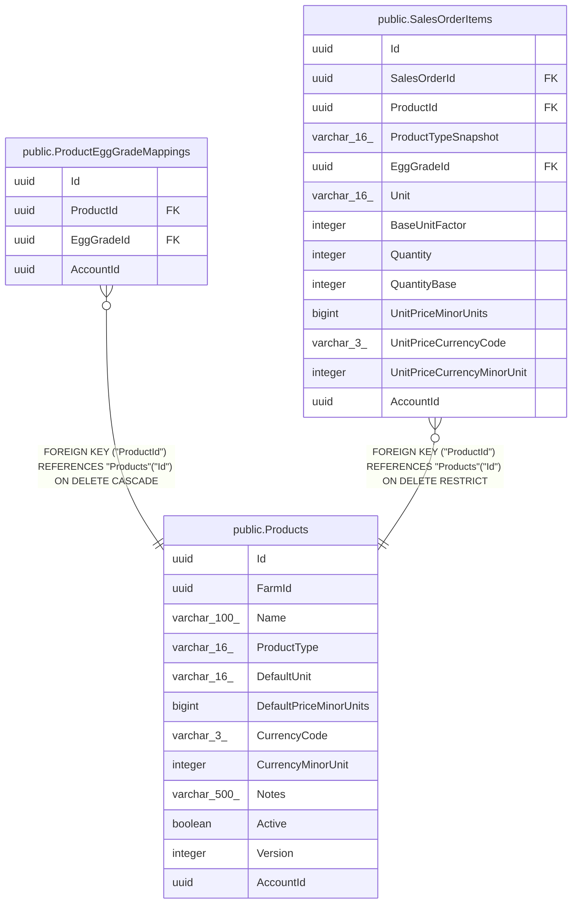

# public.Products

## Columns

| Name | Type | Default | Nullable | Children | Parents | Comment |
| ---- | ---- | ------- | -------- | -------- | ------- | ------- |
| Id | uuid |  | false | [public.ProductEggGradeMappings](public.ProductEggGradeMappings.md) [public.SalesOrderItems](public.SalesOrderItems.md) |  |  |
| FarmId | uuid |  | false |  |  |  |
| Name | varchar(100) |  | false |  |  |  |
| ProductType | varchar(16) |  | false |  |  |  |
| DefaultUnit | varchar(16) |  | false |  |  |  |
| DefaultPriceMinorUnits | bigint |  | true |  |  |  |
| CurrencyCode | varchar(3) |  | false |  |  |  |
| CurrencyMinorUnit | integer |  | false |  |  |  |
| Notes | varchar(500) |  | true |  |  |  |
| Active | boolean |  | false |  |  |  |
| Version | integer |  | false |  |  |  |
| AccountId | uuid |  | false |  |  |  |

## Viewpoints

| Name | Definition |
| ---- | ---------- |
| [Sales & finance](viewpoint-2.md) | Customers, orders, FIFO allocations, payments, expenses, products. |

## Constraints

| Name | Type | Definition |
| ---- | ---- | ---------- |
| Products_AccountId_not_null | n | NOT NULL "AccountId" |
| Products_Active_not_null | n | NOT NULL "Active" |
| Products_CurrencyCode_not_null | n | NOT NULL "CurrencyCode" |
| Products_CurrencyMinorUnit_not_null | n | NOT NULL "CurrencyMinorUnit" |
| Products_DefaultUnit_not_null | n | NOT NULL "DefaultUnit" |
| Products_FarmId_not_null | n | NOT NULL "FarmId" |
| Products_Id_not_null | n | NOT NULL "Id" |
| Products_Name_not_null | n | NOT NULL "Name" |
| Products_ProductType_not_null | n | NOT NULL "ProductType" |
| Products_Version_not_null | n | NOT NULL "Version" |
| PK_Products | PRIMARY KEY | PRIMARY KEY ("Id") |

## Indexes

| Name | Definition |
| ---- | ---------- |
| PK_Products | CREATE UNIQUE INDEX "PK_Products" ON public."Products" USING btree ("Id") |
| IX_Products_AccountId_LowerName | CREATE UNIQUE INDEX "IX_Products_AccountId_LowerName" ON public."Products" USING btree ("AccountId", lower(("Name")::text)) |

## Relations

---

> Generated by [tbls](https://github.com/k1LoW/tbls)
