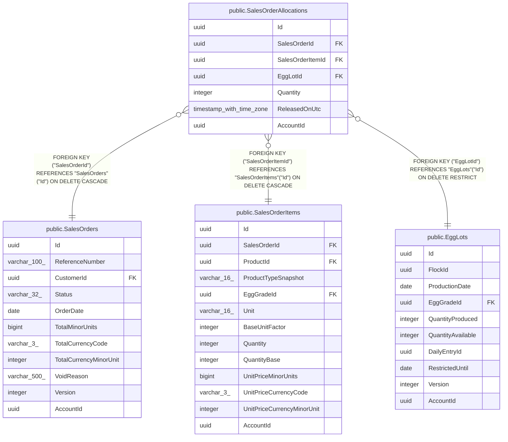

# public.SalesOrderAllocations

## Columns

| Name | Type | Default | Nullable | Children | Parents | Comment |
| ---- | ---- | ------- | -------- | -------- | ------- | ------- |
| Id | uuid |  | false |  |  |  |
| SalesOrderId | uuid |  | false |  | [public.SalesOrders](public.SalesOrders.md) |  |
| SalesOrderItemId | uuid |  | false |  | [public.SalesOrderItems](public.SalesOrderItems.md) |  |
| EggLotId | uuid |  | false |  | [public.EggLots](public.EggLots.md) |  |
| Quantity | integer |  | false |  |  |  |
| ReleasedOnUtc | timestamp with time zone |  | true |  |  |  |
| AccountId | uuid |  | false |  |  |  |

## Viewpoints

| Name | Definition |
| ---- | ---------- |
| [Sales & finance](viewpoint-2.md) | Customers, orders, FIFO allocations, payments, expenses, products. |

## Constraints

| Name | Type | Definition |
| ---- | ---- | ---------- |
| SalesOrderAllocations_AccountId_not_null | n | NOT NULL "AccountId" |
| SalesOrderAllocations_EggLotId_not_null | n | NOT NULL "EggLotId" |
| SalesOrderAllocations_Id_not_null | n | NOT NULL "Id" |
| SalesOrderAllocations_Quantity_not_null | n | NOT NULL "Quantity" |
| SalesOrderAllocations_SalesOrderId_not_null | n | NOT NULL "SalesOrderId" |
| SalesOrderAllocations_SalesOrderItemId_not_null | n | NOT NULL "SalesOrderItemId" |
| FK_SalesOrderAllocations_SalesOrders_SalesOrderId | FOREIGN KEY | FOREIGN KEY ("SalesOrderId") REFERENCES "SalesOrders"("Id") ON DELETE CASCADE |
| FK_SalesOrderAllocations_EggLots_EggLotId | FOREIGN KEY | FOREIGN KEY ("EggLotId") REFERENCES "EggLots"("Id") ON DELETE RESTRICT |
| FK_SalesOrderAllocations_SalesOrderItems_SalesOrderItemId | FOREIGN KEY | FOREIGN KEY ("SalesOrderItemId") REFERENCES "SalesOrderItems"("Id") ON DELETE CASCADE |
| PK_SalesOrderAllocations | PRIMARY KEY | PRIMARY KEY ("Id") |

## Indexes

| Name | Definition |
| ---- | ---------- |
| PK_SalesOrderAllocations | CREATE UNIQUE INDEX "PK_SalesOrderAllocations" ON public."SalesOrderAllocations" USING btree ("Id") |
| IX_SalesOrderAllocations_EggLotId | CREATE INDEX "IX_SalesOrderAllocations_EggLotId" ON public."SalesOrderAllocations" USING btree ("EggLotId") |
| IX_SalesOrderAllocations_SalesOrderId | CREATE INDEX "IX_SalesOrderAllocations_SalesOrderId" ON public."SalesOrderAllocations" USING btree ("SalesOrderId") |
| IX_SalesOrderAllocations_SalesOrderItemId | CREATE INDEX "IX_SalesOrderAllocations_SalesOrderItemId" ON public."SalesOrderAllocations" USING btree ("SalesOrderItemId") |

## Relations

---

> Generated by [tbls](https://github.com/k1LoW/tbls)
