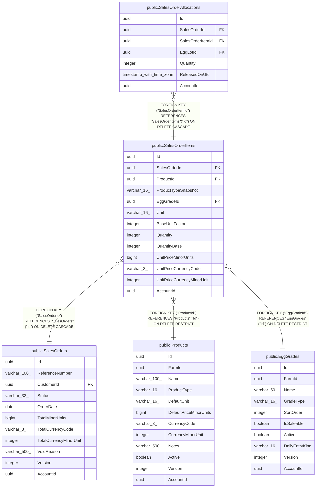

# public.SalesOrderItems

## Columns

| Name | Type | Default | Nullable | Children | Parents | Comment |
| ---- | ---- | ------- | -------- | -------- | ------- | ------- |
| Id | uuid |  | false | [public.SalesOrderAllocations](public.SalesOrderAllocations.md) |  |  |
| SalesOrderId | uuid |  | false |  | [public.SalesOrders](public.SalesOrders.md) |  |
| ProductId | uuid |  | false |  | [public.Products](public.Products.md) |  |
| ProductTypeSnapshot | varchar(16) |  | false |  |  |  |
| EggGradeId | uuid |  | false |  | [public.EggGrades](public.EggGrades.md) |  |
| Unit | varchar(16) |  | false |  |  |  |
| BaseUnitFactor | integer |  | false |  |  |  |
| Quantity | integer |  | false |  |  |  |
| QuantityBase | integer |  | false |  |  |  |
| UnitPriceMinorUnits | bigint |  | false |  |  |  |
| UnitPriceCurrencyCode | varchar(3) |  | false |  |  |  |
| UnitPriceCurrencyMinorUnit | integer |  | false |  |  |  |
| AccountId | uuid |  | false |  |  |  |

## Viewpoints

| Name | Definition |
| ---- | ---------- |
| [Sales & finance](viewpoint-2.md) | Customers, orders, FIFO allocations, payments, expenses, products. |

## Constraints

| Name | Type | Definition |
| ---- | ---- | ---------- |
| SalesOrderItems_AccountId_not_null | n | NOT NULL "AccountId" |
| SalesOrderItems_BaseUnitFactor_not_null | n | NOT NULL "BaseUnitFactor" |
| SalesOrderItems_EggGradeId_not_null | n | NOT NULL "EggGradeId" |
| SalesOrderItems_Id_not_null | n | NOT NULL "Id" |
| SalesOrderItems_ProductId_not_null | n | NOT NULL "ProductId" |
| SalesOrderItems_ProductTypeSnapshot_not_null | n | NOT NULL "ProductTypeSnapshot" |
| SalesOrderItems_QuantityBase_not_null | n | NOT NULL "QuantityBase" |
| SalesOrderItems_Quantity_not_null | n | NOT NULL "Quantity" |
| SalesOrderItems_SalesOrderId_not_null | n | NOT NULL "SalesOrderId" |
| SalesOrderItems_UnitPriceCurrencyCode_not_null | n | NOT NULL "UnitPriceCurrencyCode" |
| SalesOrderItems_UnitPriceCurrencyMinorUnit_not_null | n | NOT NULL "UnitPriceCurrencyMinorUnit" |
| SalesOrderItems_UnitPriceMinorUnits_not_null | n | NOT NULL "UnitPriceMinorUnits" |
| SalesOrderItems_Unit_not_null | n | NOT NULL "Unit" |
| FK_SalesOrderItems_EggGrades_EggGradeId | FOREIGN KEY | FOREIGN KEY ("EggGradeId") REFERENCES "EggGrades"("Id") ON DELETE RESTRICT |
| FK_SalesOrderItems_Products_ProductId | FOREIGN KEY | FOREIGN KEY ("ProductId") REFERENCES "Products"("Id") ON DELETE RESTRICT |
| FK_SalesOrderItems_SalesOrders_SalesOrderId | FOREIGN KEY | FOREIGN KEY ("SalesOrderId") REFERENCES "SalesOrders"("Id") ON DELETE CASCADE |
| PK_SalesOrderItems | PRIMARY KEY | PRIMARY KEY ("Id") |

## Indexes

| Name | Definition |
| ---- | ---------- |
| PK_SalesOrderItems | CREATE UNIQUE INDEX "PK_SalesOrderItems" ON public."SalesOrderItems" USING btree ("Id") |
| IX_SalesOrderItems_EggGradeId | CREATE INDEX "IX_SalesOrderItems_EggGradeId" ON public."SalesOrderItems" USING btree ("EggGradeId") |
| IX_SalesOrderItems_ProductId | CREATE INDEX "IX_SalesOrderItems_ProductId" ON public."SalesOrderItems" USING btree ("ProductId") |
| IX_SalesOrderItems_SalesOrderId | CREATE INDEX "IX_SalesOrderItems_SalesOrderId" ON public."SalesOrderItems" USING btree ("SalesOrderId") |

## Relations

---

> Generated by [tbls](https://github.com/k1LoW/tbls)
