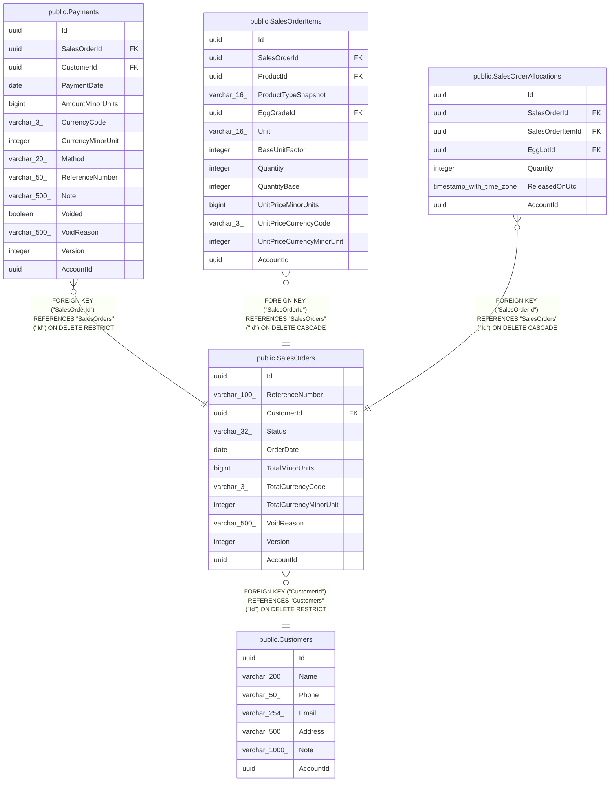

# public.SalesOrders

## Columns

| Name | Type | Default | Nullable | Children | Parents | Comment |
| ---- | ---- | ------- | -------- | -------- | ------- | ------- |
| Id | uuid |  | false | [public.Payments](public.Payments.md) [public.SalesOrderItems](public.SalesOrderItems.md) [public.SalesOrderAllocations](public.SalesOrderAllocations.md) |  |  |
| ReferenceNumber | varchar(100) |  | false |  |  |  |
| CustomerId | uuid |  | false |  | [public.Customers](public.Customers.md) |  |
| Status | varchar(32) |  | false |  |  |  |
| OrderDate | date |  | false |  |  |  |
| TotalMinorUnits | bigint |  | false |  |  |  |
| TotalCurrencyCode | varchar(3) |  | false |  |  |  |
| TotalCurrencyMinorUnit | integer |  | false |  |  |  |
| VoidReason | varchar(500) |  | true |  |  |  |
| Version | integer |  | false |  |  |  |
| AccountId | uuid |  | false |  |  |  |

## Viewpoints

| Name | Definition |
| ---- | ---------- |
| [Sales & finance](viewpoint-2.md) | Customers, orders, FIFO allocations, payments, expenses, products. |

## Constraints

| Name | Type | Definition |
| ---- | ---- | ---------- |
| SalesOrders_AccountId_not_null | n | NOT NULL "AccountId" |
| SalesOrders_CustomerId_not_null | n | NOT NULL "CustomerId" |
| SalesOrders_Id_not_null | n | NOT NULL "Id" |
| SalesOrders_OrderDate_not_null | n | NOT NULL "OrderDate" |
| SalesOrders_ReferenceNumber_not_null | n | NOT NULL "ReferenceNumber" |
| SalesOrders_Status_not_null | n | NOT NULL "Status" |
| SalesOrders_TotalCurrencyCode_not_null | n | NOT NULL "TotalCurrencyCode" |
| SalesOrders_TotalCurrencyMinorUnit_not_null | n | NOT NULL "TotalCurrencyMinorUnit" |
| SalesOrders_TotalMinorUnits_not_null | n | NOT NULL "TotalMinorUnits" |
| SalesOrders_Version_not_null | n | NOT NULL "Version" |
| FK_SalesOrders_Customers_CustomerId | FOREIGN KEY | FOREIGN KEY ("CustomerId") REFERENCES "Customers"("Id") ON DELETE RESTRICT |
| PK_SalesOrders | PRIMARY KEY | PRIMARY KEY ("Id") |

## Indexes

| Name | Definition |
| ---- | ---------- |
| PK_SalesOrders | CREATE UNIQUE INDEX "PK_SalesOrders" ON public."SalesOrders" USING btree ("Id") |
| IX_SalesOrders_AccountId_ReferenceNumber | CREATE UNIQUE INDEX "IX_SalesOrders_AccountId_ReferenceNumber" ON public."SalesOrders" USING btree ("AccountId", "ReferenceNumber") |
| IX_SalesOrders_CustomerId | CREATE INDEX "IX_SalesOrders_CustomerId" ON public."SalesOrders" USING btree ("CustomerId") |

## Relations

---

> Generated by [tbls](https://github.com/k1LoW/tbls)
