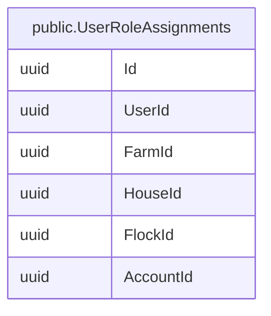

# public.UserRoleAssignments

## Columns

| Name | Type | Default | Nullable | Children | Parents | Comment |
| ---- | ---- | ------- | -------- | -------- | ------- | ------- |
| Id | uuid |  | false |  |  |  |
| UserId | uuid |  | false |  |  |  |
| FarmId | uuid |  | true |  |  |  |
| HouseId | uuid |  | true |  |  |  |
| FlockId | uuid |  | true |  |  |  |
| AccountId | uuid |  | false |  |  |  |

## Viewpoints

| Name | Definition |
| ---- | ---------- |
| [Identity & access](viewpoint-3.md) | ASP.NET Identity, refresh tokens, per-flock role assignments. |

## Constraints

| Name | Type | Definition |
| ---- | ---- | ---------- |
| UserRoleAssignments_AccountId_not_null | n | NOT NULL "AccountId" |
| UserRoleAssignments_Id_not_null | n | NOT NULL "Id" |
| UserRoleAssignments_UserId_not_null | n | NOT NULL "UserId" |
| PK_UserRoleAssignments | PRIMARY KEY | PRIMARY KEY ("Id") |

## Indexes

| Name | Definition |
| ---- | ---------- |
| PK_UserRoleAssignments | CREATE UNIQUE INDEX "PK_UserRoleAssignments" ON public."UserRoleAssignments" USING btree ("Id") |
| IX_UserRoleAssignments_AccountId_UserId | CREATE INDEX "IX_UserRoleAssignments_AccountId_UserId" ON public."UserRoleAssignments" USING btree ("AccountId", "UserId") |
| IX_UserRoleAssignments_UserId_FlockId | CREATE UNIQUE INDEX "IX_UserRoleAssignments_UserId_FlockId" ON public."UserRoleAssignments" USING btree ("UserId", "FlockId") |

## Relations

---

> Generated by [tbls](https://github.com/k1LoW/tbls)
