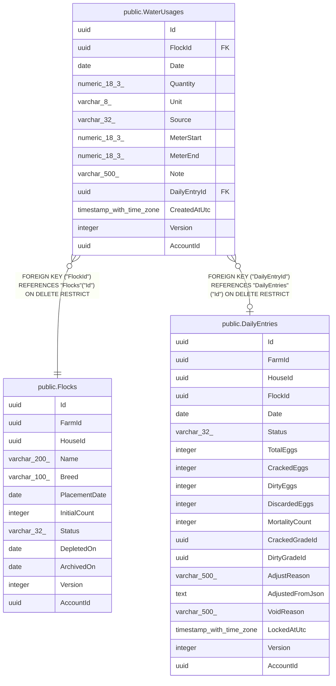

# public.WaterUsages

## Columns

| Name | Type | Default | Nullable | Children | Parents | Comment |
| ---- | ---- | ------- | -------- | -------- | ------- | ------- |
| Id | uuid |  | false |  |  |  |
| FlockId | uuid |  | false |  | [public.Flocks](public.Flocks.md) |  |
| Date | date |  | false |  |  |  |
| Quantity | numeric(18,3) |  | false |  |  |  |
| Unit | varchar(8) |  | false |  |  |  |
| Source | varchar(32) |  | false |  |  |  |
| MeterStart | numeric(18,3) |  | true |  |  |  |
| MeterEnd | numeric(18,3) |  | true |  |  |  |
| Note | varchar(500) |  | true |  |  |  |
| DailyEntryId | uuid |  | true |  | [public.DailyEntries](public.DailyEntries.md) |  |
| CreatedAtUtc | timestamp with time zone |  | false |  |  |  |
| Version | integer |  | false |  |  |  |
| AccountId | uuid |  | false |  |  |  |

## Viewpoints

| Name | Definition |
| ---- | ---------- |
| [Flocks & egg production](viewpoint-0.md) | The daily egg loop — flocks, daily entries, grading, lots, movements. |

## Constraints

| Name | Type | Definition |
| ---- | ---- | ---------- |
| WaterUsages_AccountId_not_null | n | NOT NULL "AccountId" |
| WaterUsages_CreatedAtUtc_not_null | n | NOT NULL "CreatedAtUtc" |
| WaterUsages_Date_not_null | n | NOT NULL "Date" |
| WaterUsages_FlockId_not_null | n | NOT NULL "FlockId" |
| WaterUsages_Id_not_null | n | NOT NULL "Id" |
| WaterUsages_Quantity_not_null | n | NOT NULL "Quantity" |
| WaterUsages_Source_not_null | n | NOT NULL "Source" |
| WaterUsages_Unit_not_null | n | NOT NULL "Unit" |
| WaterUsages_Version_not_null | n | NOT NULL "Version" |
| FK_WaterUsages_DailyEntries_DailyEntryId | FOREIGN KEY | FOREIGN KEY ("DailyEntryId") REFERENCES "DailyEntries"("Id") ON DELETE RESTRICT |
| FK_WaterUsages_Flocks_FlockId | FOREIGN KEY | FOREIGN KEY ("FlockId") REFERENCES "Flocks"("Id") ON DELETE RESTRICT |
| PK_WaterUsages | PRIMARY KEY | PRIMARY KEY ("Id") |

## Indexes

| Name | Definition |
| ---- | ---------- |
| PK_WaterUsages | CREATE UNIQUE INDEX "PK_WaterUsages" ON public."WaterUsages" USING btree ("Id") |
| IX_WaterUsages_DailyEntryId | CREATE INDEX "IX_WaterUsages_DailyEntryId" ON public."WaterUsages" USING btree ("DailyEntryId") |
| IX_WaterUsages_FlockId_Date | CREATE INDEX "IX_WaterUsages_FlockId_Date" ON public."WaterUsages" USING btree ("FlockId", "Date") |

## Relations

---

> Generated by [tbls](https://github.com/k1LoW/tbls)
