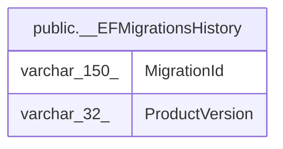

# public.__EFMigrationsHistory

## Columns

| Name | Type | Default | Nullable | Children | Parents | Comment |
| ---- | ---- | ------- | -------- | -------- | ------- | ------- |
| MigrationId | varchar(150) |  | false |  |  |  |
| ProductVersion | varchar(32) |  | false |  |  |  |

## Constraints

| Name | Type | Definition |
| ---- | ---- | ---------- |
| __EFMigrationsHistory_MigrationId_not_null | n | NOT NULL "MigrationId" |
| __EFMigrationsHistory_ProductVersion_not_null | n | NOT NULL "ProductVersion" |
| PK___EFMigrationsHistory | PRIMARY KEY | PRIMARY KEY ("MigrationId") |

## Indexes

| Name | Definition |
| ---- | ---------- |
| PK___EFMigrationsHistory | CREATE UNIQUE INDEX "PK___EFMigrationsHistory" ON public."__EFMigrationsHistory" USING btree ("MigrationId") |

## Relations

---

> Generated by [tbls](https://github.com/k1LoW/tbls)
