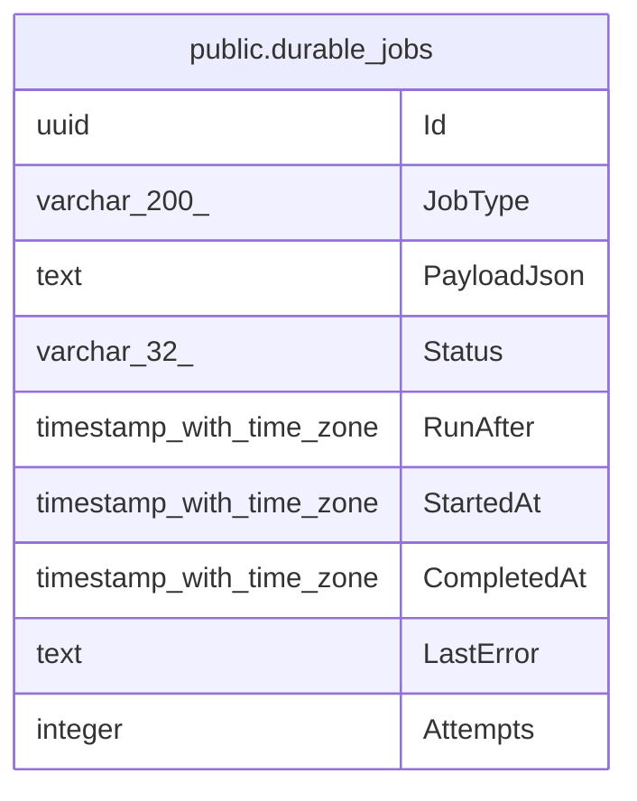

# public.durable_jobs

## Columns

| Name | Type | Default | Nullable | Children | Parents | Comment |
| ---- | ---- | ------- | -------- | -------- | ------- | ------- |
| Id | uuid |  | false |  |  |  |
| JobType | varchar(200) |  | false |  |  |  |
| PayloadJson | text |  | false |  |  |  |
| Status | varchar(32) |  | false |  |  |  |
| RunAfter | timestamp with time zone |  | false |  |  |  |
| StartedAt | timestamp with time zone |  | true |  |  |  |
| CompletedAt | timestamp with time zone |  | true |  |  |  |
| LastError | text |  | true |  |  |  |
| Attempts | integer |  | false |  |  |  |

## Viewpoints

| Name | Definition |
| ---- | ---------- |
| [Platform & operations](viewpoint-4.md) | Tenancy root, audit, jobs, idempotency, seeding bookkeeping. |

## Constraints

| Name | Type | Definition |
| ---- | ---- | ---------- |
| durable_jobs_Attempts_not_null | n | NOT NULL "Attempts" |
| durable_jobs_Id_not_null | n | NOT NULL "Id" |
| durable_jobs_JobType_not_null | n | NOT NULL "JobType" |
| durable_jobs_PayloadJson_not_null | n | NOT NULL "PayloadJson" |
| durable_jobs_RunAfter_not_null | n | NOT NULL "RunAfter" |
| durable_jobs_Status_not_null | n | NOT NULL "Status" |
| PK_durable_jobs | PRIMARY KEY | PRIMARY KEY ("Id") |

## Indexes

| Name | Definition |
| ---- | ---------- |
| PK_durable_jobs | CREATE UNIQUE INDEX "PK_durable_jobs" ON public.durable_jobs USING btree ("Id") |
| IX_durable_jobs_Status_RunAfter | CREATE INDEX "IX_durable_jobs_Status_RunAfter" ON public.durable_jobs USING btree ("Status", "RunAfter") |

## Relations

---

> Generated by [tbls](https://github.com/k1LoW/tbls)
