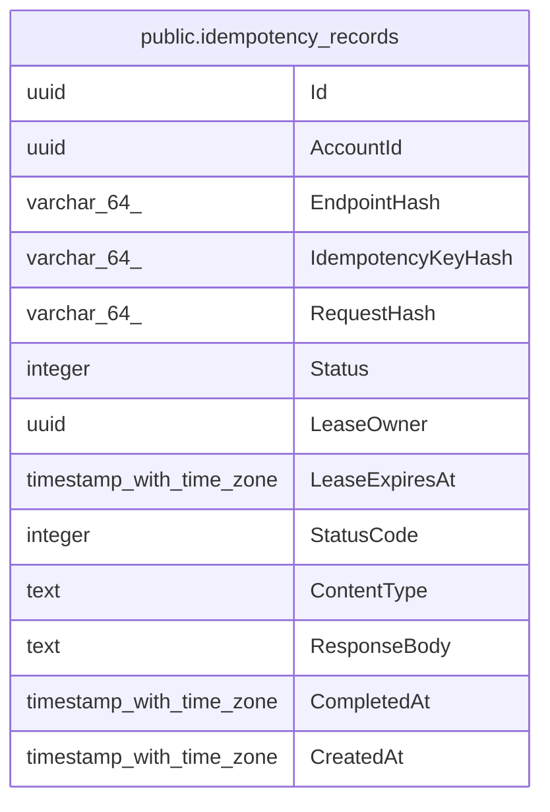

# public.idempotency_records

## Columns

| Name | Type | Default | Nullable | Children | Parents | Comment |
| ---- | ---- | ------- | -------- | -------- | ------- | ------- |
| Id | uuid |  | false |  |  |  |
| AccountId | uuid |  | false |  |  |  |
| EndpointHash | varchar(64) |  | false |  |  |  |
| IdempotencyKeyHash | varchar(64) |  | false |  |  |  |
| RequestHash | varchar(64) |  | false |  |  |  |
| Status | integer |  | false |  |  |  |
| LeaseOwner | uuid |  | false |  |  |  |
| LeaseExpiresAt | timestamp with time zone |  | false |  |  |  |
| StatusCode | integer |  | true |  |  |  |
| ContentType | text |  | true |  |  |  |
| ResponseBody | text |  | true |  |  |  |
| CompletedAt | timestamp with time zone |  | true |  |  |  |
| CreatedAt | timestamp with time zone |  | false |  |  |  |

## Viewpoints

| Name | Definition |
| ---- | ---------- |
| [Platform & operations](viewpoint-4.md) | Tenancy root, audit, jobs, idempotency, seeding bookkeeping. |

## Constraints

| Name | Type | Definition |
| ---- | ---- | ---------- |
| idempotency_records_AccountId_not_null | n | NOT NULL "AccountId" |
| idempotency_records_CreatedAt_not_null | n | NOT NULL "CreatedAt" |
| idempotency_records_EndpointHash_not_null | n | NOT NULL "EndpointHash" |
| idempotency_records_Id_not_null | n | NOT NULL "Id" |
| idempotency_records_IdempotencyKeyHash_not_null | n | NOT NULL "IdempotencyKeyHash" |
| idempotency_records_LeaseExpiresAt_not_null | n | NOT NULL "LeaseExpiresAt" |
| idempotency_records_LeaseOwner_not_null | n | NOT NULL "LeaseOwner" |
| idempotency_records_RequestHash_not_null | n | NOT NULL "RequestHash" |
| idempotency_records_Status_not_null | n | NOT NULL "Status" |
| PK_idempotency_records | PRIMARY KEY | PRIMARY KEY ("Id") |

## Indexes

| Name | Definition |
| ---- | ---------- |
| PK_idempotency_records | CREATE UNIQUE INDEX "PK_idempotency_records" ON public.idempotency_records USING btree ("Id") |
| IX_idempotency_records_AccountId_EndpointHash_IdempotencyKeyHa~ | CREATE UNIQUE INDEX "IX_idempotency_records_AccountId_EndpointHash_IdempotencyKeyHa~" ON public.idempotency_records USING btree ("AccountId", "EndpointHash", "IdempotencyKeyHash") |

## Relations

---

> Generated by [tbls](https://github.com/k1LoW/tbls)
