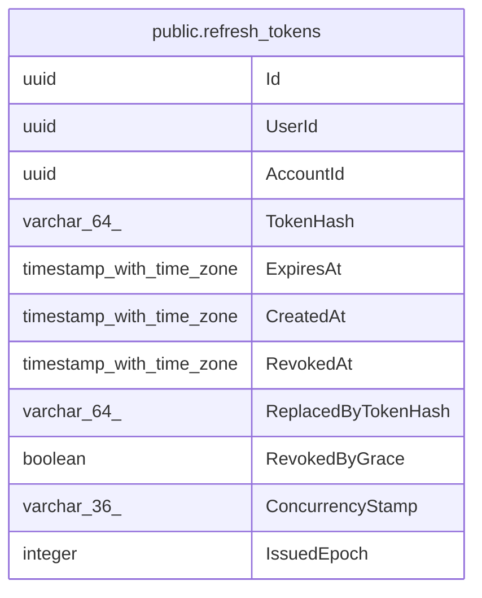

# public.refresh_tokens

## Columns

| Name | Type | Default | Nullable | Children | Parents | Comment |
| ---- | ---- | ------- | -------- | -------- | ------- | ------- |
| Id | uuid |  | false |  |  |  |
| UserId | uuid |  | false |  |  |  |
| AccountId | uuid |  | false |  |  |  |
| TokenHash | varchar(64) |  | false |  |  |  |
| ExpiresAt | timestamp with time zone |  | false |  |  |  |
| CreatedAt | timestamp with time zone |  | false |  |  |  |
| RevokedAt | timestamp with time zone |  | true |  |  |  |
| ReplacedByTokenHash | varchar(64) |  | true |  |  |  |
| RevokedByGrace | boolean | false | false |  |  |  |
| ConcurrencyStamp | varchar(36) |  | false |  |  |  |
| IssuedEpoch | integer | 0 | false |  |  |  |

## Viewpoints

| Name | Definition |
| ---- | ---------- |
| [Identity & access](viewpoint-3.md) | ASP.NET Identity, refresh tokens, per-flock role assignments. |

## Constraints

| Name | Type | Definition |
| ---- | ---- | ---------- |
| refresh_tokens_AccountId_not_null | n | NOT NULL "AccountId" |
| refresh_tokens_ConcurrencyStamp_not_null | n | NOT NULL "ConcurrencyStamp" |
| refresh_tokens_CreatedAt_not_null | n | NOT NULL "CreatedAt" |
| refresh_tokens_ExpiresAt_not_null | n | NOT NULL "ExpiresAt" |
| refresh_tokens_Id_not_null | n | NOT NULL "Id" |
| refresh_tokens_IssuedEpoch_not_null | n | NOT NULL "IssuedEpoch" |
| refresh_tokens_RevokedByGrace_not_null | n | NOT NULL "RevokedByGrace" |
| refresh_tokens_TokenHash_not_null | n | NOT NULL "TokenHash" |
| refresh_tokens_UserId_not_null | n | NOT NULL "UserId" |
| PK_refresh_tokens | PRIMARY KEY | PRIMARY KEY ("Id") |

## Indexes

| Name | Definition |
| ---- | ---------- |
| PK_refresh_tokens | CREATE UNIQUE INDEX "PK_refresh_tokens" ON public.refresh_tokens USING btree ("Id") |
| IX_refresh_tokens_ExpiresAt | CREATE INDEX "IX_refresh_tokens_ExpiresAt" ON public.refresh_tokens USING btree ("ExpiresAt") |
| IX_refresh_tokens_TokenHash | CREATE UNIQUE INDEX "IX_refresh_tokens_TokenHash" ON public.refresh_tokens USING btree ("TokenHash") |
| IX_refresh_tokens_UserId | CREATE INDEX "IX_refresh_tokens_UserId" ON public.refresh_tokens USING btree ("UserId") |

## Relations

---

> Generated by [tbls](https://github.com/k1LoW/tbls)
