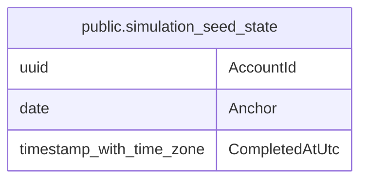

# public.simulation_seed_state

## Columns

| Name | Type | Default | Nullable | Children | Parents | Comment |
| ---- | ---- | ------- | -------- | -------- | ------- | ------- |
| AccountId | uuid |  | false |  |  |  |
| Anchor | date |  | false |  |  |  |
| CompletedAtUtc | timestamp with time zone |  | true |  |  |  |

## Viewpoints

| Name | Definition |
| ---- | ---------- |
| [Platform & operations](viewpoint-4.md) | Tenancy root, audit, jobs, idempotency, seeding bookkeeping. |

## Constraints

| Name | Type | Definition |
| ---- | ---- | ---------- |
| simulation_seed_state_AccountId_not_null | n | NOT NULL "AccountId" |
| simulation_seed_state_Anchor_not_null | n | NOT NULL "Anchor" |
| PK_simulation_seed_state | PRIMARY KEY | PRIMARY KEY ("AccountId") |

## Indexes

| Name | Definition |
| ---- | ---------- |
| PK_simulation_seed_state | CREATE UNIQUE INDEX "PK_simulation_seed_state" ON public.simulation_seed_state USING btree ("AccountId") |

## Relations

---

> Generated by [tbls](https://github.com/k1LoW/tbls)
