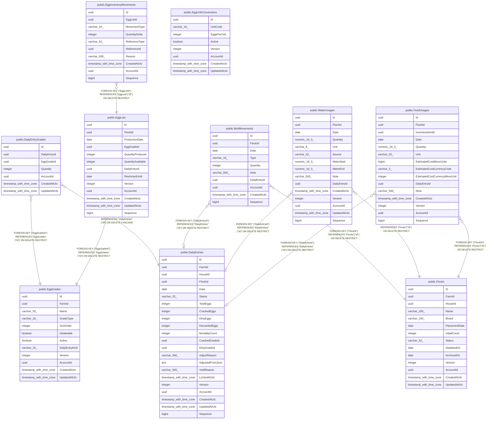

# Flocks & egg production

## Description

The daily egg loop — flocks, daily entries, grading, lots, movements.

## Tables

| Name | Columns | Comment | Type |
| ---- | ------- | ------- | ---- |
| [public.DailyEntries](public.DailyEntries.md) | 22 |  | BASE TABLE |
| [public.EggGrades](public.EggGrades.md) | 12 |  | BASE TABLE |
| [public.EggUnitConversions](public.EggUnitConversions.md) | 8 |  | BASE TABLE |
| [public.Flocks](public.Flocks.md) | 14 |  | BASE TABLE |
| [public.DailyEntryGrades](public.DailyEntryGrades.md) | 7 |  | BASE TABLE |
| [public.EggLots](public.EggLots.md) | 13 |  | BASE TABLE |
| [public.BirdMovements](public.BirdMovements.md) | 10 |  | BASE TABLE |
| [public.WaterUsages](public.WaterUsages.md) | 15 |  | BASE TABLE |
| [public.FeedUsages](public.FeedUsages.md) | 15 |  | BASE TABLE |
| [public.EggInventoryMovements](public.EggInventoryMovements.md) | 10 |  | BASE TABLE |

## Relations

---

> Generated by [tbls](https://github.com/k1LoW/tbls)
