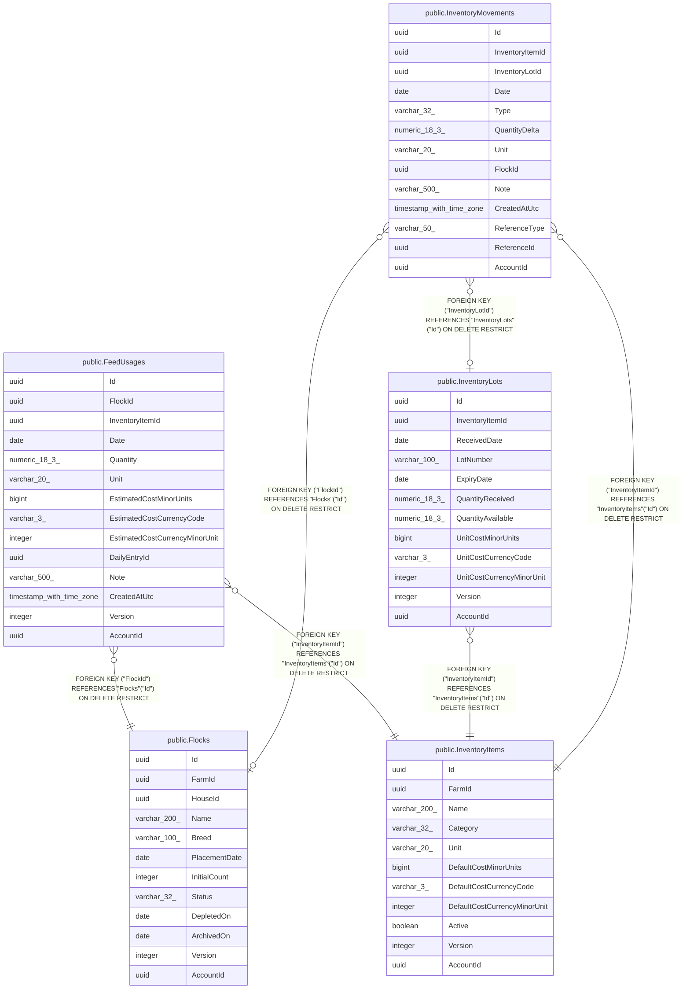

# Feed & supply inventory

## Description

Purchasable supplies, FIFO lots, and the movement ledger.

## Tables

| Name | Columns | Comment | Type |
| ---- | ------- | ------- | ---- |
| [public.Flocks](public.Flocks.md) | 12 |  | BASE TABLE |
| [public.InventoryItems](public.InventoryItems.md) | 11 |  | BASE TABLE |
| [public.FeedUsages](public.FeedUsages.md) | 14 |  | BASE TABLE |
| [public.InventoryLots](public.InventoryLots.md) | 12 |  | BASE TABLE |
| [public.InventoryMovements](public.InventoryMovements.md) | 13 |  | BASE TABLE |

## Relations

---

> Generated by [tbls](https://github.com/k1LoW/tbls)
