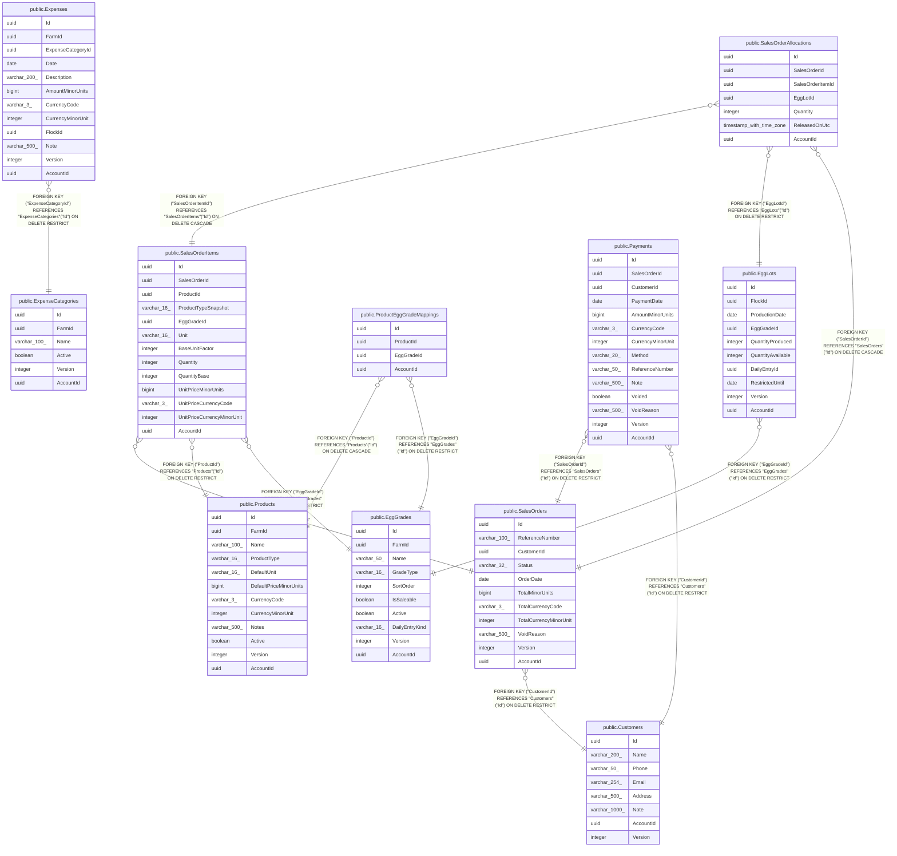

# Sales & finance

## Description

Customers, orders, FIFO allocations, payments, expenses, products.

## Tables

| Name | Columns | Comment | Type |
| ---- | ------- | ------- | ---- |
| [public.Customers](public.Customers.md) | 8 |  | BASE TABLE |
| [public.EggGrades](public.EggGrades.md) | 10 |  | BASE TABLE |
| [public.ExpenseCategories](public.ExpenseCategories.md) | 6 |  | BASE TABLE |
| [public.Products](public.Products.md) | 12 |  | BASE TABLE |
| [public.SalesOrders](public.SalesOrders.md) | 11 |  | BASE TABLE |
| [public.EggLots](public.EggLots.md) | 10 |  | BASE TABLE |
| [public.Expenses](public.Expenses.md) | 12 |  | BASE TABLE |
| [public.ProductEggGradeMappings](public.ProductEggGradeMappings.md) | 4 |  | BASE TABLE |
| [public.Payments](public.Payments.md) | 14 |  | BASE TABLE |
| [public.SalesOrderItems](public.SalesOrderItems.md) | 13 |  | BASE TABLE |
| [public.SalesOrderAllocations](public.SalesOrderAllocations.md) | 7 |  | BASE TABLE |

## Relations

---

> Generated by [tbls](https://github.com/k1LoW/tbls)
