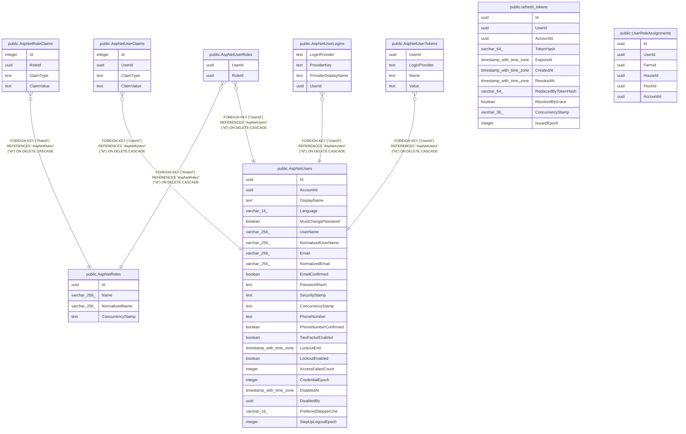

# Identity & access

## Description

ASP.NET Identity, refresh tokens, per-flock role assignments.

## Tables

| Name | Columns | Comment | Type |
| ---- | ------- | ------- | ---- |
| [public.AspNetRoles](public.AspNetRoles.md) | 4 |  | BASE TABLE |
| [public.AspNetUsers](public.AspNetUsers.md) | 24 |  | BASE TABLE |
| [public.refresh_tokens](public.refresh_tokens.md) | 11 |  | BASE TABLE |
| [public.UserRoleAssignments](public.UserRoleAssignments.md) | 6 |  | BASE TABLE |
| [public.AspNetRoleClaims](public.AspNetRoleClaims.md) | 4 |  | BASE TABLE |
| [public.AspNetUserClaims](public.AspNetUserClaims.md) | 4 |  | BASE TABLE |
| [public.AspNetUserLogins](public.AspNetUserLogins.md) | 4 |  | BASE TABLE |
| [public.AspNetUserRoles](public.AspNetUserRoles.md) | 2 |  | BASE TABLE |
| [public.AspNetUserTokens](public.AspNetUserTokens.md) | 4 |  | BASE TABLE |

## Relations

---

> Generated by [tbls](https://github.com/k1LoW/tbls)
